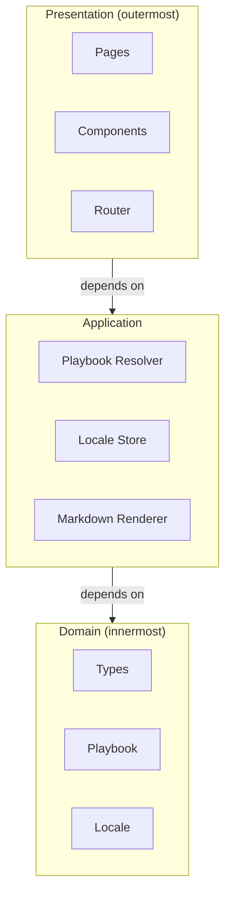
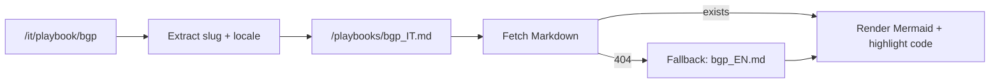
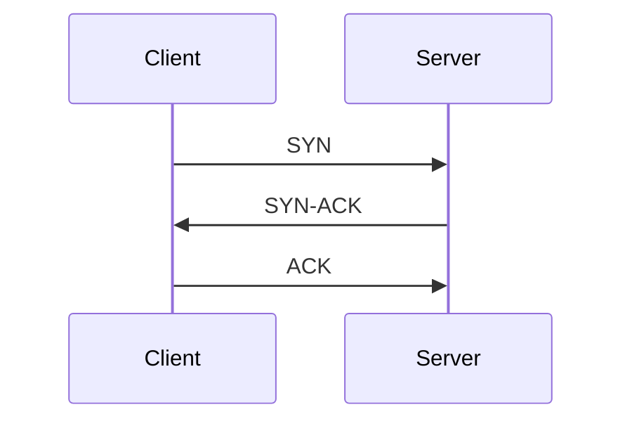
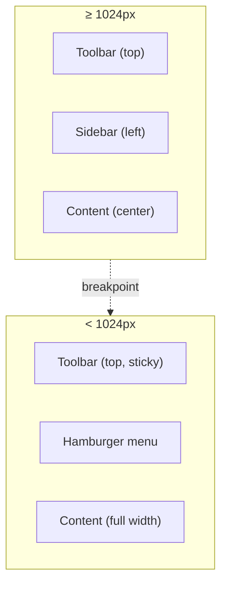

# Back 2 Basics — Principles

This document defines the engineering principles that guide how we build the platform.
It sits alongside the [Constitution](CONSTITUTION.md) (why we build) and the [Stack](STACK.md) (what we build with).

---

## 1. Clean Code

### 1.1 Functions Do One Thing

A function has a single responsibility, expressed in its name. If the name needs an "and", split
the function.

```typescript
// ✅ Good
function resolvePlaybookPath(slug: string, locale: string): string { … }
function parseFrontmatter(raw: string): PlaybookMeta { … }

// ❌ Bad
function loadPlaybookAndRenderAndTrack(slug: string): void { … }
```

### 1.2 No Comments, Clear Names

Comments explain *why*, never *what*. The *what* lives in the names.

```typescript
// ✅ Good — the comment explains the unusual choice
// Vercel edge runtime lacks fs; playbooks live in /public
const url = `/playbooks/${slug}_${locale}.md`

// ❌ Bad — the comment repeats the code
// Fetch the playbook markdown file
const response = await fetch(`/playbooks/${slug}_${locale}.md`)
```

### 1.3 Small Files

- Components: ≤ 150 lines (template + script + style).
- Composables: ≤ 80 lines.
- SCSS partials: ≤ 100 lines.

If a file exceeds the limit, extract.

### 1.4 Errors Are Values

No `try/catch` for control flow. Errors are typed return values that the caller handles.

```typescript
type Result<T, E = Error> = { ok: true; value: T } | { ok: false; error: E }

function parseLocale(raw: string): Result<'it' | 'en'> {
  if (raw === 'it' || raw === 'en') return { ok: true, value: raw }
  return { ok: false, error: new Error(`Invalid locale: ${raw}`) }
}
```

### 1.5 Test What Matters

Every public function in `composables/` and every Pinia action has a unit test.
Component tests cover the happy path, the empty state, and one error state.

---

## 2. Clean Architecture

The platform follows a simplified Clean Architecture with three concentric layers.
Dependencies point inward: outer layers know about inner layers, never the reverse.



### 2.1 Domain Layer (`src/types/`)

Pure TypeScript — no framework imports. Defines what a `Playbook`, a `Locale`, and a
`PlaybookMeta` look like. This layer has zero dependencies.

### 2.2 Application Layer (`src/composables/`, `src/stores/`)

Orchestrates the domain. Composable functions and Pinia stores live here. They know
about the domain types and about the infrastructure (fetch, localStorage), but
never about Vue components or the DOM.

### 2.3 Presentation Layer (`src/pages/`, `src/components/`)

Vue SFCs. They consume composables and stores, never the other way around.
A component imports a composable; a composable never imports a component.

### 2.4 Dependency Rule in Practice

```typescript
// ✅ Good — page imports a composable
<script setup lang="ts">
import { usePlaybook } from '@/composables/usePlaybook'
const { content, isLoading } = usePlaybook('bgp')
</script>

// ❌ Bad — composable importing a component
import Toolbar from '@/components/Toolbar.vue'
```

---

## 3. Dual-Language Playbooks

Every playbook exists in two languages: Italian and English.

### 3.1 File Convention

```
public/playbooks/
├── bgp_IT.md
├── bgp_EN.md
├── tcp_IT.md
└── tcp_EN.md
```

The suffix is always uppercase `_IT` or `_EN`. No exceptions.

### 3.2 Resolution Flow

When the user navigates to `/it/playbook/bgp`, the system:



### 3.3 Content Parity

The IT and EN versions of a playbook must convey equivalent knowledge. They are not
word-for-word translations — they are independently authored explanations of the same
concept, optimised for each language's idioms.

### 3.4 UI Shell

The toolbar, navigation, and all chrome strings are managed by `vue-i18n` with
lazy-loaded JSON bundles in `src/locales/it.json` and `src/locales/en.json`.
The content of playbooks is never passed through `vue-i18n` — only the shell.

---

## 4. Diagrams

### 4.1 When to Add a Diagram

A diagram earns its place when it communicates structure, flow, or relationship
more efficiently than prose. Ask: *"Can I explain this in one sentence?"* If yes, skip the diagram.

Diagrams that **add value**:
- Architecture layers and their dependency direction.
- Request/response flows (e.g. playbook resolution).
- State transitions (e.g. locale switching).

Diagrams that are **filler**:
- A box labelled "User" next to a box labelled "Browser".
- Any diagram with fewer than 3 nodes.
- A flowchart that mirrors a 3-line code snippet.

### 4.2 Mermaid in Playbooks

Playbook authors embed Mermaid diagrams directly in Markdown:

````markdown

````

The platform renders them client-side with `mermaid.js`, respecting
`prefers-color-scheme` for light/dark themes.

### 4.3 Mermaid in Docs

Project documentation (this file, plans, ADRs) uses Mermaid for architecture
diagrams. The same rule applies: only when it clarifies.

---

## 5. Mobile-First Navigation

The platform must be fully usable on a smartphone with no loss of functionality.

### 5.1 Layout Adaptation



### 5.2 Key Rules

| Rule | Implementation |
|---|---|
| **Touch targets ≥ 44px** | Buttons, links, and interactive elements meet Apple HIG minimum. |
| **No horizontal scroll** | Content reflows; tables use `overflow-x: auto` only when unavoidable. |
| **Sticky toolbar** | Always visible at the top; hides on scroll-down, reappears on scroll-up. |
| **Bottom-sheet navigation** | On mobile, the sidebar becomes a bottom sheet triggered by the hamburger icon. |
| **Readable without zoom** | Base font size is 16px. Code blocks wrap on small screens. |
| **Offline-first** | Playbooks are cached after first load (service worker via Vite PWA plugin). |

### 5.3 Mobile Playbook Reading

The playbook reading experience on mobile is optimised for vertical scrolling:
- Single-column layout.
- Code blocks with horizontal scroll.
- "Back to index" link fixed at the bottom.
- Progress indicator (scroll-based) in the toolbar.

---

## 6. Content Authoring Standards

### 6.1 Mermaid in Content

Playbook authors must follow the same diagram discipline as the engineering team:
if prose suffices, skip the diagram. When a diagram is warranted, prefer:

- `flowchart` for processes and decision trees.
- `sequenceDiagram` for protocol handshakes and request flows.
- `graph` / `classDiagram` for structural relationships.

### 6.2 Code Samples

- Every code block has a language tag.
- Prefer real-world, runnable snippets over pseudocode.
- Keep samples under 30 lines. If longer, link to a gist or repo.

### 6.3 "Check Your Understanding"

Every playbook section ends with one or two questions that test the core concept —
not trivia. Example:

> **Q:** When would you use a TCP connection pool instead of opening a new
> connection per request?
>
> <details><summary>Answer</summary>
> When the cost of the TCP handshake dominates the request latency — typically
> for short-lived, high-frequency requests to the same host (e.g. database queries).
> </details>

---

*Last revised: 2026-07-07*
