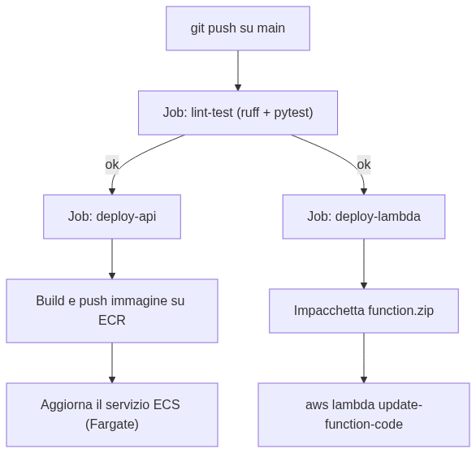

# AWS for Lazy Developers

Nel 2006, Amazon fece una cosa strana per un negozio online: prese l'infrastruttura che aveva costruito per far girare il proprio e-commerce durante il Black Friday, e la mise in affitto a chiunque, a ore. Nacque **AWS** (Amazon Web Services). Oggi AWS ha più di 200 servizi — troppi anche per gli ingegneri AWS stessi, si scherza spesso nel settore.

Questo playbook parte da un'idea semplice: **il miglior server è quello che non devi gestire tu**. Un "lazy developer" non è pigro nel senso negativo — è pigro nel senso giusto: odia riavviare server la domenica notte, odia installare patch di sicurezza a mano, odia scalare manualmente un'app quando va in tendenza su TikTok. Per questo, useremo quasi solo servizi **managed** e **serverless**: cose che AWS gestisce al posto tuo, così tu scrivi codice, non ticket di sysadmin.

Faremo una carrellata dei servizi AWS più utili per uno sviluppatore, divisi per categoria, con una spiegazione semplice, uno snippet **Terraform** (per "tirarli su" — cioè crearli) e uno snippet **Python** (per usarli dal tuo codice, di solito con `boto3`, la libreria ufficiale AWS per Python). Degli argomenti più avanzati toccheremo solo **Bedrock** — l'accesso gestito ai modelli di intelligenza artificiale — perché è probabilmente il servizio "avanzato" più utile da conoscere oggi.

Alla fine, mettiamo tutto insieme: una vera pipeline **GitHub Actions** che testa, builda e deploya un'app **FastAPI su ECS** e una **funzione Lambda**, entrambe in Python.

---

### Prima di iniziare: 4 parole che userai ovunque

| Termine | Cosa significa, in parole semplici |
|---|---|
| **Region** | Una zona geografica dove vivono i "computer" di AWS (es. `eu-west-1` = Irlanda). Scegli una region vicina ai tuoi utenti, per velocità. |
| **Account** | Il tuo "profilo AWS" — tutto quello che crei appartiene a un account, e paghi in base a quello che usi lì dentro. |
| **IaC (Infrastructure as Code)** | Invece di creare le cose cliccando sulla Console AWS, scrivi codice (Terraform, in questo playbook) che le crea per te — ripetibile, versionabile su Git, mai più "ma io avevo cliccato qualcosa a mano tre mesi fa". |
| **boto3** | La libreria Python ufficiale per parlare con AWS: `import boto3` e sei dentro. |

> 💡 **Tip**: in ogni esempio Terraform di questo playbook, immagina che esista già un file `provider.tf` con qualcosa come `provider "aws" { region = "eu-west-1" }`. Lo omettiamo per restare concisi.

---

## 1. Compute — Niente Server da Gestire

**In pillole**: invece di affittare un computer intero (EC2) e occupartene tu, AWS ti offre modi per far girare codice pagando solo per quello che usi, senza mai fare `ssh` su nessuna macchina.

### AWS Lambda

**A cosa serve**: esegue una funzione quando succede qualcosa (una richiesta HTTP, un file caricato, un messaggio in coda) e poi si spegne. Paghi solo i millisecondi in cui gira. È come una macchinetta del caffè: non consuma energia finché qualcuno non preme il pulsante.

**Come si usa**: scrivi una funzione con una firma standard (`handler(event, context)`), la carichi su AWS, e qualcos'altro la "invoca" quando serve.

```hcl
# Terraform — crea la funzione Lambda
resource "aws_iam_role" "lambda_exec" {
  name = "hello-lambda-role"
  assume_role_policy = jsonencode({
    Version = "2012-10-17"
    Statement = [{
      Action    = "sts:AssumeRole"
      Effect    = "Allow"
      Principal = { Service = "lambda.amazonaws.com" }
    }]
  })
}

resource "aws_lambda_function" "hello" {
  function_name    = "hello-lazy-dev"
  role             = aws_iam_role.lambda_exec.arn
  handler          = "app.handler"
  runtime          = "python3.13"
  filename         = "lambda.zip"
  source_code_hash = filebase64sha256("lambda.zip")
}
```

```python
# app.py — il codice che gira DENTRO la Lambda
def handler(event, context):
    nome = event.get("nome", "mondo")
    return {"statusCode": 200, "body": f"Ciao, {nome}!"}
```

```python
# invoke.py — come chiami la Lambda da fuori, ad esempio da un altro script
import boto3, json

client = boto3.client("lambda")
risposta = client.invoke(
    FunctionName="hello-lazy-dev",
    Payload=json.dumps({"nome": "Ada"}).encode(),
)
print(json.load(risposta["Payload"]))   # => {'statusCode': 200, 'body': 'Ciao, Ada!'}
```

### ECS su Fargate

**A cosa serve**: se la tua app è già dentro un **container** Docker (perché magari è un'app più grande di una singola funzione, tipo una FastAPI intera), ECS la fa girare per te. **Fargate** è la parte "lazy": non scegli nemmeno più il tipo di computer — dici solo "quanta CPU e RAM mi serve" e AWS si occupa del resto.

**Come si usa**: crei un'immagine Docker, la carichi su **ECR** (il magazzino delle immagini, vedi sotto), e dici a ECS di farla girare.

```hcl
# Terraform — cluster, task definition e servizio ECS
resource "aws_ecs_cluster" "app" {
  name = "lazy-cluster"
}

resource "aws_ecs_task_definition" "api" {
  family                   = "fastapi-task"
  requires_compatibilities = ["FARGATE"]
  network_mode             = "awsvpc"
  cpu                      = "256"
  memory                   = "512"
  execution_role_arn       = aws_iam_role.ecs_exec.arn

  container_definitions = jsonencode([{
    name         = "fastapi"
    image        = "${aws_ecr_repository.api.repository_url}:latest"
    portMappings = [{ containerPort = 8000 }]
  }])
}

resource "aws_ecs_service" "api" {
  name            = "fastapi-service"
  cluster         = aws_ecs_cluster.app.id
  task_definition = aws_ecs_task_definition.api.arn
  desired_count   = 1
  launch_type     = "FARGATE"

  network_configuration {
    subnets          = var.subnet_ids
    assign_public_ip = true
  }
}
```

```python
# usa_ecs.py — forza un nuovo deploy (utile dopo aver pushato una nuova immagine)
import boto3

ecs = boto3.client("ecs")
ecs.update_service(
    cluster="lazy-cluster",
    service="fastapi-service",
    force_new_deployment=True,
)
```

### ECR (Elastic Container Registry)

**A cosa serve**: è il magazzino privato dove tieni le tue immagini Docker, così ECS (o chiunque altro) può scaricarle. Pensalo come un "Docker Hub" privato, dentro casa AWS.

```hcl
resource "aws_ecr_repository" "api" {
  name                 = "fastapi-app"
  image_tag_mutability = "IMMUTABLE"   # un tag, una volta pushato, non si può sovrascrivere
}
```

```python
# lista_immagini.py
import boto3

ecr = boto3.client("ecr")
immagini = ecr.list_images(repositoryName="fastapi-app")["imageIds"]
for img in immagini:
    print(img.get("imageTag", "senza tag"))
```

> 🧠 **La regola d'oro**: Lambda per codice che risponde a eventi occasionali e di breve durata (secondi). ECS/Fargate per applicazioni sempre accese, più pesanti, o che devono girare più a lungo di 15 minuti (il limite massimo di una singola esecuzione Lambda).

---

## 2. Storage — Il Tuo Armadio Infinito

**In pillole**: **S3** è un enorme spazio per salvare file, dove ogni file ha un "indirizzo" (chiave) e non ti devi mai preoccupare di quanto spazio hai — è, praticamente, infinito.

### Amazon S3

**A cosa serve**: immagina un armadio grande quanto vuoi, diviso in "cassetti" (i **bucket**), dove ogni oggetto che ci metti ha un'etichetta (la **key**) per ritrovarlo. Ci metti dentro immagini, video, backup, file di log, praticamente qualsiasi cosa.

**Come si usa**: carichi file, li leggi, e — se serve — generi un link temporaneo per farli scaricare a qualcun altro senza rendere pubblico tutto il bucket.

```hcl
resource "random_id" "suffix" {
  byte_length = 4
}

resource "aws_s3_bucket" "uploads" {
  bucket = "lazy-dev-uploads-${random_id.suffix.hex}"   # il nome deve essere UNICO al mondo
}
```

```python
import boto3

s3 = boto3.client("s3")
BUCKET = "lazy-dev-uploads-abcd1234"

s3.upload_file("foto.jpg", BUCKET, "foto.jpg")   # carica un file locale

url = s3.generate_presigned_url(
    "get_object",
    Params={"Bucket": BUCKET, "Key": "foto.jpg"},
    ExpiresIn=3600,   # il link funziona solo per un'ora
)
print(url)
```

---

## 3. Database — Dove Vivono i Dati

**In pillole**: **DynamoDB** è un database velocissimo se conosci già la "chiave" della riga che ti serve — perfetto per app moderne. **RDS/Aurora** è un database relazionale classico (tipo Postgres) ma senza doverlo installare né aggiornare tu.

### DynamoDB

**A cosa serve**: è un enorme "quaderno" organizzato a chiave-valore. Se sai l'ID di quello che cerchi, la risposta arriva in millisecondi, qualunque sia la dimensione della tabella — che abbia 10 o 10 miliardi di righe.

```hcl
resource "aws_dynamodb_table" "utenti" {
  name         = "utenti"
  billing_mode = "PAY_PER_REQUEST"   # paghi per richiesta, niente da "dimensionare" a mano
  hash_key     = "id"

  attribute {
    name = "id"
    type = "S"   # S = String
  }
}
```

```python
import boto3

table = boto3.resource("dynamodb").Table("utenti")

table.put_item(Item={"id": "ada-1", "nome": "Ada", "eta": 36})

item = table.get_item(Key={"id": "ada-1"})["Item"]
print(item)   # => {'id': 'ada-1', 'nome': 'Ada', 'eta': Decimal('36')}
```

### RDS / Aurora Serverless

**A cosa serve**: se hai bisogno di un vero database relazionale (tabelle, `JOIN`, transazioni SQL) — come Postgres o MySQL — ma senza installarlo, applicare patch di sicurezza o gestire backup a mano, RDS lo fa per te. La versione **Serverless v2** di Aurora è la scelta "lazy": si scala da sola, e se il traffico è zero, paghi (quasi) zero.

```hcl
resource "aws_rds_cluster" "db" {
  cluster_identifier = "lazy-db"
  engine             = "aurora-postgresql"
  engine_mode        = "provisioned"
  master_username    = "admin"
  master_password    = var.db_password

  serverlessv2_scaling_configuration {
    min_capacity = 0.5
    max_capacity = 2
  }
}

resource "aws_rds_cluster_instance" "db_instance" {
  cluster_identifier = aws_rds_cluster.db.id
  instance_class     = "db.serverless"
  engine             = aws_rds_cluster.db.engine
}
```

```python
# NOTA: per FARE QUERY su RDS non usi boto3, ma un driver SQL vero (es. psycopg2) —
# boto3 serve solo per l'AMMINISTRAZIONE del servizio, non per parlare col database.
import boto3

rds = boto3.client("rds")
stato = rds.describe_db_clusters(DBClusterIdentifier="lazy-db")["DBClusters"][0]["Status"]
print(stato)   # => "available"
```

> 🧠 **La regola d'oro**: usa DynamoDB quando conosci in anticipo *come* interrogherai i dati (per chiave). Usa RDS/Aurora quando hai bisogno di query complesse, relazioni tra tabelle, o semplicemente il tuo team pensa già in SQL.

---

## 4. Networking & Delivery — Come gli Utenti Ti Trovano

**In pillole**: **API Gateway** riceve le richieste HTTP e le smista. **CloudFront** tiene copie dei tuoi file vicino agli utenti nel mondo, per velocità. **Route 53** traduce nomi (`miosito.com`) in indirizzi reali.

### API Gateway

**A cosa serve**: è il "receptionist" della tua app — riceve richieste HTTP da internet e le passa alla Lambda (o al servizio) giusto, gestendo per te cose noiose come CORS, throttling, e autenticazione.

```hcl
resource "aws_apigatewayv2_api" "http_api" {
  name          = "lazy-api"
  protocol_type = "HTTP"
}

resource "aws_apigatewayv2_integration" "lambda" {
  api_id                 = aws_apigatewayv2_api.http_api.id
  integration_type       = "AWS_PROXY"
  integration_uri        = aws_lambda_function.hello.invoke_arn
  payload_format_version = "2.0"
}

resource "aws_apigatewayv2_route" "ciao" {
  api_id    = aws_apigatewayv2_api.http_api.id
  route_key = "GET /ciao"
  target    = "integrations/${aws_apigatewayv2_integration.lambda.id}"
}

resource "aws_apigatewayv2_stage" "default" {
  api_id      = aws_apigatewayv2_api.http_api.id
  name        = "$default"
  auto_deploy = true
}
```

```python
# usa_api.py — dal punto di vista di chi CHIAMA l'API, non serve boto3: è HTTP normale
import requests

risposta = requests.get("https://abc123.execute-api.eu-west-1.amazonaws.com/ciao")
print(risposta.json())
```

### CloudFront

**A cosa serve**: è una **CDN** (Content Delivery Network) — una rete di "magazzini" sparsi nel mondo che tengono una copia dei tuoi file vicino a chi li richiede. Se il tuo bucket S3 è in Irlanda e un utente lo scarica dal Giappone, senza CloudFront il file viaggia da un capo all'altro del mondo. Con CloudFront, il file era già in un magazzino vicino a Tokyo.

```hcl
resource "aws_cloudfront_distribution" "cdn" {
  enabled = true

  origin {
    domain_name = aws_s3_bucket.uploads.bucket_regional_domain_name
    origin_id   = "s3-uploads"
  }

  default_cache_behavior {
    target_origin_id       = "s3-uploads"
    viewer_protocol_policy = "redirect-to-https"
    allowed_methods         = ["GET", "HEAD"]
    cached_methods           = ["GET", "HEAD"]

    forwarded_values {
      query_string = false
      cookies { forward = "none" }
    }
  }

  restrictions {
    geo_restriction { restriction_type = "none" }
  }

  viewer_certificate {
    cloudfront_default_certificate = true
  }
}
```

```python
# svuota_cache.py — dopo un deploy, dì a CloudFront di dimenticare le vecchie copie
import boto3

cf = boto3.client("cloudfront")
cf.create_invalidation(
    DistributionId="E123EXAMPLE",
    InvalidationBatch={
        "Paths": {"Quantity": 1, "Items": ["/*"]},
        "CallerReference": "deploy-2026-07-16",
    },
)
```

### Route 53

**A cosa serve**: è la rubrica telefonica di internet. Traduce un nome leggibile come `api.miolazyapp.dev` nell'indirizzo reale del tuo servizio (CloudFront, un Load Balancer, ecc.).

```hcl
resource "aws_route53_zone" "main" {
  name = "miolazyapp.dev"
}

resource "aws_route53_record" "api" {
  zone_id = aws_route53_zone.main.zone_id
  name    = "api.miolazyapp.dev"
  type    = "A"

  alias {
    name                   = aws_cloudfront_distribution.cdn.domain_name
    zone_id                = aws_cloudfront_distribution.cdn.hosted_zone_id
    evaluate_target_health = false
  }
}
```

```python
import boto3

r53 = boto3.client("route53")
for zona in r53.list_hosted_zones()["HostedZones"]:
    print(zona["Name"], zona["Id"])
```

---

## 5. Messaggistica — Il Collante tra Servizi

**In pillole**: quando due parti della tua app devono "parlarsi" senza aspettarsi a vicenda, usi la messaggistica invece di chiamate dirette. **SQS** è una fila alla cassa, **SNS** è un megafono, **EventBridge** è uno smistatore intelligente.

### SQS (Simple Queue Service)

**A cosa serve**: è una coda — come la fila alla cassa del supermercato. Un servizio mette messaggi in coda, un altro li prende ed elabora **uno alla volta**, al proprio ritmo. Se il consumatore è lento o si rompe per un attimo, i messaggi restano lì ad aspettare, non si perdono.

```hcl
resource "aws_sqs_queue" "ordini" {
  name                       = "ordini-in-attesa"
  visibility_timeout_seconds = 30
}
```

```python
import boto3

sqs = boto3.client("sqs")
queue_url = "https://sqs.eu-west-1.amazonaws.com/123456789012/ordini-in-attesa"

sqs.send_message(QueueUrl=queue_url, MessageBody='{"ordine_id": 42}')

messaggi = sqs.receive_message(QueueUrl=queue_url, MaxNumberOfMessages=1)
for m in messaggi.get("Messages", []):
    print(m["Body"])
    sqs.delete_message(QueueUrl=queue_url, ReceiptHandle=m["ReceiptHandle"])
```

### SNS (Simple Notification Service)

**A cosa serve**: è un megafono. Un messaggio pubblicato su un "topic" arriva a **tutti** gli iscritti contemporaneamente — email, SMS, un'altra coda SQS, una Lambda. A differenza di SQS (uno alla volta), qui tutti ricevono la stessa notizia insieme.

```hcl
resource "aws_sns_topic" "notifiche" {
  name = "notifiche-ordini"
}

resource "aws_sns_topic_subscription" "email" {
  topic_arn = aws_sns_topic.notifiche.arn
  protocol  = "email"
  endpoint  = "dev@miolazyapp.dev"
}
```

```python
import boto3

sns = boto3.client("sns")
sns.publish(
    TopicArn="arn:aws:sns:eu-west-1:123456789012:notifiche-ordini",
    Subject="Ordine #42",
    Message="Nuovo ordine ricevuto!",
)
```

### EventBridge

**A cosa serve**: è uno smistatore di pacchi intelligente. In base al "tipo" di evento che arriva, decide da solo dove instradarlo — senza che il servizio che genera l'evento sappia nulla di chi lo riceverà. Ottimo per disaccoppiare parti diverse di un sistema grande.

```hcl
resource "aws_cloudwatch_event_rule" "nuovo_ordine" {
  name = "nuovo-ordine"
  event_pattern = jsonencode({
    source      = ["app.ordini"]
    detail-type = ["OrdineCreato"]
  })
}

resource "aws_cloudwatch_event_target" "invia_a_lambda" {
  rule = aws_cloudwatch_event_rule.nuovo_ordine.name
  arn  = aws_lambda_function.hello.arn
}
```

```python
import boto3, json

events = boto3.client("events")
events.put_events(Entries=[{
    "Source": "app.ordini",
    "DetailType": "OrdineCreato",
    "Detail": json.dumps({"ordine_id": 42}),
}])
```

> 🧠 **La regola d'oro**: SQS quando serve UN solo lavoratore che elabora ogni messaggio. SNS quando servono PIÙ destinatari che devono sapere subito la stessa cosa. EventBridge quando hai tanti "tipi" di eventi diversi e vuoi smistarli con delle regole, senza scrivere quella logica a mano.

---

## 6. Sicurezza & Configurazione — Il Buttafuori e la Cassaforte

**In pillole**: **IAM** decide chi può fare cosa. **SSM Parameter Store** (o **Secrets Manager**) tiene password e configurazioni fuori dal codice, al sicuro.

### IAM (Identity and Access Management)

**A cosa serve**: è il buttafuori del "club AWS". Ogni persona, ogni servizio, ogni Lambda ha un'identità (uno **user** o un **role**), e IAM decide — tramite delle **policy** — cosa quell'identità può toccare. Hai già visto degli esempi nelle sezioni precedenti (il `aws_iam_role` per la Lambda, per ECS): è sempre IAM dietro le quinte.

```hcl
resource "aws_iam_policy" "leggi_solo_s3" {
  name = "leggi-solo-bucket-uploads"

  policy = jsonencode({
    Version = "2012-10-17"
    Statement = [{
      Effect   = "Allow"
      Action   = ["s3:GetObject"]
      Resource = "${aws_s3_bucket.uploads.arn}/*"
    }]
  })
}
```

```python
import boto3

sts = boto3.client("sts")
print(sts.get_caller_identity())   # chi sono "io", secondo AWS, in questo momento?
```

> 🧠 **La regola d'oro — Least Privilege**: dai sempre il **minimo permesso necessario**, mai `"Action": "*"`. Se la tua Lambda deve solo leggere da un bucket, dalle il permesso di leggere SOLO quel bucket — non "tutto S3", e tantomeno "tutto AWS".

### SSM Parameter Store

**A cosa serve**: è la cassaforte dove tieni password, chiavi API, URL di configurazione — invece di scriverle nel codice o in un file `.env` committato per sbaglio su Git. `SecureString` cifra il valore automaticamente.

```hcl
resource "aws_ssm_parameter" "db_password" {
  name  = "/lazyapp/db_password"
  type  = "SecureString"
  value = var.db_password
}
```

```python
import boto3

ssm = boto3.client("ssm")
password = ssm.get_parameter(
    Name="/lazyapp/db_password",
    WithDecryption=True,
)["Parameter"]["Value"]
```

> 💡 **Tip**: per segreti semplici (password, token), Parameter Store è gratis e basta. Per segreti che devono **ruotare automaticamente** (es. una password di database che cambia ogni 30 giorni da sola), esiste **Secrets Manager** — stessa idea, con la rotazione automatica integrata, a un costo leggermente più alto.

---

## 7. Osservabilità — Il Cruscotto

**In pillole**: **CloudWatch** è il cruscotto della tua auto: log, metriche, e allarmi che ti avvisano quando qualcosa va storto, prima che se ne accorga un utente arrabbiato.

### CloudWatch

**A cosa serve**: ogni servizio AWS scrive automaticamente i propri log e le proprie metriche (CPU, richieste al secondo, errori...) su CloudWatch. Tu puoi leggerli, cercarli, e creare **allarmi** che ti avvisano (o reagiscono da soli) quando qualcosa supera una soglia.

```hcl
resource "aws_cloudwatch_log_group" "api_logs" {
  name              = "/ecs/fastapi"
  retention_in_days = 14   # dopo 14 giorni, i log vecchi vengono cancellati da soli
}

resource "aws_cloudwatch_metric_alarm" "cpu_alta" {
  alarm_name          = "ecs-cpu-alta"
  comparison_operator = "GreaterThanThreshold"
  evaluation_periods   = 2
  metric_name           = "CPUUtilization"
  namespace              = "AWS/ECS"
  period                   = 60
  statistic                 = "Average"
  threshold                 = 80
}
```

```python
import boto3

logs = boto3.client("logs")
eventi = logs.filter_log_events(
    logGroupName="/ecs/fastapi",
    filterPattern="ERROR",
)
for e in eventi["events"]:
    print(e["message"])
```

---

## 8. Il Livello Avanzato: Bedrock

**In pillole**: **Amazon Bedrock** ti dà accesso, tramite una singola API, a modelli di intelligenza artificiale già pronti (come Claude di Anthropic) — senza addestrarli, senza gestire GPU, senza hostare nulla tu.

### Amazon Bedrock

**A cosa serve**: immagina di voler aggiungere "intelligenza" alla tua app — rispondere a domande, riassumere testi, generare contenuti — ma senza costruire e mantenere tu stesso un modello di AI (un lavoro da team specializzati, non da "lazy developer"). Bedrock è un negozio di modelli già pronti all'uso, a noleggio: chiami un'API, paghi per quello che usi, e un modello di livello mondiale ti risponde.

**Come si usa**: attivi l'accesso al modello che ti interessa (dalla Console, una tantum), dai alla tua identità AWS il permesso di invocarlo, e poi chiami `invoke_model` da Python.

```hcl
# Il "provisioning" di Bedrock è quasi tutto permessi — il modello esiste già, gestito da AWS
resource "aws_iam_policy" "usa_bedrock" {
  name = "usa-claude-su-bedrock"

  policy = jsonencode({
    Version = "2012-10-17"
    Statement = [{
      Effect   = "Allow"
      Action   = ["bedrock:InvokeModel"]
      Resource = "arn:aws:bedrock:*::foundation-model/anthropic.claude-*"
    }]
  })
}
```

```python
import boto3, json

bedrock = boto3.client("bedrock-runtime")

risposta = bedrock.invoke_model(
    modelId="anthropic.claude-3-5-sonnet-20241022-v2:0",
    body=json.dumps({
        "anthropic_version": "bedrock-2023-05-31",
        "max_tokens": 200,
        "messages": [{"role": "user", "content": "Spiegami Bedrock in una frase, come a un tredicenne"}],
    }),
)

testo = json.loads(risposta["body"].read())["content"][0]["text"]
print(testo)
```

> 🧠 **La regola d'oro**: Bedrock è "avanzato" non perché sia complicato da usare (l'hai appena visto: una `invoke_model` e via), ma perché tocca un dominio diverso — l'AI generativa. Per tutto il resto (SageMaker, Rekognition, Comprehend...) questo playbook si ferma qui apposta: sono servizi specialistici, non il pane quotidiano di uno sviluppatore "lazy" che vuole spedire prodotto.

---

## 9. Progetto: la Pipeline CI/CD con GitHub Actions

Mettiamo insieme tutto: una **FastAPI** che gira su **ECS/Fargate**, e una **Lambda** — entrambe in Python, entrambe testate e lintate automaticamente a ogni push su `main`, entrambe deployate senza che tu debba mai digitare un comando `aws` a mano.



### Struttura del progetto

```
mio-progetto/
├── api/
│   ├── app/
│   │   └── main.py
│   ├── Dockerfile
│   └── requirements.txt
├── lambda/
│   ├── handler.py
│   └── requirements.txt
├── tests/
│   ├── test_api.py
│   └── test_lambda.py
└── .github/
    └── workflows/
        └── deploy.yml
```

```python
# api/app/main.py
from fastapi import FastAPI

app = FastAPI()

@app.get("/salute")
def salute():
    return {"stato": "ok"}
```

```dockerfile
# api/Dockerfile
FROM python:3.13-slim
WORKDIR /app
COPY requirements.txt .
RUN pip install --no-cache-dir -r requirements.txt
COPY app ./app
CMD ["uvicorn", "app.main:app", "--host", "0.0.0.0", "--port", "8000"]
```

```python
# lambda/handler.py
def handler(event, context):
    return {"statusCode": 200, "body": "Ciao dalla Lambda!"}
```

### Step 0: il ruolo IAM che GitHub userà per autenticarsi

Prima regola del "lazy ma sicuro": **niente chiavi AWS salvate nei secret di GitHub**. Usiamo **OIDC** (OpenID Connect): creiamo un ruolo IAM che si fida esplicitamente di "questo repository, su questo branch" — GitHub presenta un token temporaneo, AWS lo verifica, e concede l'accesso solo per la durata del job. Nessuna credenziale statica da ruotare o da far trapelare per errore.

```hcl
resource "aws_iam_openid_connect_provider" "github" {
  url             = "https://token.actions.githubusercontent.com"
  client_id_list  = ["sts.amazonaws.com"]
  thumbprint_list = ["6938fd4d98bab03faadb97b34396831e3780aea1"]
}

resource "aws_iam_role" "github_actions" {
  name = "github-actions-deploy"

  assume_role_policy = jsonencode({
    Version = "2012-10-17"
    Statement = [{
      Effect    = "Allow"
      Principal = { Federated = aws_iam_openid_connect_provider.github.arn }
      Action    = "sts:AssumeRoleWithWebIdentity"
      Condition = {
        StringEquals = {
          "token.actions.githubusercontent.com:sub" = "repo:mio-utente/mio-progetto:ref:refs/heads/main"
        }
      }
    }]
  })
}
```

### Step 1: trigger e permessi del workflow

```yaml
# .github/workflows/deploy.yml
name: Deploy

on:
  push:
    branches: [main]

permissions:
  id-token: write   # obbligatorio per autenticarsi su AWS via OIDC
  contents: read

env:
  AWS_REGION: eu-west-1
```

### Step 2: il job che lint-a e testa (comune ad API e Lambda)

Nessun deploy parte se lint o test falliscono — questo job è una dipendenza (`needs`) per entrambi i deploy successivi.

```yaml
jobs:
  lint-test:
    runs-on: ubuntu-latest
    steps:
      - uses: actions/checkout@v4

      - uses: actions/setup-python@v5
        with:
          python-version: "3.13"

      - name: Installa le dipendenze
        run: pip install ruff pytest -r api/requirements.txt -r lambda/requirements.txt

      - name: Lint con ruff
        run: ruff check api lambda

      - name: Test con pytest
        run: pytest tests/
```

### Step 3: il job che deploya la FastAPI su ECS

```yaml
  deploy-api:
    needs: lint-test
    runs-on: ubuntu-latest
    steps:
      - uses: actions/checkout@v4

      - name: Autenticati su AWS (OIDC, nessuna chiave salvata)
        uses: aws-actions/configure-aws-credentials@v4
        with:
          role-to-assume: arn:aws:iam::123456789012:role/github-actions-deploy
          aws-region: ${{ env.AWS_REGION }}

      - name: Login su ECR
        id: ecr
        uses: aws-actions/amazon-ecr-login@v2

      - name: Build e push dell'immagine Docker
        env:
          REGISTRY: ${{ steps.ecr.outputs.registry }}
          REPOSITORY: fastapi-app
        run: |
          docker build -t $REGISTRY/$REPOSITORY:latest ./api
          docker push $REGISTRY/$REPOSITORY:latest

      - name: Aggiorna il servizio ECS
        run: |
          aws ecs update-service \
            --cluster lazy-cluster \
            --service fastapi-service \
            --force-new-deployment
```

> 💡 **Tip**: qui, per restare semplici, ritagghiamo sempre `:latest` e usiamo `--force-new-deployment` per dire a ECS "vai a riprendere l'immagine". In un progetto vero, meglio taggare ogni immagine con `${{ github.sha }}`, registrare una **nuova Task Definition** che punta a quel tag preciso, e aggiornare il servizio su quella — così sai sempre ESATTAMENTE quale commit gira in produzione, e un rollback è "torna alla Task Definition precedente", un'operazione di un secondo.

### Step 4: il job che deploya la Lambda

```yaml
  deploy-lambda:
    needs: lint-test
    runs-on: ubuntu-latest
    steps:
      - uses: actions/checkout@v4

      - name: Autenticati su AWS (OIDC)
        uses: aws-actions/configure-aws-credentials@v4
        with:
          role-to-assume: arn:aws:iam::123456789012:role/github-actions-deploy
          aws-region: ${{ env.AWS_REGION }}

      - name: Impacchetta la funzione
        run: |
          cd lambda
          pip install -r requirements.txt -t package
          cd package && zip -r ../function.zip . && cd ..
          zip -g function.zip handler.py

      - name: Pubblica il nuovo codice
        run: |
          aws lambda update-function-code \
            --function-name hello-lazy-dev \
            --zip-file fileb://lambda/function.zip
```

### Concetti applicati

- **Sezione 1**: `aws_lambda_function`, `aws_ecs_service`, `aws_ecr_repository` — la coppia Lambda + ECS/Fargate, entrambe "senza server da gestire"
- **Sezione 6**: il ruolo IAM per GitHub Actions, con il principio del minimo permesso (solo `sts:AssumeRoleWithWebIdentity`, solo da quel repo/branch)
- **Sezione 7**: i log del container finiscono su CloudWatch (`/ecs/fastapi`) — il primo posto dove guardare se il deploy sembra andato bene ma l'app non risponde

---

## 🎉 Ce l'hai fatta!

Hai completato **AWS for Lazy Developers**. Ora sai:

- Perché "lazy" è una virtù: servizi managed e serverless ti tolgono di mezzo la gestione dei server
- **Compute**: Lambda per funzioni brevi ed event-driven, ECS/Fargate per container sempre accesi, ECR per ospitare le immagini Docker
- **Storage**: S3 come armadio infinito, con link temporanei per condividere file senza renderli pubblici
- **Database**: DynamoDB per query veloci per chiave, RDS/Aurora Serverless per SQL vero senza gestirlo tu
- **Networking**: API Gateway come receptionist HTTP, CloudFront come CDN globale, Route 53 come rubrica di internet
- **Messaggistica**: SQS (coda, uno alla volta), SNS (megafono, a tutti), EventBridge (smistatore intelligente)
- **Sicurezza**: IAM e il principio del minimo permesso, Parameter Store per non scrivere mai una password nel codice
- **Osservabilità**: CloudWatch come cruscotto di log, metriche e allarmi
- **Il livello avanzato**: Bedrock, per aggiungere AI generativa alla tua app con una singola chiamata API
- Come costruire una vera pipeline CI/CD con GitHub Actions: lint, test, autenticazione OIDC senza chiavi salvate, deploy su ECS e su Lambda

**Dove andare ora?**

- 📖 [AWS Well-Architected Framework](https://aws.amazon.com/architecture/well-architected/) — le linee guida ufficiali per progettare bene su AWS
- 🧱 [Terraform AWS Provider Docs](https://registry.terraform.io/providers/hashicorp/aws/latest/docs) — la documentazione di ogni singola risorsa che hai visto qui
- 🐍 [Boto3 Docs](https://boto3.amazonaws.com/v1/documentation/api/latest/index.html) — ogni servizio AWS ha un client boto3, con tutti i metodi disponibili
- 🤖 [Amazon Bedrock User Guide](https://docs.aws.amazon.com/bedrock/) — approfondisci i modelli disponibili e le opzioni avanzate (streaming, agenti, knowledge base)
- 🐍 [.NET Pragmatic Approach](/it/playbook/dotnet) — se ti va di confrontare lo stesso spirito pragmatico applicato a un ecosistema completamente diverso

> 🧠 **L'ultimo consiglio**: non serve conoscere tutti e 200 i servizi AWS. Serve conoscere bene i 10-15 che risolvono il 90% dei problemi che incontrerai — quelli che hai appena visto in questo playbook — e sapere quando è il momento di cercarne uno nuovo. Il resto, lo impari quando ti serve davvero. Buon deploy! 🟠
