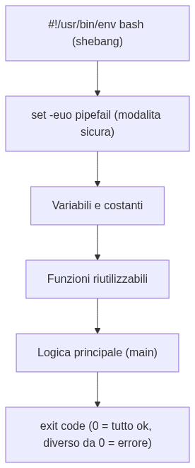

# Don't Be Afraid of Bash

You know that black (or white) window full of text that movies always show when a hacker is "breaking into the system"? That's a **terminal**, and the text you type into it is **bash** commands. It's only scary because you don't know it yet: in reality it's one of the most powerful and simplest tools that exist, and in this playbook you'll learn to use it without terror, with real examples and plenty of real-world analogies. No prerequisites: if you know what a file and a folder are, you're already ready.

---

## 1. Introduction to Bash

### What it really is

Deep down, the computer only understands text commands. When you double-click an icon, someone else (the operating system) is actually translating that click into a command that looks something like "open this program". **Bash** lets you give those same commands directly, by typing them, instead of going through icons.

🧠 **Analogy**: clicking icons is like ordering at a restaurant by pointing at photos on the menu. Using Bash is like talking directly to the cook, telling them exactly what you want, with which ingredients and in what order. At first it seems more complicated, but as soon as you learn the right words, you get exactly what you want, much faster — and you can even write the "recipe" once and have it repeated a thousand times.

### Three words people always mix up

| Term | What it is |
|---|---|
| **Terminal** | The black window. It's just the "screen" where you type and read text. |
| **Shell** | The program that reads what you type and executes it. Bash is one shell among many (there are others: `zsh`, `fish`...). |
| **Bash** | The name of ONE specific shell — "Bourne Again SHell" — the most widespread in the world, present on almost every server, Docker container, and Mac/Linux machine. |

> 💡 **Tip**: to find out which shell you're currently using, type `echo $SHELL`. To find out which version of Bash you have, type `bash --version`.

### Your first 4 commands

```bash
pwd      # "Print Working Directory" — where am I right now?
ls       # "LiSt" — what's in this folder?
cd       # "Change Directory" — move to another folder
echo     # print something on screen
```

```bash
$ pwd
/home/user/projects

$ ls
pizzahub  notes.txt  photos

$ cd pizzahub
$ pwd
/home/user/projects/pizzahub

$ echo "Hello Bash!"
Hello Bash!
```

> 🧠 **Golden rule**: in Bash, almost every command has the same shape: `command [options] [arguments]`. `ls -la /home` is "the command `ls`, with the options `-l` (detailed list) and `-a` (also show hidden files), on the `/home` folder". Once you get this grammar, learning a new command is just a matter of remembering its options.

### Why it's worth learning

This isn't nostalgia for tinkerers: every server, every Docker container, every CI/CD pipeline (the robots that automatically test and publish code) speaks Bash. If you work in software — even just a little — sooner or later you'll find yourself in front of a terminal, and knowing how to use it saves you hours of work you'd otherwise do by hand, click after click.

---

## 2. Core commands and instructions (e.g. `awk`)

**One-liner**: Bash has a small army of commands, each specialized in one precise task. The real power isn't knowing them all by heart, but knowing how to **combine them**.

### Commands for moving around files and folders

```bash
mkdir recipes          # create a folder
cp recipe.txt backup/    # copy a file
mv recipe.txt recipes/     # move (or rename) a file
rm old.txt                # delete a file (WARNING: there's no trash bin!)
cat recipe.txt                  # print the ENTIRE content of a file
head -n 5 log.txt                   # print only the FIRST 5 lines
tail -n 5 log.txt                      # print only the LAST 5 lines
```

> 💡 **Tip**: `rm` doesn't send files to a trash bin, it really deletes them. Before using it with `*` (which means "all files"), stop for a second and re-read the command. It's the most famous beginner mistake of all time.

### The text champions: `grep`, `sed`, `sort`, `wc`

```bash
grep "error" log.txt        # find lines that contain "error"
grep -i "error" log.txt        # same as above, but ignores upper/lowercase
grep -c "error" log.txt           # count HOW MANY lines contain "error"

sort names.txt                # sort lines alphabetically
sort -n numbers.txt              # sort lines as NUMBERS, not text

wc -l log.txt                # count how many lines the file has
uniq -c                   # count consecutive duplicates
```

### `awk`: the Swiss army knife of columns

`awk` reads a file **line by line**, and for each line splits it into "columns" separated by spaces (or by another character, if you tell it to). Then you decide what to do with those columns.

```
# orders.txt
Margherita  6.50  3
Diavola     8.00  1
FourCheese  9.00  2
```

```bash
awk '{print $1}' orders.txt
# Margherita
# Diavola
# FourCheese
# $1 = first column, $2 = second column, $0 = the whole line

awk '{print $1, $2 * $3}' orders.txt
# Margherita 19.5
# Diavola 8
# FourCheese 18
# computes price * quantity for every line!

awk '$3 > 1 {print $1}' orders.txt
# Margherita
# FourCheese
# print only the pizzas ordered more than once
```

🧠 **Analogy**: `awk` is like a spreadsheet that lives in the terminal — every line is a "row" of the spreadsheet, every space-separated word is a "column". Instead of clicking on a cell, you write `$2` to say "column number 2".

### Pipes: chaining commands together

The `|` symbol (called a **pipe**) takes the output of one command and passes it as input to the next command.

```bash
cat access.log | grep "ERROR" | awk '{print $2}' | sort | uniq -c
```


> 🧠 **Golden rule**: read every pipeline like an assembly line: each command does **one simple thing**, and passes the result to the next command. `cat` reads the file, `grep` filters only the error lines, `awk` extracts the IP address, `sort` puts them in order, `uniq -c` counts how many times each one repeats. No single command, on its own, is complicated — it's the chain that does the hard work.

### Redirection: saving instead of printing

```bash
echo "Hello" > greeting.txt      # writes to greeting.txt (ERASES whatever was there before!)
echo "Again" >> greeting.txt      # APPENDS to the end, without erasing
command 2> errors.log               # saves only errors to a file
command < input.txt                    # reads input.txt as the command's input
```

> 💡 **Tip**: `>` overwrites, `>>` appends at the end. Mixing them up is the second most famous beginner mistake — one extra `>` and the file you wanted to keep disappears, replaced by the new content.

---

## 3. Constructs

**One-liner**: Bash isn't "just commands" — it's also a real programming language, with variables, `if`, loops, and functions. Less elegant than Python or JavaScript, but enough to automate almost anything.

### Variables

```bash
name="Margherita"          # ⚠️ NO spaces before or after the = sign
echo "Pizza: $name"           # use the variable with $
echo "Pizza: ${name}!"           # with braces, safer when text follows immediately after

price=6.50
quantity=3
total=$((price * quantity))    # arithmetic: $(( ... ))
echo "Total: $total"
```

```bash
# ❌ this does NOT work: spaces around = confuse bash
name = "Margherita"

# ✅ no spaces
name="Margherita"
```

### `if`: deciding what to do

```bash
quantity=3

if [ "$quantity" -gt 0 ]; then
    echo "Valid order"
elif [ "$quantity" -eq 0 ]; then
    echo "Empty order"
else
    echo "Invalid quantity"
fi
```

| Number comparison | Meaning | Text comparison | Meaning |
|---|---|---|---|
| `-eq` | equal | `==` | equal |
| `-ne` | not equal | `!=` | not equal |
| `-gt` | greater than | `-z "$s"` | empty string |
| `-lt` | less than | `-n "$s"` | non-empty string |

> 💡 **Tip**: use `[[ ... ]]` instead of `[ ... ]` when you can — it's a more modern and safer version (for example it won't betray you if a variable is empty), available in Bash (though not in the more minimal `sh`).

### Loops: `for` and `while`

```bash
# for: repeat for every element in a list
for pizza in Margherita Diavola FourCheese; do
    echo "Preparing the $pizza"
done

# for over files
for file in *.txt; do
    echo "Found: $file"
done

# while: repeat as long as a condition is true
counter=1
while [ "$counter" -le 5 ]; do
    echo "Attempt number $counter"
    counter=$((counter + 1))
done
```

### `case`: a more readable `switch` than a pile of `if`s

```bash
case "$1" in
    start)
        echo "Starting the service"
        ;;
    stop)
        echo "Stopping the service"
        ;;
    *)
        echo "Usage: $0 {start|stop}"
        ;;
esac
```

### Functions: don't repeat the same code twice

```bash
greet() {
    local name="$1"          # $1 = first argument passed to the function
    echo "Hello, $name!"
}

greet "World"        # Hello, World!
```

```bash
add() {
    local a="$1"
    local b="$2"
    echo $((a + b))         # to "return" a value, print it with echo...
}

result=$(add 3 5)      # ...and capture it with $( )
echo "The result is $result"
```

> 🧠 **Golden rule**: Bash functions don't have a real "return a value" like other languages — `return` in Bash is only for the exit code (0 = success, non-zero = error). To have a function "return" a piece of data, the convention is to print the value with `echo` and capture it from outside with `$(...)`, as in the example above.

### Arrays: lists of values

```bash
pizzas=("Margherita" "Diavola" "Four Cheese")

echo "${pizzas[0]}"             # Margherita (the first element, index 0)
echo "${pizzas[@]}"                # all the elements
echo "${#pizzas[@]}"                  # how many elements there are: 3

for pizza in "${pizzas[@]}"; do
    echo "- $pizza"
done
```

---

## 4. How do I program in Bash — where do I start?

**One-liner**: a Bash script is just a text file with Bash commands inside, one per line, that the computer executes in sequence from top to bottom — exactly like you'd type them by hand into the terminal.

### Anatomy of a script



```bash
#!/usr/bin/env bash
# ↑ this line is called the "shebang": it tells the system "run this file with bash"

set -euo pipefail
# ↑ safe mode: stop at the first error (-e), stop if I use
#   a variable that doesn't exist (-u), fail a pipeline
#   if ANY of the commands inside it fails (-o pipefail)

BACKUP_FOLDER="/home/user/backup"    # a constant, in UPPERCASE by convention

create_folder_if_needed() {
    if [ ! -d "$BACKUP_FOLDER" ]; then
        mkdir -p "$BACKUP_FOLDER"
        echo "Folder created: $BACKUP_FOLDER"
    fi
}

main() {
    create_folder_if_needed
    echo "Ready for backup!"
}

main
```

### From script to command: `chmod +x`

```bash
chmod +x backup.sh    # makes the file "executable"
./backup.sh               # runs it (the "./" means "look here, in this folder")
```

> 💡 **Tip**: if you forget `chmod +x`, the system responds with "Permission denied" — it's not a mysterious error, it simply means "this file doesn't have permission to be executed". You can also run it without making it executable, by typing `bash backup.sh`.

### Arguments: talking to your script

```bash
#!/usr/bin/env bash
# usage: ./greet.sh John Smith

echo "First name: $1"          # $1 = first argument
echo "Last name: $2"          # $2 = second argument
echo "All: $@"               # $@ = all the arguments
echo "How many: $#"                 # $# = how many arguments were passed
echo "Who ran me: $0"        # $0 = the name of the script itself
```

```bash
$ ./greet.sh John Smith
First name: John
Last name: Smith
All: John Smith
How many: 2
Who ran me: ./greet.sh
```

### Exit codes: how a script says "I succeeded" or "I failed"

```bash
#!/usr/bin/env bash

if [ ! -f "orders.csv" ]; then
    echo "Error: file not found" >&2   # >&2 sends the message to errors, not normal output
    exit 1                                     # non-zero = "something went wrong"
fi

echo "File found, proceeding"
exit 0        # zero = "everything's fine" (it's also the default value if you don't write exit)
```

```bash
./check.sh
echo "The previous command returned: $?"    # $? = exit code of the LAST command that ran
```

> 🧠 **Golden rule**: every Bash command, when it finishes, returns a number: `0` means "all good", any other number means "something went wrong". This is how scripts talk to each other and to the outside world (for example, a CI/CD pipeline checks the exit code to decide whether your test passed or not).

### Where do I actually start?

1. Open the terminal and try the commands from section 2, one at a time.
2. Write an alias for a command you use often (`alias ll="ls -la"` in your `~/.bashrc`).
3. Turn a sequence of commands you repeat by hand into a small 5-line script.
4. Install **ShellCheck** (`shellcheck backup.sh`): it's an automatic checker that flags mistakes and common errors before they become real problems. Almost every professional Bash script uses it.
5. Only after that, explore more advanced constructs (associative arrays, `trap`, `getopts` for options like `-h`/`--help`).

> 💡 **Tip**: you don't need to learn all of Bash before starting. The best way to learn is to automate something tedious you actually do — even just renaming 10 files — and grow from there.

---

## 5. Good parts, Bad parts

**One-liner**: Bash is phenomenal at certain things and terrible at others. Knowing where the boundary is saves you hours of frustration.

### The "good parts"

| Strength | Why it matters |
|---|---|
| **It's everywhere** | Every Linux server, every Docker container, macOS: Bash (or a compatible shell) is always there, no installation needed |
| **Pipes** | Combining small commands with `\|` is incredibly powerful for manipulating text and files |
| **Blazing fast for simple tasks** | Renaming 100 files, searching through thousands of log lines: Bash does it in one line, another language would need a whole program |
| **The perfect "glue"** | Bash is the ideal language for orchestrating *other* programs (Docker, git, curl, your own scripts) |
| **CI/CD speaks Bash** | Almost every GitHub Actions, GitLab CI, Jenkins pipeline runs Bash commands under the hood |

### The "bad parts"

```bash
# ❌ without quotes, spaces in filenames break everything
rm $file_to_delete
# if $file_to_delete equals "important document.txt",
# bash reads it as TWO arguments: "important" and "document.txt"!

# ✅ always put variables in quotes
rm "$file_to_delete"
```

```bash
# ❌ without `set -e`, a script keeps going even after a serious error
cd /folder/that/does/not/exist
rm -rf *          # oops... this runs in the WRONG folder!

# ✅ with set -e, the script stops at the first error
set -e
cd /folder/that/does/not/exist     # the script stops here, rm never runs
rm -rf *
```

> 🧠 **Golden rule**: Bash's reputation as a "dangerous" language comes almost entirely from these two problems — unquoted variables and missing `set -euo pipefail`. Fix them in every script you write, and most of the disasters told in internet urban legends simply won't happen to you.

| ❌ Where Bash is weak | Use instead |
|---|---|
| Complex logic, with lots of calculations or data structures | Python, or any "real" language |
| Robust error handling (structured try/catch) | Python, Go, or a language with real exceptions |
| Reliably manipulating JSON/XML | Python with dedicated libraries (or `jq` for simple JSON) |
| Large programs, maintained by many people | A language with tests, types, a real package manager |
| Perfect portability across different systems | Careful: `bash` on Mac is often older than the one on Linux, and not every system has Bash (some only have `sh`) |

> 💡 **Tip**: the practical rule most professionals use is "if your Bash script goes past 100 lines, or needs real error handling, it's time to rewrite it in Python". Bash is perfect as the glue between the pieces, not for being the entire application.

---

## 6. 5 simple "recipes"

Five small, practical scripts, ready to copy and adapt. Each one uses only what you've already learned in this playbook.

### Recipe 1 — The backup with an automatic date

```bash
#!/usr/bin/env bash
set -euo pipefail

FOLDER="$1"
DATE=$(date +%Y%m%d)
DESTINATION="backup-${DATE}.tar.gz"

tar czf "$DESTINATION" "$FOLDER"
echo "Backup created: $DESTINATION"
```

```bash
./backup.sh pizzahub/
# Backup created: backup-20260717.tar.gz
```

### Recipe 2 — The log detective

```bash
#!/usr/bin/env bash
set -euo pipefail

LOG_FILE="$1"

echo "Errors found by type:"
grep "ERROR" "$LOG_FILE" | awk '{print $3}' | sort | uniq -c | sort -rn
```

```bash
./detective.sh access.log
# Errors found by type:
#      12 timeout
#       5 not_found
#       2 unauthorized
```

### Recipe 3 — The tireless watchman

```bash
#!/usr/bin/env bash
set -euo pipefail

URL="$1"

while true; do
    if curl -s -o /dev/null -w "%{http_code}" "$URL" | grep -q "200"; then
        echo "$(date): $URL is online ✅"
    else
        echo "$(date): $URL is NOT responding! ❌"
    fi
    sleep 60
done
```

```bash
./watchman.sh https://pizzahub.example.com
# Mon Jul 17 2026 10:00:01: https://pizzahub.example.com is online ✅
# Mon Jul 17 2026 10:01:01: https://pizzahub.example.com is online ✅
```

### Recipe 4 — The bulk renamer

```bash
#!/usr/bin/env bash
set -euo pipefail

for file in *.jpeg; do
    [ -e "$file" ] || continue           # if there are no .jpeg files, exit without errors
    new_name="${file%.jpeg}.jpg"       # strips ".jpeg" and adds ".jpg"
    mv "$file" "$new_name"
    echo "Renamed: $file → $new_name"
done
```

```bash
./rename.sh
# Renamed: pizza1.jpeg → pizza1.jpg
# Renamed: pizza2.jpeg → pizza2.jpg
```

### Recipe 5 — The automatic cleaner

```bash
#!/usr/bin/env bash
set -euo pipefail

TEMP_FOLDER="/tmp/pizzahub-cache"
DAYS=30

echo "Looking for files older than $DAYS days in $TEMP_FOLDER..."
find "$TEMP_FOLDER" -type f -mtime "+${DAYS}" -print -delete
echo "Cleanup complete"
```

```bash
./cleanup.sh
# Looking for files older than 30 days in /tmp/pizzahub-cache...
# /tmp/pizzahub-cache/old-report.csv
# Cleanup complete
```

> 💡 **Tip**: notice that all five recipes start the same way: shebang + `set -euo pipefail`. That's not a coincidence — it's habit number one that separates a script written by a beginner from one written by someone who's already been burned a few times.

---

## In summary

1. **Bash is just a way of talking to the computer with text instead of clicks** — terminal (the window), shell (the program), Bash (a specific shell) are three different things.
2. **Commands combine through pipes** (`|`): each command does one simple thing, and the power comes from chaining them together.
3. **`awk` is the Swiss army knife of text columns** — learn `$1`, `$2`, `$0` and you unlock half of all data-manipulation problems.
4. **Variables, `if`, loops, functions**: Bash is a real programming language, just with its own syntax.
5. **Every script starts with a shebang and `set -euo pipefail`**: it's the habit that saves you from half of all disasters.
6. **Bash is perfect as the glue between systems and for automating repetitive tasks** — not for building an entire application: there, switch to a "real" language.

Now open up that black terminal and stop being afraid. 🐚
