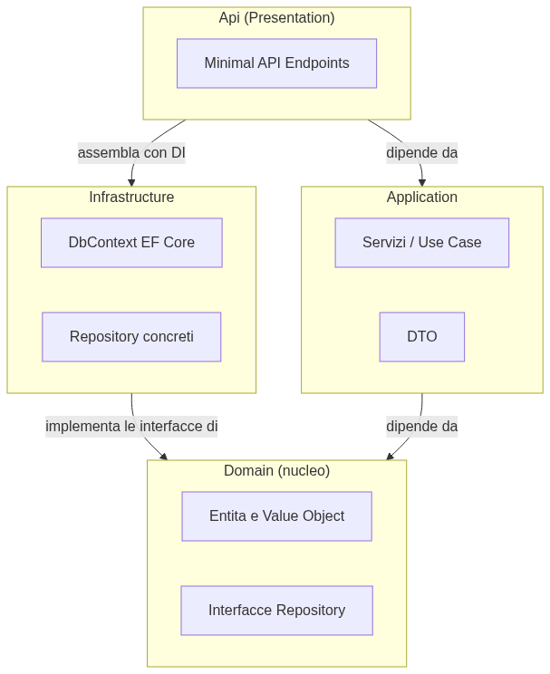
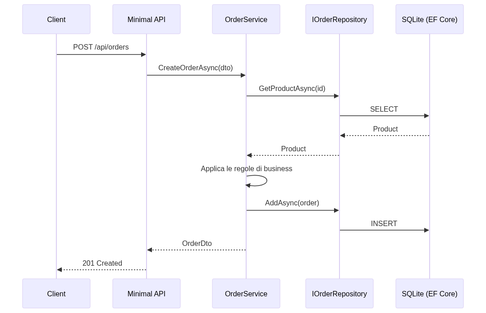

# .NET Pragmatic Approach

Back in 2000 Microsoft launched **.NET Framework**, a closed runtime, Windows only. For years it was a solid enterprise tool, but isolated from the rest of the world: no Linux, no Mac, no open source. Then, in 2016, something rare happened for a company the size of Microsoft: a complete rewrite, and the decision to make everything **open source, free, and cross-platform**. **.NET Core** was born. In 2020, with version 5, the name went back to simply **.NET** — a single runtime, for Windows, Linux, macOS, and even mobile devices and the browser (via Blazor).

Today, with **.NET 10** (released in November 2025, an **LTS** release — Long Term Support, 3 years of guaranteed maintenance), .NET is one of the most pragmatic runtimes around: nearly as fast as Go or Rust in web benchmarks, nearly as productive as Python or Ruby to write, and with a compiler (Roslyn) that saves you from a huge number of mistakes **before you even run a single line**.

The man behind C# is **Anders Hejlsberg**, the same architect behind **Turbo Pascal**, **Delphi**, and — more recently — **TypeScript**. It's no accident that C# feels familiar to Java developers (similar syntax, static typing, garbage collector) while also feeling pleasant to Python or Ruby developers, thanks to `var`, LINQ, and an ever-growing pile of modern syntactic sugar.

This playbook isn't an exhaustive manual — there are already thousands of those. It's a **pragmatic** guide: minimal fluff, discipline, and the straight path to "how real .NET is written today, the right way." By the end you'll build a small management application from scratch, putting every concept you learn along the way into practice.

---

## 1. Introduction to the Framework

**In short**: .NET is a cross-platform, open-source, high-performance runtime. The SDK gives you everything you need — compiler, package manager, test runner — with a single command: `dotnet`.

### The four pieces of the puzzle

When someone says ".NET" they actually mean four different things, often confused with one another:

| Piece | What it is | Java equivalent | Python equivalent |
|---|---|---|---|
| **SDK** | Everything needed to *develop*: compiler, CLI, templates | JDK | the Python interpreter + pip |
| **Runtime (CLR)** | The *Common Language Runtime* — executes compiled code, manages memory (GC) | JVM | CPython |
| **BCL** | *Base Class Library* — the foundational classes (`String`, `List<T>`, `File`...) | java.lang, java.util | the stdlib |
| **C#** | The language you write (not the only one: F# and VB.NET also run on .NET) | Java (the language) | Python (the language) |

C# code isn't compiled directly to machine code. It's compiled to **IL** (Intermediate Language, bytecode), and the **CLR** runs it through a **JIT** (Just-In-Time) compiler — exactly like the JVM does with Java bytecode. Anyone who knows Java will feel right at home here: same mental model, different names.

### .NET 10: what's new (pragmatically speaking)

.NET 10 is an **LTS** release: the one to build serious projects on, since it gets security updates for 3 years (versus 18 months for the intermediate STS releases). Pragmatic news that actually matters day to day:

- **C# 14**: new *extension members* (extend properties, not just methods, on existing types), the `field` keyword to access the field a property auto-generates without writing a private backing field by hand, and null-conditional assignment (`utente?.Nome = "Ada"`).
- **Native AOT** keeps maturing: you can compile your app into a native executable, without the JIT runtime, with near-instant startup — great for containers and serverless.
- **Performance**: every .NET release since 6 has pushed hard on reduced allocations, `Span<T>`, and a smarter JIT. .NET is today one of the fastest web-facing runtimes in the world according to the TechEmpower benchmarks.
- **Minimal API** is now mature and considered the default style for building HTTP services (we'll see this in section 9).

> 💡 **Tip**: no need to chase every new feature. This playbook's "pragmatic approach" uses stable, widely adopted features — the ones you'll find in a real enterprise project today, not the latest preview's experiments.

### If you're coming from Java or Python: the mindset shift

```java
// Java: classes, semicolons, static void main
public class Program {
    public static void main(String[] args) {
        System.out.println("Ciao!");
    }
}
```

```csharp
// C# 10+: top-level statements — no class, no explicit Main
Console.WriteLine("Ciao!");
```

```python
# Python: no declared type, no semicolon
print("Ciao!")
```

| Aspect | Java | Python | C# / .NET |
|---|---|---|---|
| Typing | Static, explicit | Dynamic | Static, but with `var` (inference) |
| Compilation | Bytecode → JVM | Interpreted | IL → CLR (JIT) or native (AOT) |
| Package manager | Maven / Gradle | pip / poetry | **NuGet** (`dotnet add package`) |
| Null safety | Absent (until `Optional`) | Absent (`None` everywhere) | **Nullable Reference Types** (the compiler warns you) |
| Immutability | `record` (Java 16+) | `dataclass(frozen=True)` | `record` (since 2020, C# 9) |
| Async | Thread / `CompletableFuture` | `asyncio` | native `async`/`await`, integrated everywhere |

The single most important point for anyone coming from Java: **C# adopted many modern ideas before Java did** (LINQ in 2007, `async`/`await` in 2012, records in 2020) — so a lot of things will feel like "what Java added later, but done better and built into the language."

### Who uses .NET?

**Stack Overflow** (the whole site runs on .NET, handling enormous traffic with very few servers), **Microsoft itself** (Azure, Bing, Xbox Live), major banks and insurance companies (where enterprise reliability matters more than trends), **Unity** (the most widely used game engine in the world uses C# as its scripting language), and thousands of companies that pick .NET for its balance of productivity, performance, and long-term maintenance cost.

---

## 2. The Basic Concepts

**In short**: C# is a statically typed language with inference (`var`), a clean distinction between value types and reference types, and a null-safety system the compiler enforces for you.

### A minimal program

```csharp
// Program.cs — this is an entire .NET 10 program, in full.
var nome = "Ada";
Console.WriteLine($"Ciao, {nome}!");
```

No `class Program`, no `static void Main`. These "top-level statements" (since C# 9) strip away the boilerplate that used to scare beginners — and anyone coming from Python will feel right at home.

### Variables and `var`

```csharp
var eta = 36;              // the compiler INFERS int — it's not dynamic, it's static and inferred
var nome = "Ada";           // string, decided at compile time, never changes
int altezza = 165;             // explicit, works identically

// const: a fixed value, known at compile time
const double Pi = 3.14159;

// neither of the following lines compiles:
// eta = "trentasei";  ❌ compile error — eta is int, forever
```

> 🧠 **The golden rule**: `var` **is not** `dynamic`. The type is decided once and for all by the compiler based on the assigned value. Use `var` when the type is obvious from context (`var lista = new List<string>()`), write the explicit type when it aids readability (`int risultato = CalcolaComplesso()`).

### Value type vs Reference type — the most important concept

This is the distinction that anyone coming from Python or Ruby (where "everything is a reference object") needs to recalibrate first:

```csharp
// struct = value type: it gets COPIED when you assign or pass it
struct Punto
{
    public int X, Y;
}

var p1 = new Punto { X = 1, Y = 2 };
var p2 = p1;          // p2 is an INDEPENDENT copy of p1
p2.X = 99;
Console.WriteLine(p1.X);   // => 1, unchanged!

// class = reference type: a REFERENCE to the same object is shared
class Persona
{
    public string Nome = "";
}

var pers1 = new Persona { Nome = "Ada" };
var pers2 = pers1;          // pers2 points to the SAME object as pers1
pers2.Nome = "Grace";
Console.WriteLine(pers1.Nome);   // => "Grace", because it's the same object!
```

| | `struct` (value type) | `class` (reference type) |
|---|---|---|
| Where it lives | Typically on the stack (faster) | On the heap, managed by the Garbage Collector |
| Assignment | Copies the value | Copies the reference |
| Typical use | Small immutable data: `int`, `DateTime`, coordinates | Entities with identity, complex objects, most of your code |

> 🧠 **The golden rule**: 95% of the time you'll use `class`. Use `struct` only for small immutable values with no identity of their own (e.g. `Point`, `Money` as a value object — section 5). If in doubt, `class` is almost always the right call.

### Nullable Reference Types: no more `NullPointerException`

```csharp
#nullable enable   // enabled by default in modern projects

string nome = null;   // ⚠️ the compiler WARNS you: you're assigning null to a non-nullable type

string? soprannome = null;   // ✅ the `?` explicitly declares: "this can be null"

// the compiler FORCES you to check before you use it:
if (soprannome != null)
{
    Console.WriteLine(soprannome.Length);   // ok, the compiler knows it's not null here
}

Console.WriteLine(soprannome?.Length ?? 0);   // null-conditional + null-coalescing, in one line
```

Anyone coming from Java knows the pain of a runtime `NullPointerException`, often miles away from where the `null` was assigned. In C#, the compiler tracks the "nullability" of every variable and warns you **before the code runs**, not after it's already gone to production.

### Record: pragmatic immutability

```csharp
// A record is a type meant to represent DATA, with equality by VALUE
public record Prodotto(string Nome, decimal Prezzo);

var p1 = new Prodotto("Tastiera", 49.90m);
var p2 = new Prodotto("Tastiera", 49.90m);

Console.WriteLine(p1 == p2);   // => true! Compares VALUES, not references
                                 // (with a regular class, this would have been false)

// "with expression": creates a modified copy, the original stays untouched
var p3 = p1 with { Prezzo = 39.90m };
Console.WriteLine(p1.Prezzo);   // => 49.90, unchanged
```

Records are the default choice for DTOs, Value Objects (section 5), and any data that represents "a value," not "an entity with an identity that changes over time."

### Pattern Matching

```csharp
object valore = 42;

string descrizione = valore switch
{
    int n when n < 0  => "negativo",
    int n when n == 0 => "zero",
    int n              => $"positivo: {n}",
    string s           => $"è una stringa: {s}",
    null                => "è null",
    _                    => "boh"
};

// pattern matching on records, to "destructure" data
if (p1 is Prodotto { Prezzo: > 100 } costoso)
{
    Console.WriteLine($"{costoso.Nome} è caro!");
}
```

### Collections and LINQ

**LINQ** (*Language Integrated Query*) is probably the feature that makes C# most enjoyable to write for anyone who loves `map`/`filter`/`reduce` in Ruby or list comprehensions in Python:

```csharp
var numeri = new List<int> { 1, 2, 3, 4, 5, 6 };

var pari = numeri.Where(n => n % 2 == 0);          // filter
var quadrati = numeri.Select(n => n * n);           // map
var somma = numeri.Sum();                             // reduce, already built in
var totale = numeri.Aggregate(0, (acc, n) => acc + n);  // generic reduce

// "fluent" query, readable, composable
var risultato = numeri
    .Where(n => n > 2)
    .Select(n => n * 10)
    .OrderByDescending(n => n)
    .ToList();   // => [60, 50, 40, 30]

// alternative "query" syntax, SQL-inspired — less common but valid
var altraQuery = from n in numeri
                  where n % 2 == 0
                  select n * n;
```

> 💡 **Tip**: LINQ is **lazy** (deferred evaluation) until you call `.ToList()`, `.ToArray()`, `.Count()`, or iterate with `foreach`. That means you can compose complex queries without wasting memory — we'll see this come in handy with Entity Framework in the next section, where LINQ translates directly into SQL.

---

## 3. Entity Framework (Core)

**In short**: Entity Framework Core (EF Core) is .NET's official ORM. You write C# classes, EF Core generates the database schema and translates your LINQ queries into SQL.

### What an ORM is, in one sentence

An **ORM** (*Object-Relational Mapper*) translates between two worlds that speak different languages: the C# objects in your app, and the relational tables in the database. Without an ORM you'd write SQL by hand everywhere; with EF Core you write C#, and EF Core generates the SQL for you — while still letting you drop down to raw SQL whenever you genuinely need to.

### `DbContext` and `DbSet`

```csharp
public class Prodotto
{
    public int Id { get; set; }
    public string Nome { get; set; } = "";
    public decimal Prezzo { get; set; }
}

public class MagazzinoContext : DbContext
{
    public DbSet<Prodotto> Prodotti => Set<Prodotto>();

    protected override void OnConfiguring(DbContextOptionsBuilder options)
        => options.UseSqlite("Data Source=magazzino.db");
}
```

The `DbContext` is your "aware connection" to the database: it tracks the objects you've loaded, the changes you've made, and knows how to translate them into `INSERT`/`UPDATE`/`DELETE` statements when you call `SaveChanges()`.

### Code-First: the class is the source of truth

```csharp
using var db = new MagazzinoContext();

var tastiera = new Prodotto { Nome = "Tastiera meccanica", Prezzo = 89.90m };
db.Prodotti.Add(tastiera);   // NOT yet written to the database, only "tracked"

db.SaveChanges();             // NOW the INSERT is generated and executed
```

You don't write the SQL schema yourself: you **generate** it from your classes, via **migrations**:

```bash
dotnet tool install --global dotnet-ef        # once only, to get the ef command

dotnet ef migrations add InitialCreate         # generates the migration code
dotnet ef database update                       # applies the migration to the real database
dotnet ef migrations add AggiungiCategoria      # every class change = a new migration
```

Every migration is version-controllable C# code: you can see exactly what changed between one database state and the next, and anyone on the team can recreate the schema from scratch by running all the migrations in order.

### Querying with LINQ

```csharp
// EF Core translates THIS LINQ into SQL, it doesn't run it in memory!
var prodottiCari = db.Prodotti
    .Where(p => p.Prezzo > 50)
    .OrderBy(p => p.Nome)
    .ToList();

// generates something like:
// SELECT * FROM Prodotti WHERE Prezzo > 50 ORDER BY Nome
```

### Relationships

```csharp
public class Categoria
{
    public int Id { get; set; }
    public string Nome { get; set; } = "";
    public List<Prodotto> Prodotti { get; set; } = [];   // one-to-many
}

public class Prodotto
{
    public int Id { get; set; }
    public string Nome { get; set; } = "";
    public decimal Prezzo { get; set; }

    public int CategoriaId { get; set; }             // foreign key
    public Categoria? Categoria { get; set; }          // navigation property
}

// Include(): EXPLICITLY loads the relationship (eager loading)
var prodotti = db.Prodotti
    .Include(p => p.Categoria)
    .ToList();
```

> 🧠 **The golden rule — the N+1 problem**: if you access `prodotto.Categoria` **without** having called `Include()`, EF Core can run a separate query for every single product (with *lazy loading* enabled) — a performance disaster with 1,000 products. Always use explicit `Include()` for relationships you already know you'll need to read. It's the same trap Java developers know as Hibernate's "N+1 problem."

### Tracking vs `AsNoTracking`

```csharp
// by default, EF Core "tracks" every loaded entity (to detect changes to save later)
var prodotto = db.Prodotti.First();   // TRACKED — slower, uses memory for comparison

// for read-only queries (e.g. an API that returns data without ever modifying it):
var prodottiSoloLettura = db.Prodotti
    .AsNoTracking()
    .ToList();   // faster, no tracking overhead
```

> 💡 **Tip**: use `AsNoTracking()` for **every** read-only query — it's one of the simplest, highest-impact optimizations in EF Core, and you'll use it constantly in the `GET` endpoints of your APIs (section 9).

---

## 4. OOP, the Right Way, the Pragmatic Way

**In short**: C# is a fully object-oriented language, but being "pragmatic" means favoring composition over inheritance, using small, focused interfaces, and not applying patterns just for the sake of applying them.

### Interfaces vs abstract classes

```csharp
// interface: a CONTRACT, no shared implementation
public interface INotificatore
{
    Task InviaAsync(string destinatario, string messaggio);
}

public class EmailNotificatore : INotificatore
{
    public Task InviaAsync(string destinatario, string messaggio)
    {
        Console.WriteLine($"Email a {destinatario}: {messaggio}");
        return Task.CompletedTask;
    }
}

public class SmsNotificatore : INotificatore
{
    public Task InviaAsync(string destinatario, string messaggio)
    {
        Console.WriteLine($"SMS a {destinatario}: {messaggio}");
        return Task.CompletedTask;
    }
}
```

Code that uses `INotificatore` never knows — and doesn't care — whether it's talking to an email or an SMS. This is **polymorphism through interfaces**, and it's the foundation of the Dependency Injection we'll see in section 9.

| | Interface | Abstract class |
|---|---|---|
| Shared implementation | No (contract only, except default members) | Yes, can contain common code |
| Multiple inheritance | A class can implement **many** | A class can inherit from **only one** |
| When to use it | Almost always: contracts, dependencies to inject | Rarely: when you genuinely need to share implementation between closely related types |

> 🧠 **The golden rule**: always start with an interface. Add an abstract class only once you notice you're duplicating the same concrete code across multiple implementations — and even then, consider composition first.

### Composition over Inheritance

```csharp
// ❌ Deep inheritance: fragile, hard to change
public class Uccello { public virtual void Vola() => Console.WriteLine("Volo!"); }
public class Pinguino : Uccello { public override void Vola() => throw new NotSupportedException(); }
// ⚠️ penguins are birds, but they don't fly — the inheritance is lying to you

// ✅ Composition: compose behaviors, not family trees
public interface IMovimento { void Muoviti(); }

public class VoloComportamento : IMovimento { public void Muoviti() => Console.WriteLine("Volo!"); }
public class NuotoComportamento : IMovimento { public void Muoviti() => Console.WriteLine("Nuoto!"); }

public class Animale(string nome, IMovimento movimento)   // primary constructor, C# 12+
{
    public void Muoviti() => movimento.Muoviti();
}

var pinguino = new Animale("Pingu", new NuotoComportamento());
var aquila = new Animale("Aquila", new VoloComportamento());
```

Every `Animale` **has** a way of moving, instead of being forced **to be** something inside a rigid hierarchy that doesn't actually reflect reality. This is the Gang of Four's *"favor composition over inheritance"* principle — just as true in C# as it is in Java.

### SOLID, applied pragmatically

| Principle | The textbook version | The pragmatic version |
|---|---|---|
| **S**ingle Responsibility | A class has only one reason to change | If the class name contains an "and" ("Manager**And**Validator"), split it |
| **O**pen/Closed | Open for extension, closed for modification | Use interfaces at the points you know will change; don't armor-plate everything "just in case" |
| **L**iskov Substitution | A subclass must be substitutable for its base without breaking anything | If `Pinguino : Uccello` has to throw `NotSupportedException`, the inheritance is wrong (see above) |
| **I**nterface Segregation | Many small interfaces, not one giant one | An `IRepository<T>` with 15 methods is an anti-pattern: split it by responsibility |
| **D**ependency Inversion | Depend on abstractions, not concrete implementations | Your services depend on `INotificatore`, never directly on `EmailNotificatore` |

> 🧠 **The golden rule**: SOLID principles aren't laws of physics, they're heuristics. Apply them when they solve a real problem (code that's hard to test, extend, or understand). Don't apply them "up front" on a small project — that's overengineering, the exact opposite of the pragmatism this playbook preaches.

### Records for data, classes for behavior

A very practical, pragmatic distinction: if a type represents **a value** (a DTO, a coordinate, a date range), use `record`. If it represents **an entity with identity and behavior** (an `Ordine` that knows how to calculate its own total, a `Utente` that knows how to validate itself), use `class`. No further dogma is needed.

---

## 5. Clean Code, Clean Architecture, DDD

**In short**: clean code in C# means honest names, small methods, and zero comments that just repeat what the code already says. Clean Architecture organizes the project into layers with a single rule: dependencies always point inward.

### Clean Code, in practice

```csharp
// ❌ dishonest name, method that does too much
public void ProcessaDati(List<int> d)
{
    var r = new List<int>();
    foreach (var x in d)
    {
        if (x > 0) r.Add(x * 2);
    }
    // ...another 40 lines...
}

// ✅ honest names, a single responsibility per method
public List<int> RaddoppiaValoriPositivi(List<int> numeri)
    => numeri.Where(n => n > 0).Select(n => n * 2).ToList();
```

```csharp
// ❌ the comment just repeats what the code already says
// check if the order is valid
if (ordine.Totale > 0 && ordine.Righe.Count > 0) { }

// ✅ a method with an honest name removes the need for the comment
if (ordine.EValido()) { }
```

> 💡 **Tip**: if you need a comment to explain WHAT a line of code does, the code has a naming problem, not a documentation problem. Save comments for the WHY ("// we use UTC here because the external provider requires it"), never the WHAT.

### Clean Architecture: the layers

```
GestionaleApp/
├── Domain/            ← the core: entities, value objects, interfaces. ZERO external dependencies
├── Application/        ← services, use cases, DTOs. Depends only on Domain
├── Infrastructure/       ← EF Core, concrete repositories, external services. Implements Domain's interfaces
└── Api/                    ← Minimal API, Program.cs. The entry point, wires everything together with DI
```



The **dependency rule** is a single one, and it has no exceptions: the arrows always point inward. `Domain` knows nothing about Entity Framework, HTTP, or any other library — it's pure C#. `Infrastructure` knows about `Domain` (to implement its interfaces), but `Domain` never knows about `Infrastructure`.

```csharp
// Domain/IProdottoRepository.cs — the interface lives in Domain
public interface IProdottoRepository
{
    Task<Prodotto?> GetByIdAsync(int id);
    Task AddAsync(Prodotto prodotto);
}

// Infrastructure/ProdottoRepository.cs — the implementation lives outside, and DEPENDS on Domain
public class ProdottoRepository(MagazzinoContext db) : IProdottoRepository
{
    public Task<Prodotto?> GetByIdAsync(int id) => db.Prodotti.FindAsync(id).AsTask();
    public Task AddAsync(Prodotto prodotto) { db.Prodotti.Add(prodotto); return db.SaveChangesAsync(); }
}
```

The concrete benefit: you can test all the `Application` and `Domain` logic **without a real database**, by swapping `IProdottoRepository` for a fake in-memory one in your tests (section 6). And you can change databases — from SQLite to PostgreSQL — by touching only `Infrastructure`.

### DDD, pragmatically summarized

*Domain-Driven Design* isn't a framework, it's a way of thinking about code as a model of the business domain:

| DDD concept | What it is | Example |
|---|---|---|
| **Entity** | Has an identity that persists over time, even as its data changes | `Ordine` (the same order, even if its status changes) |
| **Value Object** | Defined entirely by its values, with no identity of its own | `Indirizzo`, `Denaro` — two `Denaro(10, "EUR")` are always equal |
| **Aggregate** | A group of entities/value objects treated as one consistent unit | `Ordine` + its `RigaOrdine` items — you never modify a line without going through the order |
| **Repository** | An abstraction for loading/saving an Aggregate, hides the database | `IOrdineRepository` |

```csharp
// Value Object: immutable, equality by value — a record is perfect for this
public record Denaro(decimal Importo, string Valuta)
{
    public static Denaro operator +(Denaro a, Denaro b)
    {
        if (a.Valuta != b.Valuta)
            throw new InvalidOperationException("Non puoi sommare valute diverse");
        return a with { Importo = a.Importo + b.Importo };
    }
}

// Entity with real behavior, not just data (the opposite of an "anemic model")
public class Ordine
{
    public int Id { get; private set; }
    private readonly List<RigaOrdine> _righe = [];
    public IReadOnlyList<RigaOrdine> Righe => _righe;

    public void AggiungiRiga(Prodotto prodotto, int quantita)
    {
        if (quantita <= 0) throw new ArgumentException("La quantità deve essere positiva");
        _righe.Add(new RigaOrdine(prodotto, quantita));
    }

    public Denaro Totale() =>
        _righe.Aggregate(new Denaro(0, "EUR"), (tot, riga) => tot + riga.Subtotale());
}
```

> 🧠 **The golden rule — anemic model vs rich model**: an "anemic model" (`Ordine` with only `get`/`set`, and all the logic scattered across controllers) is the most common anti-pattern in enterprise code. A rich model, like `Ordine` above, can answer questions about its own state on its own (`Totale()`) and protects its own invariants (`AggiungiRiga` rejects negative quantities). Business logic lives where the data it touches lives.

---

## 6. TDD

**In short**: TDD (Test-Driven Development) in .NET is typically written with **xUnit**, following the Red-Green-Refactor cycle and the Arrange-Act-Assert structure.

### The Red-Green-Refactor cycle

1. **Red**: write a test that describes the behavior you want, and watch it fail (because the code doesn't exist yet).
2. **Green**: write the minimum code needed to make the test pass — nothing more.
3. **Refactor**: clean up the code (and the test, if needed), with the confidence that the test will warn you if you break something.

### Arrange-Act-Assert structure with xUnit

```csharp
// GestionaleApp.Tests/OrdineTests.cs
using Xunit;

public class OrdineTests
{
    [Fact]
    public void AggiungiRiga_ConQuantitaPositiva_AggiungeLaRiga()
    {
        // Arrange — set up the data and dependencies
        var ordine = new Ordine();
        var prodotto = new Prodotto { Nome = "Tastiera", Prezzo = 50m };

        // Act — perform the action you want to test
        ordine.AggiungiRiga(prodotto, 2);

        // Assert — verify the expected result
        Assert.Single(ordine.Righe);
        Assert.Equal(100m, ordine.Totale().Importo);
    }

    [Fact]
    public void AggiungiRiga_ConQuantitaNegativa_LanciaEccezione()
    {
        var ordine = new Ordine();
        var prodotto = new Prodotto { Nome = "Tastiera", Prezzo = 50m };

        Assert.Throws<ArgumentException>(() => ordine.AggiungiRiga(prodotto, -1));
    }

    [Theory]
    [InlineData(1, 50)]
    [InlineData(3, 150)]
    [InlineData(10, 500)]
    public void Totale_ConQuantitaVariabile_CalcolaCorrettamente(int quantita, decimal atteso)
    {
        var ordine = new Ordine();
        ordine.AggiungiRiga(new Prodotto { Nome = "Tastiera", Prezzo = 50m }, quantita);

        Assert.Equal(atteso, ordine.Totale().Importo);
    }
}
```

`[Fact]` is a single test. `[Theory]` + `[InlineData]` runs the same test with several different inputs — very useful for not repeating the same Arrange-Act-Assert ten times over.

### Mocking dependencies

Thanks to Clean Architecture (section 5), testing application logic doesn't require a real database — a fake `IProdottoRepository` is enough:

```csharp
using NSubstitute;   // a modern mocking library, an alternative to Moq

public class OrdineServiceTests
{
    [Fact]
    public async Task CreaOrdineAsync_ConProdottoEsistente_CreaEValida()
    {
        // Arrange — a FAKE repository, that returns an already-prepared product
        var repo = Substitute.For<IProdottoRepository>();
        repo.GetByIdAsync(1).Returns(new Prodotto { Id = 1, Nome = "Tastiera", Prezzo = 50m });

        var service = new OrdineService(repo);

        // Act
        var ordine = await service.CreaOrdineAsync(prodottoId: 1, quantita: 2);

        // Assert
        Assert.Equal(100m, ordine.Totale().Importo);
        await repo.Received(1).GetByIdAsync(1);   // verify it was CALLED, not just check the result
    }
}
```

> 🧠 **The golden rule**: mock the boundaries of the system (repositories, external HTTP calls, the system clock) — never the object you're actually testing. If your test needs 6 mocks to test a single class, that's a sign the class is doing too much: go back to section 4 (Single Responsibility).

### Commands

```bash
dotnet new xunit -o GestionaleApp.Tests    # creates a test project
dotnet test                                    # runs all tests
dotnet test --filter "Ordine"                   # runs only tests matching "Ordine"
dotnet watch test                                 # reruns tests on every save — great for TDD
```

---

## 7. The Tools (CLI, NuGet)

**In short**: everything you need to work with .NET goes through a single command: `dotnet`. Packages are called NuGet packages, the direct equivalent of a Ruby gem or a pip package.

### The `dotnet` command

```bash
dotnet new webapi -o GestionaleApi     # creates a new project from a template
dotnet new sln                            # creates a solution (groups multiple projects)

dotnet build                                 # compiles
dotnet run                                     # compiles and runs
dotnet watch run                                # runs and RECOMPILES automatically on every saved change

dotnet test                                       # runs tests
dotnet publish -c Release -o ./out                  # optimized build, ready for deployment

dotnet --list-sdks                                    # installed SDKs
dotnet --version                                        # active SDK version
```

`dotnet watch run` is the exact equivalent of `nodemon` in Node.js or Rails' auto-reload: you change a file, the app recompiles and restarts on its own.

### NuGet: the package manager

```bash
dotnet add package Microsoft.EntityFrameworkCore.Sqlite    # adds a dependency
dotnet add package NSubstitute --version 5.*                  # with a version constraint

dotnet restore     # downloads all dependencies declared in the .csproj (usually automatic)
dotnet list package               # lists the project's dependencies
dotnet list package --outdated       # flags which ones have a newer version available
```

Dependencies end up in the project's `.csproj` file — the equivalent of `package.json` or a `Gemfile`:

```xml
<!-- GestionaleApi.csproj -->
<Project Sdk="Microsoft.NET.Sdk.Web">
  <PropertyGroup>
    <TargetFramework>net10.0</TargetFramework>
    <Nullable>enable</Nullable>
    <ImplicitUsings>enable</ImplicitUsings>
  </PropertyGroup>

  <ItemGroup>
    <PackageReference Include="Microsoft.EntityFrameworkCore.Sqlite" Version="10.0.0" />
  </ItemGroup>
</Project>
```

### Code quality

```bash
dotnet format                # formats code according to .editorconfig conventions — like `rubocop -a` or `black`
dotnet tool install --global dotnet-outdated-tool
dotnet outdated               # checks for outdated dependencies in more detail than `list package --outdated`
```

### Editors and IDEs

| Editor | When to use it |
|---|---|
| **Visual Studio** (Windows) | The most complete: a very powerful debugger, visual designers, great for large projects |
| **VS Code** + C# Dev Kit extension | Lightweight, cross-platform, great if you already use it with other languages |
| **JetBrains Rider** | The choice for anyone coming from IntelliJ/PyCharm — same philosophy, same familiar shortcuts |

> 💡 **Tip**: if you already know IntelliJ IDEA or PyCharm from Java/Python, Rider will feel instantly like home — same smart refactoring engine, same UX.

---

## 8. Async Programming

**In short**: `async`/`await` in C# doesn't block the thread while waiting for an I/O operation (network, disk, database) — it frees the thread to do other work, and resumes when the result is ready.

### `Task` and `Task<T>`

```csharp
// a method that does NOT return a value, but is asynchronous
public async Task SalvaLogAsync(string messaggio)
{
    await File.AppendAllTextAsync("log.txt", messaggio);
}

// a method that returns a value, asynchronously
public async Task<Prodotto?> TrovaProdottoAsync(int id)
{
    return await db.Prodotti.FindAsync(id);
}

// the caller uses `await` to "wait" for the result, without blocking the thread
var prodotto = await TrovaProdottoAsync(1);
```

The most useful comparison with Python: `Task<T>` is conceptually an `asyncio` `Coroutine`/`Future`, and `await` works very similarly — with one crucial difference: **C# doesn't need an explicit event loop** like `asyncio.run()`. `async`/`await` is natively built into ASP.NET Core, EF Core, and practically every I/O library.

### Why not `async void`

```csharp
// ❌ async void: exceptions HERE can crash the entire application,
// and you can't `await` it to wait for it to complete
public async void ElaboraOrdine(int id) { ... }

// ✅ async Task: exceptions propagate normally, and it's awaitable
public async Task ElaboraOrdineAsync(int id) { ... }
```

The only legitimate exception to this rule: UI **event handlers** (e.g. `button_Click`), which by signature must be `void` and can't be `Task`.

> 🧠 **The golden rule**: if a method does I/O (database, HTTP, file system), make it `async Task`/`async Task<T>` and use `await` all the way up the call chain. Never mix `.Result` or `.Wait()` on a `Task` inside synchronous code — it's the number one cause of deadlocks in ASP.NET applications.

### `CancellationToken`: cancelling operations in progress

```csharp
public async Task<List<Prodotto>> CercaProdottiAsync(string query, CancellationToken ct)
{
    return await db.Prodotti
        .Where(p => p.Nome.Contains(query))
        .ToListAsync(ct);   // if the client cancels the HTTP request, the query stops
}
```

In an API, ASP.NET Core automatically passes a `CancellationToken` linked to the HTTP request: if the user closes the browser while the query is still running, the database stops the work instead of continuing pointlessly.

### Running multiple operations in parallel

```csharp
// ❌ sequential: 3 calls at 200ms each = 600ms total
var prodotto = await TrovaProdottoAsync(1);
var categoria = await TrovaCategoriaAsync(2);
var recensioni = await TrovaRecensioniAsync(1);

// ✅ parallel: 3 independent calls start together = ~200ms total
var prodottoTask = TrovaProdottoAsync(1);
var categoriaTask = TrovaCategoriaAsync(2);
var recensioniTask = TrovaRecensioniAsync(1);

await Task.WhenAll(prodottoTask, categoriaTask, recensioniTask);

var prodotto = await prodottoTask;   // the result is already ready, this await is instant
```

### `IAsyncEnumerable<T>`: asynchronous streams

```csharp
public async IAsyncEnumerable<Prodotto> LeggiTuttiAsync()
{
    await foreach (var prodotto in db.Prodotti.AsAsyncEnumerable())
    {
        yield return prodotto;   // produces items one at a time, without loading them all into memory
    }
}
```

---

## 9. Writing APIs

**In short**: **Minimal API** is the modern, recommended style for building HTTP services in .NET — less boilerplate than classic Controllers, the same power, ideal for pragmatic REST APIs.

### Minimal API: the syntax

```csharp
// Program.cs
var builder = WebApplication.CreateBuilder(args);

builder.Services.AddDbContext<MagazzinoContext>();
builder.Services.AddScoped<IProdottoRepository, ProdottoRepository>();

var app = builder.Build();

app.MapGet("/api/prodotti", async (IProdottoRepository repo) =>
{
    var prodotti = await repo.GetAllAsync();
    return Results.Ok(prodotti);
});

app.MapGet("/api/prodotti/{id:int}", async (int id, IProdottoRepository repo) =>
{
    var prodotto = await repo.GetByIdAsync(id);
    return prodotto is not null ? Results.Ok(prodotto) : Results.NotFound();
});

app.MapPost("/api/prodotti", async (CreaProdottoDto dto, IProdottoRepository repo) =>
{
    if (dto.Prezzo <= 0)
        return Results.ValidationProblem(new Dictionary<string, string[]>
        {
            ["Prezzo"] = ["Il prezzo deve essere positivo"]
        });

    var prodotto = new Prodotto { Nome = dto.Nome, Prezzo = dto.Prezzo };
    await repo.AddAsync(prodotto);
    return Results.Created($"/api/prodotti/{prodotto.Id}", prodotto);
});

app.Run();

public record CreaProdottoDto(string Nome, decimal Prezzo);
```

### Dependency Injection: native, not a plugin

.NET has a Dependency Injection container **built into the framework** — no external library needed (unlike Java, where Spring is a separate framework):

```csharp
// registration — usually in Program.cs
builder.Services.AddScoped<IProdottoRepository, ProdottoRepository>();   // one instance per HTTP request
builder.Services.AddSingleton<ICache, MemoryCache>();                     // one instance for the whole app
builder.Services.AddTransient<IEmailSender, SmtpEmailSender>();            // a new instance every time

// usage — the framework automatically "injects" dependencies into the endpoint's parameters
app.MapGet("/api/prodotti", async (IProdottoRepository repo) => await repo.GetAllAsync());
```

| Lifetime | When to use it |
|---|---|
| `Scoped` | Default for repositories, services tied to an HTTP request (e.g. `DbContext`) |
| `Singleton` | Services with no mutable per-request state: caches, configuration, shared HTTP clients |
| `Transient` | Lightweight, stateless services, where it doesn't matter if a new instance is created every time |

### DTOs and validation

Never expose your domain entities directly in the API — use dedicated DTOs (often `record`, for immutability):

```csharp
public record CreaProdottoDto(string Nome, decimal Prezzo);
public record ProdottoDto(int Id, string Nome, decimal Prezzo)
{
    public static ProdottoDto Da(Prodotto p) => new(p.Id, p.Nome, p.Prezzo);
}
```

> 🧠 **The golden rule**: the domain entity (`Prodotto`) knows the business rules. The DTO only knows the shape of data on the wire. Confusing the two leads to dangerous coupling: changing a database column ends up breaking the API's public contract.

### OpenAPI / Swagger

```csharp
builder.Services.AddOpenApi();   // built into .NET 9+, no external package needed

var app = builder.Build();
app.MapOpenApi();                  // exposes the JSON schema at /openapi/v1.json

if (app.Environment.IsDevelopment())
{
    app.MapScalarApiReference();      // interactive UI to explore and try out the API
}
```

### Honest status codes

```csharp
Results.Ok(dato)              // 200
Results.Created(url, dato)   // 201
Results.NoContent()             // 204 — e.g. after a successful DELETE
Results.NotFound()               // 404
Results.ValidationProblem(errori)   // 400, in the standard ProblemDetails format (RFC 7807)
Results.Conflict()                    // 409
```

---

## 10. Project: Building MagazzinoLite, a Mini Inventory Manager from Scratch

Let's put everything we've learned together: Domain, EF Core, Clean Architecture, TDD, async, and Minimal API, in a small but real inventory management system.

### What MagazzinoLite does

```bash
# Lists the available products
GET /api/prodotti

# Adds a new product to the catalog
POST /api/prodotti     { "nome": "Tastiera meccanica", "prezzo": 89.90 }

# Creates an order for a product and a quantity
POST /api/ordini     { "prodottoId": 1, "quantita": 3 }

# Retrieves an order's details, with the total calculated
GET /api/ordini/{id}
```

### Quick commands to get started

```bash
dotnet new sln -o MagazzinoLite && cd MagazzinoLite

dotnet new classlib -o Domain
dotnet new classlib -o Application
dotnet new classlib -o Infrastructure
dotnet new webapi -o Api
dotnet new xunit -o Tests

dotnet sln add Domain Application Infrastructure Api Tests
dotnet add Application reference Domain
dotnet add Infrastructure reference Domain Application
dotnet add Api reference Application Infrastructure
dotnet add Tests reference Application Domain

dotnet add Infrastructure package Microsoft.EntityFrameworkCore.Sqlite
dotnet add Api package Microsoft.EntityFrameworkCore.Design
dotnet add Tests package NSubstitute
```

### Project structure



```
MagazzinoLite/
├── Domain/
│   ├── Prodotto.cs
│   ├── Ordine.cs
│   ├── Denaro.cs
│   └── IProdottoRepository.cs
├── Application/
│   ├── OrdineService.cs
│   └── Dto/
├── Infrastructure/
│   ├── MagazzinoContext.cs
│   └── ProdottoRepository.cs
├── Api/
│   └── Program.cs
└── Tests/
    └── OrdineServiceTests.cs
```

### Step 1: Domain — entities and value objects

```csharp
// Domain/Prodotto.cs
public class Prodotto
{
    public int Id { get; set; }
    public string Nome { get; set; } = "";
    public decimal Prezzo { get; set; }
}

// Domain/Denaro.cs
public record Denaro(decimal Importo, string Valuta = "EUR")
{
    public static Denaro operator +(Denaro a, Denaro b) => a with { Importo = a.Importo + b.Importo };
}

// Domain/Ordine.cs
public class Ordine
{
    public int Id { get; set; }
    public int ProdottoId { get; set; }
    public int Quantita { get; set; }
    public decimal PrezzoUnitario { get; set; }

    public Denaro Totale() => new(PrezzoUnitario * Quantita);
}

// Domain/IProdottoRepository.cs
public interface IProdottoRepository
{
    Task<List<Prodotto>> GetAllAsync();
    Task<Prodotto?> GetByIdAsync(int id);
    Task AddAsync(Prodotto prodotto);
}

// Domain/IOrdineRepository.cs
public interface IOrdineRepository
{
    Task<Ordine?> GetByIdAsync(int id);
    Task AddAsync(Ordine ordine);
}
```

### Step 2: Infrastructure — EF Core

```csharp
// Infrastructure/MagazzinoContext.cs
public class MagazzinoContext(DbContextOptions<MagazzinoContext> options) : DbContext(options)
{
    public DbSet<Prodotto> Prodotti => Set<Prodotto>();
    public DbSet<Ordine> Ordini => Set<Ordine>();
}

// Infrastructure/ProdottoRepository.cs
public class ProdottoRepository(MagazzinoContext db) : IProdottoRepository
{
    public Task<List<Prodotto>> GetAllAsync() => db.Prodotti.AsNoTracking().ToListAsync();
    public Task<Prodotto?> GetByIdAsync(int id) => db.Prodotti.FindAsync(id).AsTask();

    public async Task AddAsync(Prodotto prodotto)
    {
        db.Prodotti.Add(prodotto);
        await db.SaveChangesAsync();
    }
}

// Infrastructure/OrdineRepository.cs
public class OrdineRepository(MagazzinoContext db) : IOrdineRepository
{
    public Task<Ordine?> GetByIdAsync(int id) => db.Ordini.FindAsync(id).AsTask();

    public async Task AddAsync(Ordine ordine)
    {
        db.Ordini.Add(ordine);
        await db.SaveChangesAsync();
    }
}
```

### Step 3: Application — the service with the business logic

```csharp
// Application/Dto/OrdineDto.cs
public record CreaOrdineDto(int ProdottoId, int Quantita);
public record OrdineDto(int Id, string ProdottoNome, int Quantita, decimal Totale);

// Application/OrdineService.cs
public class OrdineService(IProdottoRepository prodotti, IOrdineRepository ordini)
{
    public async Task<OrdineDto> CreaOrdineAsync(CreaOrdineDto dto)
    {
        if (dto.Quantita <= 0)
            throw new ArgumentException("La quantità deve essere positiva");

        var prodotto = await prodotti.GetByIdAsync(dto.ProdottoId)
            ?? throw new InvalidOperationException("Prodotto non trovato");

        var ordine = new Ordine
        {
            ProdottoId = prodotto.Id,
            Quantita = dto.Quantita,
            PrezzoUnitario = prodotto.Prezzo
        };

        await ordini.AddAsync(ordine);

        return new OrdineDto(ordine.Id, prodotto.Nome, ordine.Quantita, ordine.Totale().Importo);
    }
}
```

Notice how `OrdineService` knows nothing about SQLite, HTTP, or EF Core — it depends only on interfaces defined in `Domain`. This is exactly what makes the service testable in isolation (Step 6) and the database swappable without touching a single line of business logic.

### Step 4: Api — Minimal API

```csharp
// Api/Program.cs
var builder = WebApplication.CreateBuilder(args);

builder.Services.AddDbContext<MagazzinoContext>(opt => opt.UseSqlite("Data Source=magazzino.db"));
builder.Services.AddScoped<IProdottoRepository, ProdottoRepository>();
builder.Services.AddScoped<IOrdineRepository, OrdineRepository>();
builder.Services.AddScoped<OrdineService>();
builder.Services.AddOpenApi();

var app = builder.Build();

if (app.Environment.IsDevelopment())
{
    app.MapOpenApi();
}

app.MapGet("/api/prodotti", async (IProdottoRepository repo) => Results.Ok(await repo.GetAllAsync()));

app.MapPost("/api/prodotti", async (Prodotto prodotto, IProdottoRepository repo) =>
{
    await repo.AddAsync(prodotto);
    return Results.Created($"/api/prodotti/{prodotto.Id}", prodotto);
});

app.MapPost("/api/ordini", async (CreaOrdineDto dto, OrdineService service) =>
{
    try
    {
        var ordine = await service.CreaOrdineAsync(dto);
        return Results.Created($"/api/ordini/{ordine.Id}", ordine);
    }
    catch (InvalidOperationException ex)
    {
        return Results.NotFound(new { errore = ex.Message });
    }
    catch (ArgumentException ex)
    {
        return Results.BadRequest(new { errore = ex.Message });
    }
});

app.Run();
```

### Step 5: the database migration

```bash
dotnet ef migrations add InitialCreate --project Infrastructure --startup-project Api
dotnet ef database update --project Infrastructure --startup-project Api
```

### Step 6: testing the service with xUnit

```csharp
// Tests/OrdineServiceTests.cs
using NSubstitute;
using Xunit;

public class OrdineServiceTests
{
    [Fact]
    public async Task CreaOrdineAsync_ConProdottoValido_RestituisceIlTotaleCorretto()
    {
        // Arrange
        var prodottiRepo = Substitute.For<IProdottoRepository>();
        var ordiniRepo = Substitute.For<IOrdineRepository>();
        prodottiRepo.GetByIdAsync(1).Returns(new Prodotto { Id = 1, Nome = "Tastiera", Prezzo = 50m });

        var service = new OrdineService(prodottiRepo, ordiniRepo);

        // Act
        var risultato = await service.CreaOrdineAsync(new CreaOrdineDto(ProdottoId: 1, Quantita: 3));

        // Assert
        Assert.Equal(150m, risultato.Totale);
        Assert.Equal("Tastiera", risultato.ProdottoNome);
    }

    [Fact]
    public async Task CreaOrdineAsync_ConProdottoInesistente_LanciaEccezione()
    {
        var prodottiRepo = Substitute.For<IProdottoRepository>();
        var ordiniRepo = Substitute.For<IOrdineRepository>();
        prodottiRepo.GetByIdAsync(99).Returns((Prodotto?)null);

        var service = new OrdineService(prodottiRepo, ordiniRepo);

        await Assert.ThrowsAsync<InvalidOperationException>(
            () => service.CreaOrdineAsync(new CreaOrdineDto(ProdottoId: 99, Quantita: 1)));
    }
}
```

### Run it and try it out

```bash
cd Api
dotnet watch run

# in another terminal
curl -X POST http://localhost:5000/api/prodotti \
  -H "Content-Type: application/json" \
  -d '{"nome": "Tastiera meccanica", "prezzo": 89.90}'

curl -X POST http://localhost:5000/api/ordini \
  -H "Content-Type: application/json" \
  -d '{"prodottoId": 1, "quantita": 3}'

curl http://localhost:5000/api/prodotti
```

### Concepts applied

- **Section 2**: `record` for the DTOs (`CreaOrdineDto`, `OrdineDto`), primary constructors for injecting dependencies into repositories
- **Section 3**: `DbContext`, `DbSet`, migrations, `AsNoTracking()` for read-only queries
- **Section 4**: interfaces (`IProdottoRepository`, `IOrdineRepository`) instead of concrete dependencies
- **Section 5**: Domain / Application / Infrastructure / Api separation, with dependencies pointing inward
- **Section 6**: `OrdineService` tested in isolation with fake repositories (NSubstitute)
- **Section 8**: every I/O operation is `async`/`await` from top to bottom
- **Section 9**: Minimal API, native Dependency Injection, honest status codes (`201`, `404`, `400`)

---

## 🎉 You made it!

You've completed **.NET Pragmatic Approach**. Now you know:

- What .NET is today, how it got here, and what .NET 10 brings that's new (LTS, C# 14)
- The fundamental concepts of C#: `var`, value type vs reference type, nullable reference types, records, pattern matching, LINQ
- How to use Entity Framework Core to talk to a database without writing SQL by hand, avoiding the N+1 trap
- Pragmatic OOP: interfaces, composition instead of deep inheritance, SOLID as a heuristic, not a dogma
- Clean Code, Clean Architecture (Domain → Application → Infrastructure → Api), and the basics of DDD
- TDD with xUnit: Red-Green-Refactor, Arrange-Act-Assert, mocking the system's boundaries
- The everyday tools: the `dotnet` CLI, NuGet, `dotnet format`, the most-used editors
- How to build modern APIs with Minimal API and native Dependency Injection
- How to put it all together in **MagazzinoLite**, a real mini inventory manager, from `dotnet new` to the first `curl`

**Where to go from here?**

- 📖 [Official .NET Docs](https://learn.microsoft.com/en-us/dotnet/) — the official Microsoft documentation
- 🧪 [xUnit Docs](https://xunit.net) — dig deeper into matchers, shared fixtures, and integration tests
- 📘 *Clean Architecture* by Robert C. Martin — the reference book for layered separation
- 🗃️ [EF Core Docs](https://learn.microsoft.com/en-us/ef/core/) — advanced queries, performance, providers other than SQLite
- 💎 [Ruby on Rails: Professional Applications](/it/playbook/rails) — compare the same problem (building a robust web app) solved with a "convention over configuration" framework

> 🧠 **One last piece of advice**: .NET doesn't ask you to be dogmatic. Use interfaces where they're needed, not everywhere. Use patterns when they solve a real problem, not as a style exercise. Pragmatic discipline — few clear layers, tests that matter, code that reads itself — always beats the "perfect" architecture nobody can change anymore. Happy coding! 🟣
