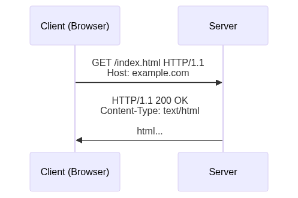

# Protocollo HTTP

**In pillole**: HTTP è il fondamento del web — un protocollo stateless, testuale, request-response che permette ai client di richiedere risorse ai server.

---

## Come Funziona HTTP



Ogni interazione HTTP è una **richiesta** (request) dal client seguita da una **risposta** (response) dal server. Il server non inizia mai la comunicazione.

---

## Struttura della Richiesta

```
METODO /percorso HTTP/VERSIONE
Header: valore

[body opzionale]
```

Esempio:

```
POST /api/users HTTP/1.1
Host: api.example.com
Content-Type: application/json

{"name": "Alice"}
```

---

## Metodi HTTP

| Metodo | Scopo | Idempotente | Ha Body |
|--------|-------|-------------|---------|
| **GET** | Leggere una risorsa | ✅ | ❌ |
| **POST** | Creare una risorsa | ❌ | ✅ |
| **PUT** | Sostituire una risorsa | ✅ | ✅ |
| **PATCH** | Aggiornare parzialmente | ❌ | ✅ |
| **DELETE** | Rimuovere una risorsa | ✅ | ❌ |
| **HEAD** | Come GET, senza body | ✅ | ❌ |
| **OPTIONS** | Verificare metodi permessi | ✅ | ❌ |

**Idempotente** significa: chiamarlo N volte ha lo stesso effetto di chiamarlo una volta. PUT, DELETE, GET sono idempotenti. POST non lo è.

---

## Codici di Stato

| Range | Significato | Esempi |
|-------|-------------|--------|
| **1xx** | Informativo | `100 Continue` |
| **2xx** | Successo | `200 OK`, `201 Created`, `204 No Content` |
| **3xx** | Redirezione | `301 Moved Permanently`, `302 Found`, `304 Not Modified` |
| **4xx** | Errore Client | `400 Bad Request`, `401 Unauthorized`, `403 Forbidden`, `404 Not Found`, `422 Unprocessable` |
| **5xx** | Errore Server | `500 Internal Server Error`, `502 Bad Gateway`, `503 Service Unavailable` |

**Fondamentali per API REST**: `200`, `201`, `204`, `301`, `400`, `401`, `403`, `404`, `422`, `500`.

---

## Header

Gli header sono metadati chiave-valore allegati a ogni richiesta e risposta.

### Header di Richiesta

| Header | Esempio | Scopo |
|--------|---------|-------|
| `Host` | `api.example.com` | Dominio richiesto (obbligatorio in HTTP/1.1) |
| `Content-Type` | `application/json` | Formato del body |
| `Accept` | `application/json` | Formato che il client vuole ricevere |
| `Authorization` | `Bearer <token>` | Autenticazione |
| `User-Agent` | `Mozilla/5.0...` | Identificazione client |

### Header di Risposta

| Header | Esempio | Scopo |
|--------|---------|-------|
| `Content-Type` | `text/html` | Formato del body |
| `Cache-Control` | `max-age=3600` | Regole di caching |
| `Set-Cookie` | `session=abc` | Salvare dati sul client |
| `Location` | `/new-url` | Usato con redirect 3xx |

---

## Content Negotiation

Il client dichiara cosa vuole (`Accept`), il server dichiara cosa sta inviando (`Content-Type`).

```
Request:  Accept: application/json
Response: Content-Type: application/json
```

Se il server non può fornire il formato richiesto, restituisce `406 Not Acceptable`.

---

## Statelessness

HTTP è **stateless**: ogni richiesta è indipendente. Il server non ricorda le richieste precedenti.

Per questo abbiamo:
- **Cookie**: salvati sul client, inviati con ogni richiesta
- **Token** (JWT, OAuth): inviati nell'header `Authorization`
- **Sessioni**: stato lato server referenziato da un cookie

Per le API REST, la statelessness è una caratteristica positiva: ogni richiesta deve contenere tutto ciò che serve al server per elaborarla.

---

**Verifica la Comprensione**

> **D:** Perché POST non è idempotente mentre PUT lo è?
>
> <details><summary>Risposta</summary>
> PUT sostituisce la risorsa a un URI specifico — inviare lo stesso PUT due volte produce lo stesso risultato. POST tipicamente crea una nuova risorsa — inviare lo stesso POST due volte crea due risorse.
> </details>

> **D:** Quando useresti `201 Created` invece di `200 OK`?
>
> <details><summary>Risposta</summary>
> `201 Created` indica che una nuova risorsa è stata creata (tipicamente in risposta a POST). `200 OK` indica che la richiesta ha avuto successo e la risposta contiene i dati richiesti (tipicamente GET o PUT).
> </details>
