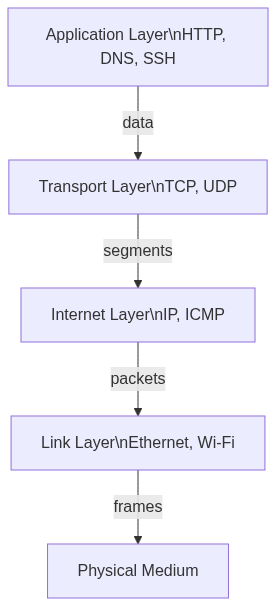

# Fondamenti di Networking

**In pillole**: Il networking è il modo in cui i computer comunicano tra loro usando uno stack di protocolli a livelli che gestisce tutto, dai segnali fisici ai dati applicativi.

---

## Lo Stack TCP/IP

Il modello TCP/IP ha quattro livelli. Ogni livello incapsula i dati del livello superiore.



- **Collegamento (Link)**: Sposta frame tra due nodi direttamente connessi (indirizzi MAC).
- **Internet**: Instrada i pacchetti attraverso le reti (indirizzi IP).
- **Trasporto**: Consegna i dati in modo affidabile (TCP) o veloce (UDP) tra processi (porte).
- **Applicazione**: Protocolli usati direttamente dalle app (HTTP, DNS, SSH).

### Incapsulamento

I dati scendono nello stack in invio: ogni livello avvolge il payload del livello superiore con il proprio header. In ricezione, ogni livello rimuove il proprio header e passa il payload al livello superiore.

---

## Indirizzamento IP

Ogni dispositivo su internet ha un indirizzo IP. IPv4 ha 32 bit, scritti come quattro ottetti: `192.168.1.1`.

### Subnet Mask

La subnet mask indica quale parte dell'IP è la **rete** e quale l'**host**:

```
IP:   192.168.1.42
Mask: 255.255.255.0  → Rete: 192.168.1.0, Host: 42
```

### Notazione CIDR

`192.168.1.0/24` significa "i primi 24 bit sono il prefisso di rete". Equivale a mask `255.255.255.0`.

| CIDR | Mask | Host |
|------|------|------|
| /8 | 255.0.0.0 | ~16 milioni |
| /16 | 255.255.0.0 | 65.534 |
| /24 | 255.255.255.0 | 254 |

---

## DNS: La Rubrica di Internet

Il DNS traduce nomi leggibili (`google.com`) in indirizzi IP (`142.250.185.78`).

### Gerarchia dei Domini

```
Root (.)
 └── com
      └── example
           ├── www   (record A → IP)
           └── mail  (record A → IP)
```

### Tipi di Record

| Record | Scopo | Esempio |
|--------|-------|---------|
| **A** | Dominio → IPv4 | `example.com → 93.184.216.34` |
| **AAAA** | Dominio → IPv6 | `example.com → 2606:2800:220:1:...` |
| **CNAME** | Alias a un altro dominio | `www.example.com → example.com` |
| **MX** | Server di posta | `example.com → mail.example.com` |
| **TXT** | Testo arbitrario | SPF, DKIM, verifica |

### Sottodomini

Un sottodominio è un prefisso aggiunto a un dominio: `blog.example.com`. Ogni sottodominio può avere i propri record DNS e puntare a un server diverso.

### CNAME vs A

- Un **record A** punta direttamente a un IP. Usalo per domini root e quando l'IP è stabile.
- Un **CNAME** punta a un altro nome di dominio. Usalo per sottodomini che devono sempre seguire il target. **Mai usare CNAME su un dominio root** (violazione RFC).

### TTL (Time to Live)

Il TTL indica ai resolver DNS per quanto tempo tenere in cache un record (in secondi). TTL basso = propagazione rapida, più query. TTL alto = meno query, cambi più lenti.

---

## Routing

I router inoltrano pacchetti tra reti usando tabelle di routing. Il concetto chiave: un router deve conoscere solo il **next hop**, non l'intero percorso.

---

**Verifica la Comprensione**

> **D:** Perché non si può usare un CNAME sul dominio root (`example.com`)?
>
> <details><summary>Risposta</summary>
> Un CNAME non può coesistere con altri record (come SOA o NS) richiesti dal dominio root. RFC 1034 lo vieta. Usa un record A o un ALIAS/ANAME (specifico del provider).
> </details>

> **D:** Cosa succede alla risoluzione DNS quando il TTL scade?
>
> <details><summary>Risposta</summary>
> Il resolver scarta il record in cache e interroga di nuovo il nameserver autoritativo. Se l'IP è cambiato dall'ultima query, il resolver ottiene il nuovo valore.
> </details>
