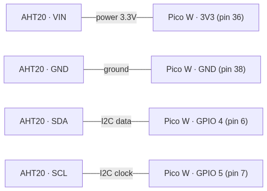

# Bare Metal Rust for the Raspberry Pi Pico

There comes a moment in every programmer's life when you realize that underneath all the frameworks, browsers and operating systems there is… a chip. A piece of silicon switching wires on and off. "Bare metal" means programming that chip **directly**, with no operating system in the way: no Linux, no processes, no `println`. Just your code and the hardware. It sounds terrifying, but with a **Raspberry Pi Pico** costing a few euros and **Rust**, this world turns out to be surprisingly welcoming. In this playbook we'll build, piece by piece, a real **temperature datalogger**: a device that reads a sensor, stores the data and ships it over Wi-Fi. No hardware prerequisites: if you've seen a little Rust, you're ready.

---

## 1. What "bare metal" is, and why Rust

**In a nutshell**: bare metal means your program is the **only** thing running on the chip. There's no operating system lending you memory, managing files or printing to a screen: you either build those comforts yourself, or do without them.

When you write a program for your computer, there's a huge operating system underneath acting as a middleman: it opens files, allocates memory, gives you a terminal. On a microcontroller like the Pico, **none of that exists**. Your code is loaded into a chip with 264 KB of RAM and starts on its own, the instant you power it up.

🧠 **Analogy**: writing a normal app is like cooking in a fully-equipped kitchen — there's an oven, a fridge, running water. Bare metal programming is like cooking while camping: you've got a single burner and that's it. Want hot water? You heat it yourself. It's more work, but you understand *exactly* what's going on, and you depend on no one.

Why use Rust instead of good old C, which ruled this world for 40 years?

| | C | Rust |
|---|---|---|
| **Memory errors** | At your own risk: one bad pointer locks up the chip silently | The compiler catches them *before* the code is even flashed |
| **Concurrency** | Easy to write race conditions that are hell to track down | The type system makes many race conditions impossible |
| **Dependencies** | Hand-crafted Makefiles, libraries copied by hand | `cargo` and `crates.io`, just like "normal" Rust |
| **Abstractions** | Costly or absent | "Zero-cost": you pay only for what you use, like in C |

> 💡 **Tip**: on a microcontroller a memory bug doesn't hand you a friendly error screen — the device simply freezes, or worse, behaves at random. That's why the guarantees Rust gives you *at compile time* are worth even more here than on a PC.

---

## 2. The star: Raspberry Pi Pico W

**In a nutshell**: the Pico is a board the size of a pencil eraser, with a microcontroller, a bit of memory and two rows of pins (the **GPIOs**) you connect sensors and actuators to. The "W" version adds Wi-Fi.

At its heart is the **RP2040** chip: two ARM Cortex-M0+ cores, 264 KB of RAM, and no mass storage except an external **flash** (usually 2 MB) where your program lives. No disk, no screen, no keyboard. There's only:

- **GPIO** (General Purpose Input/Output): pins you can set to "on" (3.3V) or "off" (0V), or read to know whether something set them on/off.
- **Communication buses**: groups of pins with precise rules for talking to sensors. The most common are **I2C**, **SPI** and **UART**.
- **CYW43** (Pico W only): a second chip that handles Wi-Fi and Bluetooth.

🧠 **Analogy**: think of the Pico as a control box with lots of sockets. The GPIOs are generic "on/off" sockets. Buses like I2C are "smart" sockets that follow a protocol — a bit like the difference between a light switch and a USB port: both carry power, but USB can also *talk* to whatever you plug in.

For our datalogger we need very little: the Pico W, an **AHT20** temperature sensor, and four wires. That's it.

> 💡 **Tip**: there's also the newer **Pico 2** (RP2350 chip), more powerful. Everything you see in this playbook works on both by changing a couple of configuration lines — the Rust ecosystem supports them both.

---

## 3. `no_std`: Rust without the safety net

**In a nutshell**: the Rust you know leans on the standard library (`std`) for files, threads, printing and memory allocation. On bare metal that library doesn't exist, so you work with `#![no_std]`: a stripped-down but surprisingly complete version.

Every bare-metal Rust program starts with two odd lines:

```rust
#![no_std]   // no standard library: there's no OS to implement it
#![no_main]  // no classic main() function: we define the "start" ourselves
```

What do you lose with `no_std`? The things that require an operating system:

| You lose (needs the OS) | You keep (`core`, always available) |
|---|---|
| `String`, `Vec`, `HashMap` (they allocate memory) | `&str`, fixed-size arrays, slices |
| `println!`, files, "classic" networking | All the math, the types, `Option`/`Result` |
| Operating-system threads | The ownership model and traits |

No `Vec`? It's scary at first, but you get used to it: you use fixed-size arrays (`[u8; 32]`) or, if you truly need dynamic allocation, you add one with the `heapless` crate (which offers fixed-capacity `Vec` and `String`, no heap required).

🧠 **The golden rule**: `no_std` isn't "crippled Rust", it's "Rust without the parts that assume a full computer". The **borrow checker**, the types, `Result`, pattern matching — everything that makes Rust *Rust* — is still there, working for you. You lose the conveniences, you keep the guarantees.

And printing to a screen? Since there's no terminal, you use **`defmt`**: an ultra-lightweight logging system that sends messages to the PC through the debug cable.

```rust
use defmt::info;

info!("Temperature read: {} degrees", temp);
```

---

## 4. Embassy: async, even on a microcontroller

**In a nutshell**: **Embassy** is a framework that brings Rust's `async/await` to bare metal. It lets you *make* code that's really waiting on hardware events *look* sequential, without wasting energy on busy-waiting.

The classic embedded problem: you must read a sensor every 10 seconds, listen to Wi-Fi and blink an LED — all at once, on a single core (or two), with no operating system. The traditional C answer is a maze of interrupts and hand-written state machines. Embassy uses Rust's `async` instead:

```rust
use embassy_executor::Spawner;
use embassy_time::{Duration, Timer};

#[embassy_executor::main]
async fn main(spawner: Spawner) {
    let p = embassy_rp::init(Default::default());

    // Start two "tasks" that run in parallel, cooperating
    spawner.spawn(blink_led(p.PIN_25.into())).unwrap();
    spawner.spawn(read_sensor()).unwrap();
}

#[embassy_executor::task]
async fn blink_led(led: /* ... */) {
    loop {
        // "wait 500ms" does NOT block the chip: while you wait,
        // the other tasks can work
        Timer::after(Duration::from_millis(500)).await;
    }
}
```

🧠 **Analogy**: without Embassy, a chip "waiting 10 seconds" is like a waiter staring at the clock until the 10 seconds pass, serving no other table. With Embassy's `async`, that `.await` is like a waiter who, while a dish cooks, goes off to take orders from other tables. One waiter (core), but not a second wasted.

The beauty is that under the hood that `.await` puts the chip into a low-power mode until the hardware wakes it up — essential for a battery-powered device.

> 💡 **Tip**: Embassy isn't the only way to do embedded in Rust (there's also the "bare" approach with the `cortex-m-rt` crate and infinite loops), but for a project with Wi-Fi and several concurrent activities it's by far the most comfortable. It's become the de-facto standard of the ecosystem.

---

## 5. Your first complete project: LED blink, step by step

**In a nutshell**: the "Hello World" of embedded is blinking an LED. Let's build the **complete** project from scratch — file structure, dependencies, code and flashing — so you see with your own eyes how a real bare-metal project holds together. Every later project (sensor, Wi-Fi, datalogger) is just this skeleton with more flesh on it.

A Rust Pico project is made of **four files** working together. Let's look at them one by one.

### Step 1 — Create the project

```bash
cargo new pico-blink        # creates the folder with the standard skeleton
cd pico-blink
rustup target add thumbv6m-none-eabi   # the "target" for the Pico's ARM Cortex-M0+ core
```

The `thumbv6m-none-eabi` target tells Rust: "don't compile for my PC, but for an ARM Cortex-M0+ processor **with no operating system**" (`none`). That's the technical translation of "bare metal".

### Step 2 — The dependencies (`Cargo.toml`)

```toml
[dependencies]
embassy-executor = { version = "0.6", features = ["arch-cortex-m", "executor-thread"] }
embassy-time     = "0.3"
embassy-rp       = { version = "0.2", features = ["rp2040"] }   # the chip's HAL
cortex-m-rt      = "0.7"     # the ARM core's startup code
defmt            = "0.3"     # the lightweight logs
defmt-rtt        = "0.4"     # sends them to the PC over the debug cable
panic-probe      = { version = "0.3", features = ["print-defmt"] }
```

**HAL** stands for *Hardware Abstraction Layer*: the `embassy-rp` crate is the library that knows the RP2040 chip's details (where the GPIOs are, how to turn a pin on) and exposes them to you with clean functions, so you don't have to write to the registers by hand.

### Step 3 — Telling Cargo how to compile (`.cargo/config.toml`)

```toml
[build]
target = "thumbv6m-none-eabi"     # so you don't have to repeat it on every command

[target.thumbv6m-none-eabi]
# what `cargo run` runs: flashes the firmware onto the chip with probe-rs
runner = "probe-rs run --chip RP2040"
rustflags = [
  "-C", "link-arg=--nmagic",
  "-C", "link-arg=-Tlink.x",     # use cortex-m-rt's linker script
  "-C", "link-arg=-Tdefmt.x",    # and defmt's
]
```

### Step 4 — The memory map (`memory.x`)

The chip doesn't know on its own where to put the code and the data: we tell it, with a "map" of its memory.

```text
MEMORY {
    BOOT2 : ORIGIN = 0x10000000, LENGTH = 0x100
    FLASH : ORIGIN = 0x10000100, LENGTH = 2048K - 0x100
    RAM   : ORIGIN = 0x20000000, LENGTH = 264K
}
```

🧠 **Analogy**: `memory.x` is the floor plan you hand the movers. "The code goes in this room (FLASH), the variables in this other one (RAM), and careful: the first 256 bytes are reserved for the doorman (BOOT2, the code that boots the chip)." Without this plan, the linker doesn't know where to put things.

### Step 5 — The code (`src/main.rs`)

```rust
#![no_std]   // no standard library (see section 3)
#![no_main]  // the "start" is defined by Embassy, not a classic main()

use embassy_executor::Spawner;
use embassy_rp::gpio::{Level, Output};
use embassy_time::{Duration, Timer};
// These two lines "switch on" the logger and the panic handler.
// The `as _` means "import only for the side effects".
use {defmt_rtt as _, panic_probe as _};

#[embassy_executor::main]
async fn main(_spawner: Spawner) {
    // 1. Initialize the "peripherals": all the chip's hardware becomes
    //    available in `p`. From here on we take the pins we need from `p`.
    let p = embassy_rp::init(Default::default());

    // 2. On the (non-W) Pico the onboard LED is wired to GPIO 25.
    //    We configure it as an OUTPUT, starting off (Level::Low).
    let mut led = Output::new(p.PIN_25, Level::Low);

    // 3. The infinite loop: an embedded device never "finishes".
    //    There's no OS to hand control back to: the loop IS the program.
    loop {
        led.set_high();                                   // turn the LED on (3.3V)
        Timer::after(Duration::from_millis(500)).await;   // wait half a second
        led.set_low();                                    // turn the LED off (0V)
        Timer::after(Duration::from_millis(500)).await;   // wait half a second
    }
}
```

Let's read it line by line:

- **`#![no_std]` / `#![no_main]`** — we declare a bare-metal program, with no standard library and no classic `main()`.
- **`use {defmt_rtt as _, panic_probe as _};`** — we don't use these two names directly, but including them "switches on" the logger and defines what happens on a panic. Without `panic-probe`, the compiler would complain that a panic handler is missing (in `no_std` there is no default one).
- **`embassy_rp::init(...)`** — powers up and prepares all the chip's hardware, and hands it to us in the `p` variable.
- **`Output::new(p.PIN_25, Level::Low)`** — takes pin 25 and turns it into a digital output. Rust's type system stops us, for example, from reading a pin we declared as an output: a mistake that slips through in C, but here simply won't compile.
- **The `loop`** — on, wait, off, wait, forever. That `.await` on the `Timer` is Embassy's magic: while it "waits", the chip doesn't spin idly but drops into low-power mode.

> ⚠️ **Pico W warning**: on the Pico **W** the onboard LED is **not** on GPIO 25 — it's connected to the CYW43 Wi-Fi chip (remember it from section 2?). To blink it you first have to initialize the `cyw43` driver and then use `control.gpio_set(0, true).await`. To learn, start with a plain Pico or an external LED wired to any GPIO: you avoid this complication on the first go.

### The wiring (external LED)

If you use an external LED on a breadboard instead of the onboard one, this is the connection (in that case change `PIN_25` to `PIN_15` in the code):


Left to right: GPIO 15 pushes current through a **330 Ω resistor** (essential: without it the LED burns out), then into the LED's long leg (**anode, +**), out of the short leg (**cathode, −**) and back to **GND**. The resistor limits the current; the anode/cathode order matters, because an LED conducts in one direction only.

### Step 6 — Flashing it onto the chip

```bash
cargo run --release
```

This command compiles, and then the `runner` we set in `.cargo/config.toml` (`probe-rs`) flashes the firmware onto the Pico and shows you the logs in real time. If you don't have a debug probe, the alternative is to hold the **BOOTSEL** button while you plug in USB: the Pico shows up as a flash drive, and you drag the generated `.uf2` file onto it.

🧠 **The golden rule**: these **four files** — `Cargo.toml`, `.cargo/config.toml`, `memory.x`, `src/main.rs` — are the skeleton of *every* Rust Pico project, from blink to the most complex datalogger. Only the contents of `main.rs` and the list of dependencies change. Once the first LED blinks, the hardest part is already behind you.

---

## 6. The tools of the trade

**In a nutshell**: to work with the Pico you need only a handful of tools, all free and command-line based. Each covers one moment of the cycle: **compile** the code, **flash** it onto the chip, **watch the logs** and **debug**. Remember those four verbs and you always know which tool to reach for.

| Tool | What it does | When you use it |
|---|---|---|
| **rustup** | Installs Rust and the "targets" (like the Pico's) | Once, at the start |
| **cargo** | Compiles the project and fetches the dependencies | Every build |
| **probe-rs** | Flashes the firmware, shows the logs and debugs | On every upload |
| **defmt** | The ultra-lightweight logging system (embedded's "println") | In the code, always |
| **elf2uf2-rs** | Converts the binary to the `.uf2` format (BOOTSEL method) | Only if you have no probe |

### Compiling: `rustup` + `cargo`

These are the same two tools as "normal" Rust, with one extra detail: the **target**, i.e. the kind of processor you compile for.

```bash
rustup target add thumbv6m-none-eabi   # once only: add the Pico's target
cargo build --release                   # compile in optimized mode
```

> 💡 **Tip**: in embedded, `--release` is **not optional the way it is on a PC**. A debug build produces a much larger and slower binary, which sometimes doesn't even fit in the flash or is too slow to meet the hardware's timing. On the Pico you almost always work in `--release`.

### Flashing: two routes

Flashing the firmware means writing your program into the chip's flash. There are two ways, one "serious" and one "quick".

**1. With a debug probe (`probe-rs`) — the recommended route.**

```bash
cargo run --release   # compile, FLASH and show the logs, all in one go
```

Thanks to the `runner` we set in `.cargo/config.toml`, `cargo run` doesn't launch the program on your PC but ships it to the Pico through a **debug probe**. You need a small piece of hardware that bridges the PC and the chip — and the good news is that it can be a **second Pico** costing a few euros.

**2. Without a probe (BOOTSEL + `.uf2`) — the quick route.**

```bash
# convert the binary to the format the Pico understands as a flash drive
elf2uf2-rs target/thumbv6m-none-eabi/release/pico-blink pico-blink.uf2
# then: hold BOOTSEL, plug in USB → the Pico shows up as a disk
# called "RPI-RP2"; drag the .uf2 onto it and it reboots on its own
```

🧠 **Analogy**: a debug probe is like having a camera inside the workshop while you work on the engine — you see everything, you can stop, inspect. The BOOTSEL method is like handing over the car, closing the hood and restarting it: it works, but if something goes wrong you're in the dark. For learning, the probe is worth every cent.

### Watching the logs: `defmt`

On bare metal there's no terminal, so no `println!`. In its place there's **`defmt`** ("deferred formatting"): you write perfectly ordinary logs in the code…

```rust
use defmt::info;
info!("Temperature: {} C", temp);
```

…and `probe-rs`, while the chip runs, shows them to you in real time in the PC's terminal. `defmt`'s trick is that the message text **stays on the PC**: only a few bytes travel across from the chip, so the logs weigh almost nothing — essential on such a tiny device.

### Debugging: `probe-rs` again

The same probe that flashes the firmware also lets you **stop the program at a breakpoint**, inspect variables and step line by line — exactly like a debugger on a PC. You can do it from the command line or, more comfortably, from the editor: **VS Code** with the `probe-rs` extension, or the classic Cortex-Debug extension.

🧠 **The golden rule**: **a single tool, `probe-rs`, covers three of the four verbs** — flash, show logs and debug. That's why, at the start, the only real investment is getting hold of a probe (a second Pico does nicely) and configuring `probe-rs` once. Once that's done, the "edit → `cargo run` → watch the logs" cycle becomes as smooth as developing on a PC.

> 💡 **Tip**: the cheapest way to get a probe is to load the official **"debugprobe"** firmware onto a **second Pico**: you wire it to the "real" Pico with three wires and it becomes your permanent probe. Two Picos (~€8) and you have a complete development setup, forever.

---

## 7. Reading the AHT20 sensor over I2C

**In a nutshell**: **I2C** is a protocol that lets several devices talk over just two wires. Each device has an "address", and the Pico acts as the conductor who asks each one for its data in turn.

Our **AHT20** sensor measures temperature and humidity and speaks I2C. The two wires are:

- **SDA** (Serial Data): the actual data.
- **SCL** (Serial Clock): the "metronome" that dictates when to read each bit.

🧠 **Analogy**: I2C is like a phone line shared by a whole apartment building. Each tenant (sensor) has a number (address); the Pico "calls" the sensor's number, asks "what have you got?", and the sensor answers. With just two wires you can have a dozen different sensors, each with its own address.

In Rust we don't talk to the AHT20 byte by byte: we use a ready-made **driver crate** that hides the protocol details behind readable functions.

```rust
use embassy_rp::i2c::{self, I2c};
use embassy_rp::peripherals::I2C0;

#[embassy_executor::task]
async fn read_sensor(i2c: I2c<'static, I2C0, i2c::Async>) {
    // The driver crate exposes the sensor as an object
    let mut sensor = aht20::Aht20::new(i2c).await.unwrap();

    loop {
        let reading = sensor.measure().await.unwrap();
        info!(
            "Temperature: {} C, Humidity: {} %",
            reading.temperature,
            reading.humidity
        );
        Timer::after(Duration::from_secs(10)).await;
    }
}
```

> 💡 **Tip**: the great value of the Rust embedded ecosystem is the **`embedded-hal`** trait: a common "standard" that both sensor drivers and every board's implementation adhere to. The result: the same AHT20 driver runs on a Pico, an STM32 or an ESP32 without changing a line. It's the equivalent of a universal socket.

---

## 8. Storing data in flash with `sequential-storage`

**In a nutshell**: the Pico has no disk, but it does have **flash memory** (the same place the program lives). We can use a slice of it to save the latest readings and the configuration, so they survive a reboot or a power loss.

There's a catch: flash doesn't behave like a file. It has awkward rules:

- You can only write by erasing **whole blocks** at a time (not a single byte).
- Each cell survives a limited number of erasures before wearing out (tens of thousands).

If we always wrote to the same cell, we'd burn it out fast. The solution is called **wear leveling**: spreading the writes across the whole available area.

🧠 **Analogy**: always writing to the same spot in flash is like walking over the same patch of a lawn a thousand times: you carve a rut and ruin the grass. Wear leveling is like taking a different path each time: the lawn stays green far longer.

Luckily we don't have to implement it by hand: the **`sequential-storage`** crate offers two ready-made abstractions, both with wear leveling built in:

| Abstraction | What it does in our datalogger |
|---|---|
| **map** (key→value) | Store the **configuration**: Wi-Fi network name, MQTT broker address… |
| **queue** | Store the **last N** temperature readings, in chronological order |

```rust
// Push a reading into the flash-backed queue
queue::push(
    &mut flash,
    FLASH_RANGE,          // the slice of flash we reserved for it
    &mut cache,
    &reading.to_bytes(),  // the serialized data
    false,
).await.unwrap();
```

> 💡 **Tip**: reserving the right slice of flash is crucial — it must sit *after* your program, otherwise you overwrite the code. The memory configuration (the `memory.x` file) defines these boundaries. Getting them wrong is one of the most classic embedded beginner mistakes.

---

## 9. Wi-Fi: first I configure you, then I connect you

**In a nutshell**: the Pico W has a chicken-and-egg problem — to join your home Wi-Fi it needs the password, but with no screen and no keyboard, how do we hand it over? The elegant solution: on its first boot, the Pico *becomes a Wi-Fi network itself*.

The Pico W's **CYW43** chip can do two opposite jobs:

1. **Access Point (AP)**: it creates its own Wi-Fi network, which you join with your phone. The Pico serves a little web page where you type your network's name and password. This is the **first-boot** mode.
2. **Client (Station)**: it connects to an existing Wi-Fi network — the one you just configured. This is the **normal**, everyday mode.

🧠 **Analogy**: it's like a new employee on day one. At first *they* ask *you* questions ("where do I sign? what's the Wi-Fi password?") — that's Access Point mode. Once set up, they get to work quietly and stop bothering you — that's Client mode.

Once on the network, the Pico needs a "network stack" to speak TCP/IP. Enter **`embassy-net`**, which handles IP addresses, DHCP and connections, all in `async` style.

The final step: shipping the readings. We use **MQTT**, an ultra-lightweight protocol designed specifically for IoT devices. The Pico "publishes" temperatures to a **topic** (a kind of themed channel), and anyone interested — a dashboard, an app — "subscribes" to that topic and receives them.

```rust
// Publish the temperature to an MQTT topic
client.send_message(
    "home/livingroom/temperature",   // the topic
    b"21.5",                          // the value
    QoS::AtLeastOnce,
    false,
).await.unwrap();
```

🧠 **The golden rule**: MQTT works by **publish and subscribe**, not by request and response. The Pico doesn't know (and doesn't care) who reads its temperatures: it just publishes them. Zero, one, or a hundred dashboards can listen to the same topic at once. This decoupling is what makes MQTT the IoT standard.

---

## 10. The full picture: the datalogger

**In a nutshell**: let's put all the pieces together. Every building block we've seen — sensor, Embassy, flash, Wi-Fi, MQTT — takes its place in a single coherent architecture.


Here's the flow, following the figure:

1. The **AHT20 sensor** measures temperature and humidity and sends them to the Pico over **I2C** (the two SDA/SCL wires).
2. The **Pico W**, running bare-metal Rust with Embassy, orchestrates everything: one task reads the sensor every N seconds, another handles the network.
3. Readings (and the configuration) land in the **internal flash** via `sequential-storage`, so they survive reboots.
4. On **first boot**, the Pico becomes an **Access Point**: you connect with your phone and give it the Wi-Fi password through a configuration page.
5. After configuration, the Pico becomes a **Wi-Fi client** and connects to the **MQTT broker**.
6. The broker forwards the temperatures to any **dashboard or app** that has subscribed to the topic.

> 💡 **Tip**: notice how each component does **one thing only**. This isn't just elegance: on a chip with 264 KB of RAM, small, well-separated tasks are easier to fit in memory, to test and to debug. The same "Unix" philosophy as Bash pipes, applied to silicon.

### The wiring on the breadboard

Before the code, the wires. The AHT20 sensor connects to the Pico with just **four cables** — two for power, two for I2C:



| AHT20 wire | Goes to Pico pin | What it's for |
|---|---|---|
| **VIN** | 3V3 (pin 36) | 3.3V power |
| **GND** | GND (pin 38) | Common ground |
| **SDA** | GPIO 4 (pin 6) | The I2C data |
| **SCL** | GPIO 5 (pin 7) | The I2C "metronome" |

These two pins — GPIO 4 and GPIO 5 — are exactly the ones you find in the code, on the line `I2c::new_async(p.I2C0, p.PIN_5, p.PIN_4, ...)`. The physical wiring and the software must always match.

### The code, split by responsibility

A real project **doesn't all live in `main.rs`**: it's split into several files, one per responsibility. It's the same philosophy as Bash pipes — each piece does one thing and does it well. Here's how we organize the datalogger:

```text
src/
├── main.rs      # entry point: powers up the hardware and starts the tasks
├── types.rs     # the shared types: the Reading and the channel between tasks
├── sensor.rs    # the PRODUCER: reads the sensor
└── network.rs   # the CONSUMER: stores in flash and publishes over MQTT
```

Let's look at one file at a time. The underlying question: how do two tasks (one reading the sensor, one handling the network) exchange readings without stepping on each other's toes? Embassy's answer is a **channel** (`Channel`), a safe structure for moving data from one task to another. We define it in the shared file.

**`src/types.rs` — the shared stuff.** Here live the things every other file uses: the `Reading` struct and the channel that links them. Keeping them separate avoids circular dependencies — `sensor` and `network` don't know about each other, they only know about `types`.

```rust
use embassy_sync::blocking_mutex::raw::ThreadModeRawMutex;
use embassy_sync::channel::Channel;

// One sensor reading: the "packet" that travels between tasks.
// `pub` = visible from the other files in the project.
#[derive(Clone, Copy)]
pub struct Reading {
    pub temperature: f32,
    pub humidity: f32,
}

// The channel linking the one who PRODUCES readings to the one who CONSUMES them.
// Capacity 8: if the consumer is slow, up to 8 readings queue up.
pub static CHANNEL: Channel<ThreadModeRawMutex, Reading, 8> = Channel::new();
```

**`src/sensor.rs` — the producer.** A single job: read the AHT20 every 10 seconds and drop the reading onto the channel. It knows nothing about Wi-Fi or MQTT.

```rust
use embassy_rp::i2c::{self, I2c};
use embassy_rp::peripherals::I2C0;
use embassy_time::{Duration, Timer};

// `crate::` means "from the root of our project": we grab the
// Reading and the channel defined in types.rs
use crate::types::{Reading, CHANNEL};

#[embassy_executor::task]
pub async fn sensor_task(i2c: I2c<'static, I2C0, i2c::Async>) {
    let mut sensor = aht20::Aht20::new(i2c).await.unwrap();
    loop {
        let m = sensor.measure().await.unwrap();
        // `send` drops the reading onto the "conveyor belt".
        // If the channel is full, it waits (in low-power mode) for room.
        CHANNEL.send(Reading {
            temperature: m.temperature,
            humidity: m.humidity,
        }).await;
        Timer::after(Duration::from_secs(10)).await;
    }
}
```

**`src/network.rs` — the consumer.** The other end of the belt: it waits for readings, stores them in flash and publishes them over MQTT. It knows nothing about the sensor, only that `Reading`s arrive on the channel.

```rust
use defmt::info;
use crate::types::CHANNEL;

#[embassy_executor::task]
pub async fn network_task() {
    // ...the Wi-Fi connection (AP → client) and the MQTT client go here,
    //    as described in section 9...
    loop {
        // `receive` blocks (at zero cost) until a reading arrives.
        let reading = CHANNEL.receive().await;

        // 1. Store in flash with sequential-storage: survives reboots
        // queue::push(&mut flash, FLASH_RANGE, &mut cache,
        //             &reading.to_bytes(), false).await.unwrap();

        // 2. Publish to the MQTT broker
        // client.send_message("home/livingroom/temperature",
        //                     b"21.5", QoS::AtLeastOnce, false).await.unwrap();

        info!("Reading handled: {} C", reading.temperature);
    }
}
```

**`src/main.rs` — the conductor.** Short and readable: it declares the modules, powers up the hardware and starts the two tasks. All the real logic lives in the other files.

```rust
#![no_std]
#![no_main]

// Declare the three files as "modules" of our project
mod types;
mod sensor;
mod network;

use embassy_executor::Spawner;
use embassy_rp::i2c::{self, I2c};
use {defmt_rtt as _, panic_probe as _};

#[embassy_executor::main]
async fn main(spawner: Spawner) {
    // 1. Power up the hardware (as in the blink of section 5)
    let p = embassy_rp::init(Default::default());

    // 2. Prepare the I2C for the sensor (SDA = GPIO4, SCL = GPIO5)
    let i2c = I2c::new_async(p.I2C0, p.PIN_5, p.PIN_4, Irqs, i2c::Config::default());

    // 3. Start the two tasks. main() finishes HERE, but the tasks keep
    //    running on their own: it's Embassy's executor that drives them.
    spawner.spawn(sensor::sensor_task(i2c)).unwrap();
    spawner.spawn(network::network_task()).unwrap();
}
```

🧠 **Analogy**: think of the files as the stations of a kitchen. `types.rs` is the shared pantry (the ingredients everyone uses). `sensor.rs` is whoever prepares the dishes, `network.rs` is whoever serves them to the tables, and `main.rs` is the chef who opens the place and tells each one "go, start". No station needs to know how the others work: they pass dishes through the "pass" (the channel).

Let's follow a single data point, step by step:

1. **`main.rs` only does the wiring.** It declares the modules, powers up the hardware, prepares the I2C, starts the two tasks and… finishes. There's no `loop` in `main`: the program's life lives entirely inside the tasks. This is the heart of the Embassy model.
2. **`sensor.rs` produces.** Every 10 seconds it reads the AHT20 and puts a `Reading` on the channel with `CHANNEL.send(...)`. It doesn't know (or care) who will use it.
3. **The channel (`types.rs`) decouples the two worlds.** It's the "conveyor belt": the producer drops readings onto it, the consumer picks them up when ready. If the consumer is busy (say, reconnecting Wi-Fi), readings pile up in the queue instead of being lost.
4. **`network.rs` consumes.** With `CHANNEL.receive().await` it waits — sleeping, wasting no power — until a reading arrives. When one does, it **stores it in flash** (so it's safe even if Wi-Fi drops) and **publishes it over MQTT**.
5. **The broker does the rest.** From there on, as we saw in section 9, anyone subscribed to the topic receives the data.

🧠 **The golden rule**: the **producer → channel → consumer** pattern is the backbone of almost every Embassy project, and giving each role its own file makes it obvious at a glance. Separating "who generates the data" from "who processes it" with a channel in between makes each piece easy to read, to test and to change — and it ensures that a slow piece (the network) never blocks a piece that has to be punctual (the sensor).

> 💡 **Tip**: to flash it all onto the chip, the exact procedure from the blink (section 5) applies: `cargo run --release` with `probe-rs`, or the `.uf2` file while holding BOOTSEL. The project skeleton (`Cargo.toml`, `.cargo/config.toml`, `memory.x`) is the same: only the extra dependencies change (the sensor driver, `cyw43`, `embassy-net`, the MQTT client, `sequential-storage`) and the contents of `main.rs`.

---

## 11. Good parts, Bad parts

**In a nutshell**: bare-metal Rust is wonderful for some things and awkward for others. Knowing where the line sits saves you weeks of frustration.

### The "good parts"

| Strength | Why it matters |
|---|---|
| **No silent crashes** | The borrow checker eliminates, up front, the memory errors that are a debugging nightmare on C chips |
| **`async` with Embassy** | Readable, low-power concurrency, without C's interrupt maze |
| **`cargo` and `crates.io`** | Adding a driver or a library is one line in `Cargo.toml`, just like normal Rust |
| **`embedded-hal`** | The same code runs on different boards with barely any changes |
| **Zero-cost abstractions** | High-level, readable code that compiles down to instructions as efficient as C |

### The "bad parts"

| Where it hurts | The reality |
|---|---|
| **A double learning curve** | You have to learn Rust *and* embedded concepts (interrupts, registers, memory maps) at the same time |
| **A younger ecosystem than C** | For exotic hardware the ready-made driver may be missing: you have to write it |
| **Cryptic error messages** | Linker errors, or async type errors on bare metal, can be baffling |
| **No `Vec` by default** | You have to reason ahead about how much memory you use (which is also a virtue) |

🧠 **The golden rule**: the pain of embedded Rust is almost all *up front* — the first project setup, the first blinking LED, the first `memory.x`. Get past that hurdle and every subsequent feature (adding a sensor, Wi-Fi, flash) is surprisingly linear, because the compiler holds your hand. In C it's the opposite: you start fast, but you pay the bug bill later.

> 💡 **Tip**: the professionals' rule of thumb is "prototype with MicroPython or the C SDK if you just need to *see whether the idea works*, but switch to bare-metal Rust the moment the project has to become reliable and last over time". Rust shines when a device must stay on for months without locking up.

---

## In summary

1. **Bare metal means no operating system**: your code is the only thing running on the chip, and the comforts (memory, prints, files) you either build or do without.
2. **`no_std` is Rust without the parts that assume a full computer** — you lose `Vec` and `println`, but you keep the borrow checker and all the guarantees that make Rust safe.
3. **Embassy brings `async/await` to the microcontroller**: readable, low-power concurrency, without C's interrupt maze.
4. **Every Rust Pico project is made of four files** — `Cargo.toml`, `.cargo/config.toml`, `memory.x`, `main.rs` — and the LED blink is the best way to see them in action for the first time.
5. **The tools are few and free**: `cargo` compiles, `probe-rs` flashes-shows-debugs, `defmt` does the logging. One probe (even a second Pico) and you're up and running.
6. **Sensors are read over buses like I2C**, and driver crates + `embedded-hal` hide the protocol details behind clean functions.
7. **Flash is used with `sequential-storage`**, which handles wear leveling itself so you don't burn out the memory.
8. **The Pico W's Wi-Fi does two jobs**: Access Point to configure itself on first boot, then client to publish data over MQTT.
9. **The producer → channel → consumer pattern** holds the datalogger together: the sensor produces, a channel decouples, the network task consumes, stores and publishes; each role in its own file.

Now grab that few-euro Pico, solder on four wires, and make the silicon talk. 🦀
