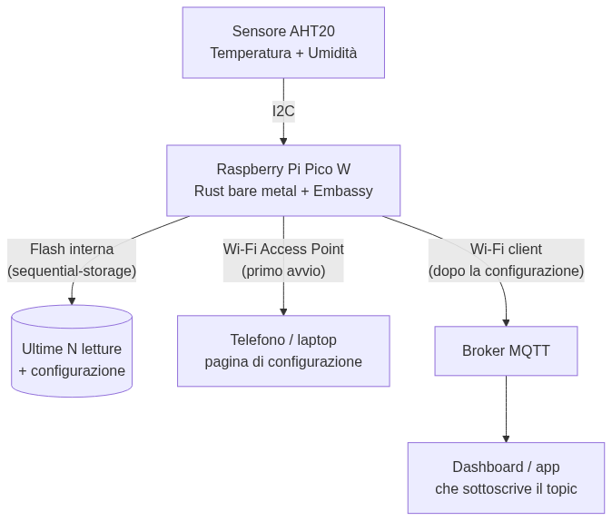

# Bare Metal Rust per Raspberry Pi Pico

C'è un momento, nella vita di ogni programmatore, in cui ti accorgi che sotto tutti i framework, i browser e i sistemi operativi c'è… un chip. Un pezzo di silicio che accende e spegne dei fili. "Bare metal" (metallo nudo) significa programmare quel chip **direttamente**, senza sistema operativo di mezzo: niente Linux, niente processi, niente `println`. Solo il tuo codice e l'hardware. Sembra terrificante, ma con un **Raspberry Pi Pico** da pochi euro e **Rust** questo mondo diventa sorprendentemente accogliente. In questo playbook costruiamo insieme, pezzo per pezzo, un vero **datalogger di temperatura**: un dispositivo che legge un sensore, salva i dati e li spedisce via Wi-Fi. Nessun prerequisito hardware: se hai già visto un po' di Rust, sei pronto.

---

## 1. Cos'è il "bare metal" e perché Rust

**In pillole**: bare metal vuol dire che il tuo programma è l'**unica** cosa in esecuzione sul chip. Non c'è un sistema operativo che ti presta la memoria, gestisce i file o stampa a schermo: quelle comodità le devi costruire tu, oppure farne a meno.

Quando scrivi un programma per il tuo computer, sotto di te c'è un sistema operativo enorme che fa da intermediario: apre file, alloca memoria, ti dà un terminale. Su un microcontrollore come il Pico, **non c'è niente di tutto questo**. Il tuo codice viene caricato in un chip da 264 KB di RAM e parte da solo, all'accensione.

🧠 **Analogia**: programmare un'app normale è come cucinare in una cucina attrezzata — c'è il forno, il frigo, l'acqua corrente. Programmare bare metal è come cucinare in campeggio: hai un fornello e basta. Se vuoi l'acqua calda te la scaldi tu. È più faticoso, ma capisci *davvero* cosa succede, e non dipendi da nessuno.

Perché usare Rust invece del classico C, che ha dominato questo mondo per 40 anni?

| | C | Rust |
|---|---|---|
| **Errori di memoria** | A tuo rischio: un puntatore sbagliato blocca il chip in silenzio | Il compilatore li blocca *prima* di caricare il codice |
| **Concorrenza** | Facile scrivere race condition difficilissime da trovare | Il sistema dei tipi rende molte race condition impossibili |
| **Dipendenze** | Makefile artigianali, librerie copiate a mano | `cargo` e `crates.io`, come nel Rust "normale" |
| **Astrazioni** | Costose o assenti | "Zero-cost": paghi solo ciò che usi, come in C |

> 💡 **Tip**: su un microcontrollore un bug di memoria non ti dà una comoda schermata d'errore — il dispositivo semplicemente si blocca, o peggio, si comporta in modo casuale. Ecco perché le garanzie che Rust ti dà *a tempo di compilazione* valgono qui ancora più che sul PC.

---

## 2. Il protagonista: Raspberry Pi Pico W

**In pillole**: il Pico è una schedina grande come una gomma da matita, con un microcontrollore, un po' di memoria e due file di piedini (i **GPIO**) a cui colleghi sensori e attuatori. La versione "W" aggiunge il Wi-Fi.

Il cuore è il chip **RP2040**: due core ARM Cortex-M0+, 264 KB di RAM, e nessuna memoria di massa se non una **flash** esterna (di solito 2 MB) dove vive il tuo programma. Non c'è disco, non c'è schermo, non c'è tastiera. C'è solo:

- **GPIO** (General Purpose Input/Output): piedini che puoi mettere a "acceso" (3.3V) o "spento" (0V), o leggere per sapere se qualcuno li ha messi a acceso/spento.
- **Bus di comunicazione**: gruppi di piedini con regole precise per parlare con i sensori. I più comuni sono **I2C**, **SPI** e **UART**.
- **CYW43** (solo sul Pico W): un secondo chip che gestisce il Wi-Fi e il Bluetooth.

🧠 **Analogia**: pensa al Pico come a una centralina con tante prese. I GPIO sono prese generiche "on/off". I bus come l'I2C sono prese "intelligenti" che seguono un protocollo — un po' come la differenza tra un interruttore della luce e una presa USB: entrambe danno corrente, ma la USB sa anche *dialogare* con ciò che colleghi.

Per il nostro datalogger ci serve poco: il Pico W, un sensore di temperatura **AHT20**, e quattro fili. Tutto qui.

> 💡 **Tip**: esiste anche il più recente **Pico 2** (chip RP2350), più potente. Tutto quello che vedi in questo playbook funziona su entrambi cambiando un paio di righe di configurazione — l'ecosistema Rust li supporta entrambi.

---

## 3. `no_std`: Rust senza rete di protezione

**In pillole**: il Rust che conosci si appoggia alla "standard library" (`std`) per file, thread, stampe e allocazione di memoria. Sul bare metal quella libreria non esiste, quindi lavori con `#![no_std]`: una versione ridotta ma sorprendentemente completa.

Ogni programma bare metal in Rust inizia con due righe strane:

```rust
#![no_std]   // niente standard library: non c'è un OS che la implementi
#![no_main]  // niente funzione main() classica: la "partenza" la definiamo noi
```

Cosa perdi con `no_std`? Le cose che richiedono un sistema operativo:

| Perdi (richiede l'OS) | Ti resta (`core`, sempre disponibile) |
|---|---|
| `String`, `Vec`, `HashMap` (allocano memoria) | `&str`, array a dimensione fissa, slice |
| `println!`, file, rete "classica" | Tutta la matematica, i tipi, gli `Option`/`Result` |
| Thread del sistema operativo | Il modello di ownership e i trait |

Niente `Vec`? All'inizio spaventa, ma ci si abitua: usi array di dimensione nota (`[u8; 32]`) o, se ti serve davvero l'allocazione dinamica, aggiungi un allocatore con la crate `heapless` (che offre `Vec` e `String` a capacità fissa, senza heap).

🧠 **La regola d'oro**: `no_std` non è "Rust monco", è "Rust senza le parti che presuppongono un computer completo". Il **borrow checker**, i tipi, i `Result`, i pattern match — cioè tutto ciò che rende Rust *Rust* — sono ancora lì, al lavoro per te. Perdi le comodità, tieni le garanzie.

E la stampa a schermo? Non esistendo un terminale, si usa **`defmt`**: un sistema di log ultraleggero che manda i messaggi al PC attraverso il cavo di debug.

```rust
use defmt::info;

info!("Temperatura letta: {} gradi", temp);
```

---

## 4. Embassy: async anche sul microcontrollore

**In pillole**: **Embassy** è un framework che porta l'`async/await` di Rust sul bare metal. Ti permette di far "sembrare" sequenziale del codice che in realtà aspetta eventi hardware, senza sprecare energia in attese attive.

Il problema classico dell'embedded: devi leggere un sensore ogni 10 secondi, ascoltare il Wi-Fi e far lampeggiare un LED — tutto insieme, con un solo core (o due), senza sistema operativo. La risposta tradizionale in C è un labirinto di interrupt e macchine a stati scritte a mano. Embassy usa invece l'`async` di Rust:

```rust
use embassy_executor::Spawner;
use embassy_time::{Duration, Timer};

#[embassy_executor::main]
async fn main(spawner: Spawner) {
    let p = embassy_rp::init(Default::default());

    // Avvia due "task" che girano in parallelo, cooperando
    spawner.spawn(lampeggia_led(p.PIN_25.into())).unwrap();
    spawner.spawn(leggi_sensore()).unwrap();
}

#[embassy_executor::task]
async fn lampeggia_led(led: /* ... */) {
    loop {
        // "aspetta 500ms" NON blocca il chip: mentre aspetti,
        // gli altri task possono lavorare
        Timer::after(Duration::from_millis(500)).await;
    }
}
```

🧠 **Analogia**: senza Embassy, il chip che "aspetta 10 secondi" è come un cameriere che fissa l'orologio finché non passano i 10 secondi, senza servire nessun altro tavolo. Con l'`async` di Embassy, quel `.await` è come un cameriere che, mentre un piatto cuoce, va a prendere le ordinazioni degli altri tavoli. Un solo cameriere (core), ma nessun secondo sprecato.

Il bello è che quel `.await`, sotto il cofano, mette il chip in modalità a basso consumo finché l'hardware non lo sveglia — fondamentale per un dispositivo a batteria.

> 💡 **Tip**: Embassy non è l'unico modo di fare embedded in Rust (esiste anche l'approccio "bare" con la crate `cortex-m-rt` e i loop infiniti), ma per un progetto con Wi-Fi e più attività concorrenti è di gran lunga il più comodo. È diventato di fatto lo standard dell'ecosistema.

---

## 5. Leggere il sensore AHT20 via I2C

**In pillole**: **I2C** è un protocollo che fa dialogare più dispositivi su appena due fili. Ogni dispositivo ha un "indirizzo", e il Pico fa da direttore d'orchestra che chiede i dati a turno.

Il nostro sensore **AHT20** misura temperatura e umidità e parla I2C. I due fili sono:

- **SDA** (Serial Data): i dati veri e propri.
- **SCL** (Serial Clock): il "metronomo" che scandisce quando leggere ogni bit.

🧠 **Analogia**: l'I2C è come una linea telefonica condivisa da un intero condominio. Ogni inquilino (sensore) ha un numero (indirizzo); il Pico "chiama" il numero del sensore, gli chiede "quanto fa?", e il sensore risponde. Con due soli fili puoi avere una decina di sensori diversi, ognuno con il suo indirizzo.

In Rust non parliamo all'AHT20 byte per byte: usiamo una **crate driver** già pronta, che nasconde i dettagli del protocollo dietro funzioni leggibili.

```rust
use embassy_rp::i2c::{self, I2c};
use embassy_rp::peripherals::I2C0;

#[embassy_executor::task]
async fn leggi_sensore(i2c: I2c<'static, I2C0, i2c::Async>) {
    // La crate driver espone il sensore come un oggetto
    let mut sensore = aht20::Aht20::new(i2c).await.unwrap();

    loop {
        let misura = sensore.measure().await.unwrap();
        info!(
            "Temperatura: {} C, Umidita: {} %",
            misura.temperature,
            misura.humidity
        );
        Timer::after(Duration::from_secs(10)).await;
    }
}
```

> 💡 **Tip**: il grande valore dell'ecosistema Rust embedded è il trait **`embedded-hal`**: uno "standard" comune a cui aderiscono sia i driver dei sensori sia le implementazioni di ogni scheda. Risultato: lo stesso driver dell'AHT20 funziona su Pico, su un STM32 o su un ESP32 senza cambiare una riga. È l'equivalente di una presa universale.

---

## 6. Salvare i dati nella flash con `sequential-storage`

**In pillole**: il Pico non ha un disco, ma ha la **memoria flash** (quella dove vive il programma). Possiamo usarne una porzione per salvare le ultime letture e la configurazione, così sopravvivono anche a un riavvio o a un'interruzione di corrente.

C'è un tranello: la flash non si comporta come un file. Ha regole scomode:

- Si scrive solo cancellando **interi blocchi** alla volta (non un byte singolo).
- Ogni cella sopporta un numero limitato di cancellazioni prima di usurarsi (decine di migliaia).

Se scrivessimo sempre nella stessa cella, la bruceremmo in fretta. La soluzione si chiama **wear leveling** (distribuzione dell'usura): spargere le scritture su tutta l'area disponibile.

🧠 **Analogia**: scrivere sempre nello stesso punto della flash è come camminare mille volte sullo stesso punto di un prato: fai un solco e rovini l'erba. Il wear leveling è come cambiare percorso ogni volta: il prato resta verde molto più a lungo.

Fortunatamente non dobbiamo implementarlo a mano: la crate **`sequential-storage`** offre due astrazioni pronte, entrambe con wear leveling incluso:

| Astrazione | A cosa serve nel nostro datalogger |
|---|---|
| **map** (chiave→valore) | Salvare la **configurazione**: nome della rete Wi-Fi, indirizzo del broker MQTT... |
| **queue** (coda) | Salvare le **ultime N letture** di temperatura, in ordine cronologico |

```rust
// Salva una lettura nella coda in flash
queue::push(
    &mut flash,
    FLASH_RANGE,          // la porzione di flash che gli abbiamo riservato
    &mut cache,
    &lettura.to_bytes(),  // i dati serializzati
    false,
).await.unwrap();
```

> 💡 **Tip**: riservare la porzione giusta di flash è cruciale — deve stare *dopo* il tuo programma, altrimenti sovrascrivi il codice. La configurazione della memoria (il file `memory.x`) definisce questi confini. Sbagliarli è uno degli errori più classici del principiante embedded.

---

## 7. Wi-Fi: prima ti configuro, poi ti connetto

**In pillole**: il Pico W ha un problema d'uovo e gallina — per connettersi al Wi-Fi di casa ha bisogno della password, ma senza schermo né tastiera come gliela diamo? La soluzione elegante: al primo avvio il Pico *diventa lui stesso* una rete Wi-Fi.

Il chip **CYW43** del Pico W sa fare due mestieri opposti:

1. **Access Point (AP)**: crea una sua rete Wi-Fi, a cui ti colleghi col telefono. Il Pico serve una piccola pagina web dove scrivi il nome della tua rete e la password. È la modalità del **primo avvio**.
2. **Client (Station)**: si connette a una rete Wi-Fi esistente — quella che gli hai appena configurato. È la modalità **normale**, di tutti i giorni.

🧠 **Analogia**: è come un nuovo dipendente al primo giorno. All'inizio è *lui* a farti delle domande ("dove firmo? qual è la password del Wi-Fi?") — è in modalità Access Point. Una volta configurato, si mette al lavoro in silenzio e non ti disturba più — è in modalità Client.

Una volta connesso alla rete, il Pico ha bisogno di uno "stack di rete" per parlare TCP/IP. Qui entra **`embassy-net`**, che gestisce indirizzi IP, DHCP e connessioni, sempre in stile `async`.

L'ultimo passo: spedire le letture. Usiamo **MQTT**, un protocollo leggerissimo pensato apposta per i dispositivi IoT. Il Pico "pubblica" le temperature su un **topic** (una specie di canale tematico), e chiunque sia interessato — una dashboard, un'app — si "sottoscrive" a quel topic e le riceve.

```rust
// Pubblica la temperatura su un topic MQTT
client.send_message(
    "casa/soggiorno/temperatura",   // il topic
    b"21.5",                          // il valore
    QoS::AtLeastOnce,
    false,
).await.unwrap();
```

🧠 **La regola d'oro**: MQTT funziona per **pubblicazione e sottoscrizione**, non per domande e risposte. Il Pico non sa (e non gli importa) chi legga le sue temperature: le pubblica e basta. Zero, una o cento dashboard possono ascoltare lo stesso topic contemporaneamente. Questo disaccoppiamento è ciò che rende MQTT lo standard dell'IoT.

---

## 8. Il quadro completo: il datalogger

**In pillole**: mettiamo insieme tutti i pezzi. Ognuno dei mattoncini che abbiamo visto — sensore, Embassy, flash, Wi-Fi, MQTT — occupa il suo posto in un'unica architettura coerente.



Ecco il flusso, seguendo la figura:

1. Il **sensore AHT20** misura temperatura e umidità e le manda al Pico via **I2C** (i due fili SDA/SCL).
2. Il **Pico W**, con Rust bare metal ed Embassy, orchestra tutto: un task legge il sensore ogni N secondi, un altro gestisce la rete.
3. Le letture (e la configurazione) finiscono nella **flash interna** tramite `sequential-storage`, così sopravvivono ai riavvii.
4. Al **primo avvio**, il Pico si fa **Access Point**: ti connetti col telefono e gli dai la password del Wi-Fi tramite una pagina di configurazione.
5. Dopo la configurazione, il Pico diventa **client Wi-Fi** e si connette al **broker MQTT**.
6. Il broker inoltra le temperature a qualunque **dashboard o app** si sia sottoscritta al topic.

> 💡 **Tip**: nota come ogni componente fa **una cosa sola**. Questo non è solo eleganza: su un chip con 264 KB di RAM, task piccoli e ben separati sono più facili da far stare in memoria, da testare e da debuggare. La stessa filosofia "Unix" delle pipe di Bash, applicata al silicio.

### Dal codice al chip: come si carica

```bash
# 1. Aggiungi il target di compilazione per il core ARM del Pico
rustup target add thumbv6m-none-eabi

# 2. Compila e carica in un colpo solo con probe-rs
#    (serve un secondo Pico come "sonda" di debug, o un debug probe)
cargo run --release

# In alternativa, senza sonda: tieni premuto BOOTSEL, collega l'USB,
# e il Pico appare come una chiavetta. Ci copi il file .uf2 e riparte.
```

> 💡 **Tip**: **`probe-rs`** è lo strumento che cambia la vita nell'embedded Rust: carica il firmware, ti mostra i log `defmt` in tempo reale e ti permette di mettere breakpoint, come un debugger normale. Vale l'investimento di un secondo Pico usato come sonda.

---

## 9. Good parts, Bad parts

**In pillole**: il Rust bare metal è meraviglioso per certe cose e scomodo per altre. Sapere dove sta il confine ti risparmia settimane di frustrazione.

### Le "good parts"

| Punto di forza | Perché conta |
|---|---|
| **Nessun crash silenzioso** | Il borrow checker elimina in partenza gli errori di memoria che sui chip C sono un incubo da debuggare |
| **`async` con Embassy** | Concorrenza leggibile e a basso consumo, senza il labirinto di interrupt del C |
| **`cargo` e `crates.io`** | Aggiungere un driver o una libreria è una riga in `Cargo.toml`, come nel Rust normale |
| **`embedded-hal`** | Lo stesso codice gira su schede diverse cambiando pochissimo |
| **Astrazioni a costo zero** | Codice ad alto livello e leggibile che compila in istruzioni efficienti quanto il C |

### Le "bad parts"

| Dove fa male | La realtà |
|---|---|
| **Curva d'apprendimento doppia** | Devi imparare *insieme* Rust e i concetti embedded (interrupt, registri, memory map) |
| **Ecosistema più giovane del C** | Per hardware esotico può mancare il driver pronto: tocca scriverlo |
| **Messaggi d'errore ostici** | Gli errori del linker o dei tipi async, sul bare metal, sanno essere criptici |
| **Niente `Vec` per default** | Devi ragionare in anticipo su quanta memoria usi (che però è anche una virtù) |

🧠 **La regola d'oro**: la fatica del Rust embedded è quasi tutta *all'inizio* — la prima configurazione del progetto, il primo LED che lampeggia, il primo `memory.x`. Superato quello scoglio, ogni funzionalità successiva (aggiungere un sensore, il Wi-Fi, la flash) è sorprendentemente lineare, perché il compilatore ti prende per mano. In C è il contrario: parti in fretta, ma paghi il conto dei bug più avanti.

> 💡 **Tip**: la regola pratica dei professionisti è "prototipa con MicroPython o l'SDK C se devi solo *vedere se l'idea funziona*, ma passa a Rust bare metal appena il progetto deve diventare affidabile e durare nel tempo". Rust brilla quando il dispositivo deve restare acceso mesi senza bloccarsi.

---

## In sintesi

1. **Bare metal significa nessun sistema operativo**: il tuo codice è l'unica cosa che gira sul chip, e le comodità (memoria, stampe, file) le costruisci o ne fai a meno.
2. **`no_std` è Rust senza le parti che presuppongono un computer completo** — perdi `Vec` e `println`, ma tieni il borrow checker e tutte le garanzie che rendono Rust sicuro.
3. **Embassy porta l'`async/await` sul microcontrollore**: concorrenza leggibile e a basso consumo, senza il labirinto di interrupt del C.
4. **I sensori si leggono via bus come l'I2C**, e le crate driver + `embedded-hal` nascondono i dettagli del protocollo dietro funzioni pulite.
5. **La flash si usa con `sequential-storage`**, che gestisce da sé il wear leveling per non bruciare la memoria.
6. **Il Wi-Fi del Pico W fa due mestieri**: Access Point per configurarsi al primo avvio, poi client per pubblicare i dati via MQTT.
7. **La fatica del Rust embedded è tutta all'inizio**: superata la prima configurazione, ogni pezzo nuovo si aggiunge con sorprendente linearità.

Ora prendi quel Pico da pochi euro, saldaci quattro fili, e fai parlare il silicio. 🦀
