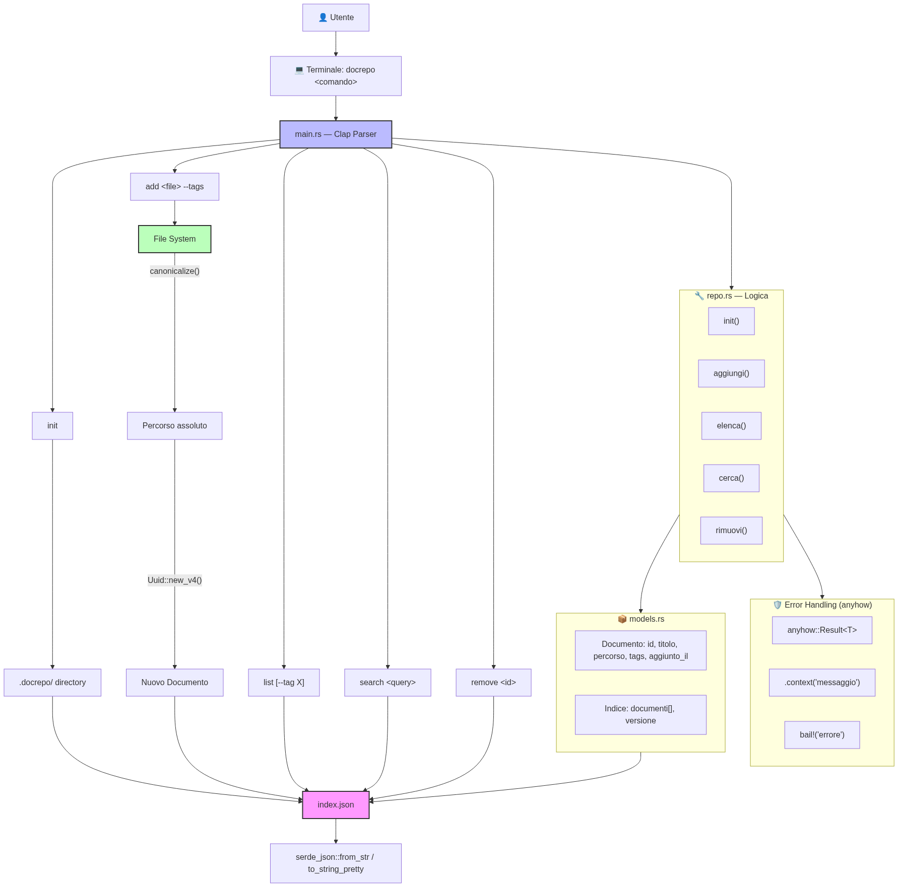

# Rust da zero a dieci

**In pillole**: Rust è un linguaggio di programmazione che ti dà il controllo totale sul computer — come il C — ma senza il rischio di far esplodere tutto. È veloce come un razzo, sicuro come una cassaforte, e ha un compilatore che ti tratta come un maestro severo: ti sgrida, ma ti fa diventare bravo.

---

## 1. Perché Rust?

Immagina di dover costruire un motore. Hai due opzioni:

- **Motore Python**: Facile da montare, pezzi grandi e colorati, istruzioni semplici. Ma se sbagli qualcosa, il motore si rompe *mentre stai già guidando*. E va piano.
- **Motore C/C++**: Potente, velocissimo, puoi modificare ogni bullone. Ma se stringi troppo una vite, il motore esplode e non sai nemmeno perché. E ci sono 300 pagine di istruzioni.
- **Motore Rust**: Potente come il C, ma con un computer di bordo che controlla *ogni tua mossa prima che tu accenda il motore*. Se c'è un problema, te lo dice subito. Il motore non si rompe mai mentre guidi.

Rust è nato nel 2015 da Mozilla (quelli di Firefox) per risolvere un problema concreto: i bug di memoria. In C e C++, puoi accidentalmente accedere a memoria che non esiste più. In Rust, il compilatore ti impedisce di farlo.

### Cosa rende Rust speciale?

| Caratteristica | Cosa significa |
|---|---|
| **Zero-cost abstractions** | Scrivere codice elegante non ti costa performance. I generics di Rust sono veloci quanto il codice scritto a mano. |
| **Memory safety senza garbage collector** | Niente `malloc`/`free` manuale, niente garbage collector che ti blocca il programma. La memoria si libera *automaticamente* quando non serve più. |
| **Concorrenza senza paura** | Scrivere codice multi-thread in C è terrorizzante. In Rust, il compilatore ti dice se due thread litigano per gli stessi dati. |
| **Compiler come mentore** | I messaggi di errore di Rust sono famosi per essere *utili*. Ti dicono esattamente cosa hai sbagliato e spesso ti suggeriscono la correzione. |

### Chi usa Rust?

- **Firefox** (Mozilla) — il motore di rendering Servo
- **Dropbox** — sincronizzazione file
- **Discord** — parti critiche del backend
- **AWS** — Firecracker (microVM per Lambda)
- **Android** — componenti di sistema
- **npm** — registry e tooling

> 💡 **Fun fact**: Da 8 anni consecutivi, Rust è il linguaggio più amato nel sondaggio annuale di Stack Overflow.

---

## 2. Rust non è Python

Se vieni da Python, preparati a uno shock culturale. Rust e Python sono quasi opposti in filosofia.

### Il mindset shift

| Concetto | Python | Rust |
|---|---|---|
| **Esecuzione** | Interpretato (riga per riga) | Compilato (tutto in una volta in binario) |
| **Errori** | A *runtime* — schianti mentre il programma gira | A *compile time* — il compilatore ti blocca prima |
| **Memoria** | Garbage collector automatico | Ownership system (niente GC, niente `free` manuale) |
| **Tipi** | Dinamici (`x = 5; x = "ciao"` funziona) | Statici (`let x = 5; x = "ciao"` NON compila) |
| **Mutabilità** | Tutto è mutabile di default | Devi dichiarare `mut` se vuoi modificare qualcosa |
| **Null** | `None` è ovunque | Non esiste `null`. Usi `Option<T>` |
| **Eccezioni** | `try`/`except` | `Result<T, E>` — gli errori sono *valori*, non lanci |

### Cosa guadagni, cosa perdi

**Guadagni:**
- Performance da C, senza i suoi incubi
- Refactoring senza paura: se compila, probabilmente funziona
- Pattern matching potente (Python 3.10 lo ha copiato con `match`/`case`)
- Tooling integrato: formatter, linter, test runner, package manager — tutto incluso

**Perdi:**
- Velocità di prototipazione: in Python scrivi 10 righe, in Rust potresti scriverne 30
- Flessibilità estrema: Rust ti costringe a fare le cose "per bene"
- Il "tanto poi sistemo": in Rust non compila finché non è corretto

```python
# Python: flessibile, ma se dimentichi di gestire l'errore...
def dividi(a, b):
    return a / b

print(dividi(10, 0))  # 💥 ZeroDivisionError a runtime
```

```rust
// Rust: il compilatore ti obbliga a pensarci
fn dividi(a: f64, b: f64) -> Option<f64> {
    if b == 0.0 {
        None       // "ehi, qualcosa è andato storto"
    } else {
        Some(a / b) // "tutto ok, ecco il risultato"
    }
}

let risultato = dividi(10.0, 0.0);
match risultato {
    Some(valore) => println!("Risultato: {}", valore),
    None => println!("Non puoi dividere per zero!"),
}
```

> 🧠 **Il mantra**: In Python scrivi codice e speri funzioni. In Rust, il compilatore è il tuo pair programmer che ti dice "questo non funzionerà mai" *prima* che tu lo scopra da solo.

---

## 3. Sintassi

Ora sporchiamoci le mani. Ecco i mattoni fondamentali di Rust.

### Variabili e costanti

```rust
// Immutabile di default — una volta assegnato, non cambia più
let nome = "Alice";

// Mutabile — dichiari esplicitamente che può cambiare
let mut contatore = 0;
contatore = contatore + 1;  // ✅ OK

// Costante — sempre immutabile, deve avere un tipo esplicito
const MAX_GIOCATORI: u32 = 4;

// Shadowing — puoi ri-dichiarare una variabile con lo stesso nome
let x = 5;
let x = x + 1;   // x ora è 6
let x = "ciao";  // x ora è una stringa — nuovo binding, tipo diverso
```

> 💡 **Perché `let mut`?** In Python tutto è mutabile e a volte modifichi cose per sbaglio. Rust ti chiede di dichiarare l'intenzione: "sì, voglio che questa variabile possa cambiare". Meno sorprese.

### Tipi primitivi

```rust
// Interi — puoi scegliere la dimensione in bit
let eta: u8 = 13;      // unsigned 8-bit (0..255)
let temperatura: i32 = -5;  // signed 32-bit
let grande: u64 = 9_000_000_000;  // unsigned 64-bit

// Virgola mobile
let pi: f64 = 3.14159;
let mezzo: f32 = 0.5;

// Booleani
let attivo: bool = true;

// Carattere — 4 byte (supporta emoji e Unicode!)
let lettera: char = '🦀';

// Tuple — gruppo di valori di tipi diversi
let coordinate: (i32, i32) = (10, 20);
let (x, y) = coordinate;  // destrutturazione
println!("x: {}, y: {}", x, y);

// Array — dimensione fissa, stesso tipo
let numeri: [i32; 5] = [1, 2, 3, 4, 5];
let zeri = [0; 100];  // array di 100 zeri

// Vettore — dimensione variabile (simile alle list di Python)
let mut lista: Vec<i32> = vec![1, 2, 3];
lista.push(4);        // aggiunge in fondo
lista.pop();          // rimuove dall'ultimo
```

### Funzioni

```rust
// Semplice — parametri tipati, tipo di ritorno dopo la freccia ->
fn somma(a: i32, b: i32) -> i32 {
    a + b  // ultima espressione senza punto e virgola = valore di ritorno
}

// Con return esplicito
fn massimo(a: i32, b: i32) -> i32 {
    if a > b {
        return a;
    }
    b
}

// Senza ritorno (unit type, simile a None di Python)
fn saluta(nome: &str) {
    println!("Ciao, {}!", nome);
}
```

> 🧠 **Expresssion vs Statement**: In Rust quasi tutto è un'espressione (restituisce un valore). Un blocco `{}` restituisce l'ultima espressione. Il `;` sopprime il valore e trasforma l'espressione in statement (restituisce `()`, il "niente" di Rust).

### Controllo di flusso

```rust
// if/else — è un'espressione, quindi puoi assegnarlo!
let numero = 7;
let messaggio = if numero > 5 {
    "grande"
} else {
    "piccolo"
};

// loop — ciclo infinito (devi uscire con break)
let mut contatore = 0;
let risultato = loop {
    contatore += 1;
    if contatore == 10 {
        break contatore * 2;  // break può restituire un valore!
    }
};
println!("Risultato: {}", risultato); // 20

// while
let mut n = 3;
while n > 0 {
    println!("{}...", n);
    n -= 1;
}
println!("Via!");

// for — il più usato
let numeri = vec![10, 20, 30, 40];
for n in &numeri {         // & = prendi in prestito, non consumare
    println!("{}", n);
}

// for con range
for i in 0..5 {            // 0, 1, 2, 3, 4 (escluso 5)
    println!("{}", i);
}

for i in 0..=5 {           // 0, 1, 2, 3, 4, 5 (incluso 5)
    println!("{}", i);
}
```

### Pattern Matching

Il `match` di Rust è uno switch sotto steroidi. È **esaustivo**: devi coprire *tutti* i casi possibili, o il compilatore si arrabbia.

```rust
enum Semaforo {
    Rosso,
    Giallo,
    Verde,
}

let stato = Semaforo::Giallo;

match stato {
    Semaforo::Rosso => println!("Fermati!"),
    Semaforo::Giallo => println!("Rallenta..."),
    Semaforo::Verde => println!("Vai!"),
    // Se dimentichi un colore, il compilatore ti urla addosso
}
```

```rust
// Match su numeri con range e condizioni (guard)
let voto = 85;

match voto {
    90..=100 => println!("Eccellente!"),
    70..=89 => println!("Bravo!"),
    60..=69 => println!("Sufficiente"),
    _ if voto < 0 => println!("Impossibile!"),
    _ => println!("Studia di più..."),
}
```

### Enum — molto più potenti delle enum di Python

```rust
// Enum con dati associati — ogni variante può contenere dati diversi
enum Messaggio {
    Testo(String),
    Immagine { url: String, larghezza: u32 },
    Reazione(char),
    Vuoto,
}

let msg = Messaggio::Testo(String::from("Ciao!"));

match msg {
    Messaggio::Testo(contenuto) => println!("Testo: {}", contenuto),
    Messaggio::Immagine { url, larghezza } => {
        println!("Immagine {} ({})px", url, larghezza)
    }
    Messaggio::Reazione(emoji) => println!("Reazione: {}", emoji),
    Messaggio::Vuoto => println!("Messaggio vuoto"),
}
```

---

## 4. I Tool: Cargo e Amici

In Python hai `pip`, `virtualenv`, `black`, `pylint`, `pytest` — tutti tool separati che devi installare. In Rust, è tutto incluso. E si chiama **Cargo**.

### rustup — il launcher

`rustup` è il primo tool che installi. Gestisce le versioni di Rust e i target di compilazione:

```bash
# Installa Rust (fallo una volta sola)
curl --proto '=https' --tlsv1.2 -sSf https://sh.rustup.rs | sh

# Aggiorna Rust all'ultima versione
rustup update

# Aggiungi un target (es. compilare per Windows da Mac)
rustup target add x86_64-pc-windows-msvc
```

### Cargo — il coltellino svizzero

```bash
# Crea un nuovo progetto
cargo new mio_progetto
# Crea: mio_progetto/
#         ├── Cargo.toml      (configurazione, dipendenze)
#         └── src/
#             └── main.rs      (il tuo codice)

# Compila (debug mode, veloce da compilare)
cargo build

# Compila e esegui
cargo run

# Compila per produzione (ottimizzato, più lento da compilare)
cargo build --release

# Esegui i test
cargo test

# Formatta il codice (come black per Python)
cargo fmt

# Linter ufficiale (come pylint, ma molto più severo e utile)
cargo clippy

# Genera la documentazione dal codice
cargo doc --open
```

### Cargo.toml — il cuore del progetto

```toml
[package]
name = "mio_progetto"
version = "0.1.0"
edition = "2021"

[dependencies]
# Libreria per creare CLI (come argparse/clicc per Python)
clap = { version = "4.5", features = ["derive"] }
# Serializzazione JSON (come json di Python, ma compilato)
serde = { version = "1.0", features = ["derive"] }
serde_json = "1.0"
# Gestione errori semplificata
anyhow = "1.0"

[dev-dependencies]
# Solo per test
tempfile = "3.0"
```

Basta aggiungere una dipendenza al `Cargo.toml` e Cargo la scarica, la compila, e la linka al tuo progetto. Niente `pip install`, niente `requirements.txt`, niente ambienti virtuali che si rompono.

### rustc — il compilatore

```bash
# Compila un singolo file (senza Cargo — utile per esperimenti veloci)
rustc main.rs
./main
```

Per progetti veri, usa sempre `cargo`. `rustc` è per script veloci o per capire come funziona il compilatore.

### I messaggi di errore

I messaggi di errore di Rust sono i migliori che tu abbia mai visto:

```
error[E0382]: borrow of moved value: `nome`
 --> src/main.rs:4:20
  |
3 |     let saluto = format!("Ciao, {}!", nome);
  |                                       ---- value moved here
4 |     println!("{}", nome);
  |                    ^^^^ value borrowed here after move
  |
  = note: move occurs because `nome` has type `String`,
    which does not implement the `Copy` trait
help: consider cloning the value before moving it
  |
3 |     let saluto = format!("Ciao, {}!", nome.clone());
  |                                            ++++++++
```

Ti dice:
1. **Cosa** hai sbagliato (`borrow of moved value`)
2. **Dove** (file, riga, colonna)
3. **Perché** (move occurs because...)
4. **Come** risolvere (`consider cloning`)

> 💡 **Pro tip**: Leggi i messaggi di errore di Rust. Davvero. Sono scritti da esseri umani per esseri umani. Molti sviluppatori Rust dicono di imparare il linguaggio *leggendo gli errori del compilatore*.

---

**Checkpoint**: A questo punto dovresti sapere:
- Perché Rust esiste e chi lo usa
- Le differenze fondamentali con Python
- Dichiarare variabili, funzioni, e controllare il flusso
- Usare Cargo per creare, compilare, e testare un progetto

> **Prossimo**: La parte che rende Rust *veramente* diverso da ogni altro linguaggio: Ownership, Borrowing e Lifetimes.

---

## 5. Ownership, Borrowing e Lifetimes

**In pillole**: In Rust, ogni valore ha un solo proprietario. Quando il proprietario esce di scena, il valore viene distrutto. Puoi *prestare* (`&`) un valore a qualcun altro, ma con regole precise: o molti lettori, o un solo scrittore. Mai entrambi. I lifetimes (`'a`) dicono al compilatore per quanto tempo un riferimento è valido.

Questa è la parte che fa impazzire i principianti. Ma se la capisci, hai capito Rust.

### L'analogia del libro

Immagina un libro della biblioteca:

- **Ownership**: Tu prendi il libro in prestito. Solo tu ce l'hai. Se lo passi a un amico (`move`), non ce l'hai più tu. Se esci dalla biblioteca (`scope`), il libro torna automaticamente sullo scaffale (`drop`).
- **Borrowing (`&T`)**: Il tuo amico ti chiede di leggerlo un attimo. Glielo passi, ma è ancora *tuo*. Lui può solo leggerlo, non scriverci sopra.
- **Mutable Borrowing (`&mut T`)**: Lasci che un amico scriva una nota a margine. Ma mentre lo fa, nessun altro può toccare il libro — nemmeno tu.
- **Lifetimes**: La bibliotecaria vuole essere sicura che nessuno abbia il libro dopo l'orario di chiusura. I lifetimes sono il timbro sulla ricevuta.

### Ownership

```rust
// REGOLA 1: Ogni valore ha esattamente UN proprietario
let s1 = String::from("ciao");  // s1 è il proprietario
let s2 = s1;                     // ownership TRASFERITA a s2
// println!("{}", s1);           // ❌ ERRORE: s1 non possiede più niente!
println!("{}", s2);              // ✅ OK: s2 è il proprietario
```

```rust
// REGOLA 2: Quando il proprietario esce dallo scope, il valore viene distrutto
{
    let s = String::from("temporaneo");
    // s è vivo qui
} // ← s esce dallo scope, la memoria viene liberata AUTOMATICAMENTE
// println!("{}", s); // ❌ ERRORE: s non esiste più

// In Python avresti bisogno del garbage collector.
// In C avresti bisogno di free(s). Se dimentichi, memory leak.
// In Rust: automatico, deterministico, gratuito.
```

### Move vs Copy

```rust
// I tipi semplici (interi, bool, char) implementano il trait Copy:
// vengono COPIATI automaticamente invece di essere mossi
let x = 5;
let y = x;   // x viene copiato — x è ancora valido!
println!("x = {}, y = {}", x, y); // ✅ OK per entrambi

// I tipi sullo heap (String, Vec) NON implementano Copy:
// vengono MOSSII, non copiati
let a = String::from("ciao");
let b = a;   // a viene MOSSO — a non è più valido
// println!("{}", a); // ❌ ERRORE

// Se vuoi una copia profonda, usa .clone()
let a = String::from("ciao");
let b = a.clone();   // costoso: alloca nuova memoria e copia i dati
println!("a = {}, b = {}", a, b); // ✅ OK per entrambi
```

### Borrowing (Prendere in Prestito)

Invece di trasferire la proprietà, puoi *prestare* un valore con `&`:

```rust
fn calcola_lunghezza(s: &String) -> usize {  // prende in prestito, NON possiede
    s.len()
    // s non viene distrutto qui — non è il proprietario
}

let nome = String::from("Alice");
let lunghezza = calcola_lunghezza(&nome);  // presta nome alla funzione
println!("{} ha {} lettere", nome, lunghezza); // ✅ nome è ancora valido!
```

Senza borrowing, avresti dovuto passare `nome` e perderlo:

```rust
fn divora_stringa(s: String) {  // prende OWNERSHIP
    println!("Gnam gnam: {}", s);
} // s viene distrutto qui

let nome = String::from("Povero");
divora_stringa(nome);
// println!("{}", nome); // ❌ nome è stato mangiato!
```

### Mutable Borrowing (`&mut`)

```rust
fn aggiungi_punto_esclamativo(s: &mut String) {
    s.push_str("!");     // può modificare perché è &mut
}

let mut frase = String::from("Ciao");
aggiungi_punto_esclamativo(&mut frase);
println!("{}", frase);  // "Ciao!"
```

### La Regola d'Oro del Borrow Checker

> **O TANTI lettori immutabili (`&T`), O UN SOLO scrittore mutabile (`&mut T`). MAI entrambi contemporaneamente.**

```rust
let mut s = String::from("test");

let r1 = &s;      // ✅ prestito immutabile #1
let r2 = &s;      // ✅ prestito immutabile #2 (OK, tanti lettori)
// let r3 = &mut s; // ❌ ERRORE: non puoi avere &mut mentre ci sono & attivi
println!("{} {}", r1, r2);

// r1 e r2 non sono più usati dopo println! — i prestiti scadono qui

let r3 = &mut s;  // ✅ OK: ora non ci sono altri prestiti attivi
r3.push_str("!");
```

Questa regola previene:
- **Data races**: due thread che modificano gli stessi dati
- **Dangling pointers**: un riferimento a dati che non esistono più
- **Unexpected mutations**: qualcuno modifica dati che stai leggendo

### Lifetimes

I lifetimes rispondono alla domanda: "Questo riferimento è ancora valido?"

```rust
// ❌ NON compila: Rust non sa quale riferimento restituire
fn piu_lungo(x: &str, y: &str) -> &str {
    if x.len() > y.len() { x } else { y }
}
```

Il compilatore vede due riferimenti in input e uno in output. Quale lifetime ha l'output? Non lo sa. Devi dirglielo:

```rust
// ✅ Con lifetime annotation esplicita
fn piu_lungo<'a>(x: &'a str, y: &'a str) -> &'a str {
    if x.len() > y.len() { x } else { y }
}
```

`'a` significa: "il riferimento restituito vive almeno quanto il più corto tra `x` e `y`".

L'annotazione **non cambia quanto vivono i valori**. Dice solo al compilatore: "fidati, il risultato vive almeno quanto entrambi gli input".

### Lifetimes nelle Struct

```rust
// Una struct che contiene un riferimento DEVE dichiarare il lifetime
struct Estratto<'a> {
    parte: &'a str,  // questo riferimento vive almeno 'a
}

let frase = String::from("Il meglio di Rust è il borrow checker.");
let prima_frase = &frase[0..23];
let estratto = Estratto { parte: prima_frase };
println!("{}", estratto.parte);
```

> 💡 **Non impazzire con i lifetimes.** Nell'80% dei casi, Rust li inferisce da solo (lifetime elision). Li scrivi esplicitamente solo in tre casi: (1) funzioni che restituiscono riferimenti con più parametri reference, (2) struct con riferimenti, (3) quando il compilatore te lo chiede.

---

**Checkpoint — Ownership**

> **D:** Cosa stampa questo codice?
> ```rust
> let s1 = String::from("a");
> let s2 = s1;
> let s3 = s2.clone();
> println!("{}", s1);
> ```
> <details><summary>Risposta</summary>
> ❌ NON compila. `s1` è stato *mosso* a `s2` — non è più valido. Non puoi usarlo. `.clone()` su `s2` crea una copia indipendente in `s3`, ma `s1` è ormai perso.
> </details>

> **D:** Perché Rust non ha un garbage collector?
>
> <details><summary>Risposta</summary>
> Perché il garbage collector (1) consuma CPU per scansionare la memoria, (2) causa pause imprevedibili (stop-the-world), (3) rende difficile scrivere sistemi real-time. Rust libera la memoria *deterministicamente* quando il proprietario esce dallo scope — zero overhead, zero pause.
> </details>

---

## 6. Gestione degli Errori e delle Eccezioni

**In pillole**: In Rust gli errori non si "lanciano". Si *restituiscono*. `Result<T, E>` è un enum con due varianti: `Ok(T)` per il successo e `Err(E)` per il fallimento. `Option<T>` è simile ma per "c'è o non c'è". L'operatore `?` è la bacchetta magica: propaga l'errore verso l'alto con una sola riga.

### Rust vs Python: la filosofia

| Concetto | Python | Rust |
|---|---|---|
| **Errore previsto** | `raise ValueError("...")` | `return Err(...)` |
| **Gestione** | `try:` / `except ValueError as e:` | `match` su `Result` o operatore `?` |
| **Errore fatale** | eccezione non gestita → crash | `panic!("...")` — crash intenzionale |
| **Valore assente** | `None` | `Option::None` |
| **Il problema** | Puoi dimenticare `except` → crash a runtime | Se dimentichi di gestire `Result`, il compilatore ti avverte |

> 🧠 **L'analogia**: `Result` è come una scatola. La apri e dentro ci trovi o un regalo (`Ok`) o un biglietto che spiega cosa è andato storto (`Err`). Non puoi fingere che la scatola sia vuota: devi aprirla.

### `panic!` — Quando Far Esplodere Tutto

`panic!` è per errori *irrecuperabili*. Se arrivi a un panic, il programma si ferma. Punto.

```rust
// Usa panic! solo quando continuare sarebbe pericoloso o impossibile
fn leggi_configurazione() -> String {
    match std::fs::read_to_string("config.toml") {
        Ok(contenuto) => contenuto,
        Err(_) => panic!("Impossibile avviare senza config.toml!"),
    }
}

// Esempi di panic giustificati:
// - Index out of bounds su un array (bug del programmatore)
// - File di configurazione mancante in produzione
// - Divisione per zero in un contesto dove non ha senso gestirla
```

La regola: se l'errore è *colpa tua* (bug), `panic!`. Se è *colpa del mondo esterno* (file mancante, rete giù), usa `Result`.

### `Result<T, E>` — L'Error Handling Standard

```rust
use std::fs::File;
use std::io::Read;

fn leggi_file(nome: &str) -> Result<String, std::io::Error> {
    let mut file = File::open(nome)?;  // ? = se errore, ritorna subito Err
    let mut contenuto = String::new();
    file.read_to_string(&mut contenuto)?;
    Ok(contenuto)
}

// Uso: gestisci entrambi i casi
match leggi_file("dati.txt") {
    Ok(testo) => println!("Contenuto: {}", testo),
    Err(e) => println!("Errore: {}", e),
}
```

### L'Operatore `?` — La Bacchetta Magica

`?` è zucchero sintattico per "se è `Ok`, estrai il valore; se è `Err`, ritorna subito l'errore alla funzione chiamante".

```rust
// SENZA ? (verboso)
fn carica_config() -> Result<Config, Error> {
    let file = match File::open("config.json") {
        Ok(f) => f,
        Err(e) => return Err(e.into()),
    };
    let config: Config = match serde_json::from_reader(file) {
        Ok(c) => c,
        Err(e) => return Err(e.into()),
    };
    Ok(config)
}

// CON ? (pulito)
fn carica_config() -> Result<Config, Error> {
    let file = File::open("config.json")?;
    let config: Config = serde_json::from_reader(file)?;
    Ok(config)
}
```

> 💡 Il `?` fa anche conversione automatica del tipo di errore (se implementa `From`). Per questo usa `.into()` nell'esempio senza `?`.

### `Option<T>` — Quando Qualcosa Può Non Esserci

`Option` è il sostituto di `null`/`None`. O c'è (`Some(valore)`) o non c'è (`None`). Il compilatore ti obbliga a gestire entrambi.

```rust
fn trova_utente(nome: &str) -> Option<Utente> {
    if nome.is_empty() {
        None
    } else {
        Some(Utente { nome: nome.to_string() })
    }
}

// Pattern matching esaustivo
match trova_utente("Alice") {
    Some(u) => println!("Trovata: {}", u.nome),
    None => println!("Nessun utente"),
}

// Scorciatoie
let u = trova_utente("Alice").unwrap();          // 💥 panica se None
let u = trova_utente("Alice").expect("Aiuto!");  // 💥 panica con messaggio
let u = trova_utente("Alice").unwrap_or(Utente::default()); // default se None

// ? funziona anche con Option!
fn saluta(nome: &str) -> Option<String> {
    let utente = trova_utente(nome)?;  // se None, ritorna None
    Some(format!("Ciao, {}!", utente.nome))
}
```

### `unwrap()` e Amici — La Scala della Disperazione

| Metodo | Cosa fa | Quando usarlo |
|---|---|---|
| `unwrap()` | Estrae `Ok`/`Some`, panica su `Err`/`None` | Solo in test o prototipi rapidi |
| `expect(msg)` | Come `unwrap()`, ma con messaggio di errore personalizzato | Quando sei *certo* che non fallirà |
| `unwrap_or(default)` | Estrae o restituisce un default | Quando hai un fallback sensato |
| `unwrap_or_else(\|e\| ...)` | Estrae o calcola un default con una closure | Quando il default va calcolato |
| `unwrap_or_default()` | Estrae o usa `Default::default()` | Per tipi che implementano `Default` |

```rust
// Scala di preferenza:
// 1. Gestisci con match → massimo controllo
// 2. Usa ? per propagare → codice pulito
// 3. unwrap_or → fallback sensato
// 4. expect → quando sei SICURO
// 5. unwrap → solo test/prototipi
```

### Librerie: `anyhow` vs `thiserror`

Scrivere tipi di errore a mano è noioso. Due librerie risolvono il problema:

| Libreria | Per | Pattern |
|---|---|---|
| **anyhow** | Codice applicativo (CLI, script) | `anyhow::Result<T>` — errore flessibile, tipo opaco |
| **thiserror** | Librerie (codice condiviso) | `#[derive(Error)]` — errori tipati, pattern matchabili |

```rust
// anyhow: perfetto per la CLI che costruirai nella sezione 10
use anyhow::{Result, Context};

fn processa_file(nome: &str) -> Result<String> {
    let contenuto = std::fs::read_to_string(nome)
        .with_context(|| format!("Impossibile leggere '{}'", nome))?;
    Ok(contenuto)
}
// anyhow::Result<T> = Result<T, anyhow::Error>
// anyhow::Error può contenere QUALSIASI errore. Flessibile, ma non tipato.
```

```rust
// thiserror: per quando vuoi che chi usa il tuo codice sappia esattamente cosa può andare storto
use thiserror::Error;

#[derive(Error, Debug)]
enum MieiErrori {
    #[error("file '{0}' non trovato")]
    FileNonTrovato(String),
    #[error("dati corrotti alla riga {riga}")]
    DatiCorrotti { riga: usize },
    #[error("errore interno: {0}")]
    Interno(#[from] std::io::Error),  // conversione automatica da io::Error
}
```

> 🧠 **Regola pratica**: Inizi con `anyhow` nel `main.rs`. Se poi crei una libreria separata, usi `thiserror` per i tipi di errore pubblici.

---

**Checkpoint — Error Handling**

> **D:** Quando usi `panic!` invece di `Result`?
>
> <details><summary>Risposta</summary>
> `panic!` è per bug del programmatore (index out of bounds, invarianti violati). `Result` è per errori prevedibili del mondo esterno (file mancante, parsing fallito, rete giù). Se l'errore può succedere in produzione senza che sia colpa tua, usa `Result`.
> </details>

> **D:** Cosa fa `?` su un `Option`?
>
> <details><summary>Risposta</summary>
> Se è `Some(valore)`, estrae `valore`. Se è `None`, fa un return immediato di `None` dalla funzione corrente. Funziona solo in funzioni che restituiscono `Option<T>`.
> </details>

---

## 7. Design Pattern in Rust

**In pillole**: I pattern che conosci da altri linguaggi esistono anche in Rust, ma il type system e l'ownership li rendono più potenti — e a volte diversi. Ecco quelli che userai di più.

### Il Costruttore: `new()` e il Builder Pattern

Rust non ha costruttori come Python (`__init__`). Per convenzione, usi una funzione associata `new()`:

```rust
struct Configurazione {
    host: String,
    porta: u16,
    debug: bool,
}

impl Configurazione {
    // Il costruttore standard
    fn new(host: String, porta: u16) -> Self {
        Self {
            host,
            porta,
            debug: false,  // default
        }
    }
}

let cfg = Configurazione::new("localhost".into(), 8080);
```

Quando hai tanti parametri opzionali, usa il **Builder Pattern**:

```rust
struct ConfigurazioneBuilder {
    host: String,
    porta: u16,
    debug: bool,
}

impl ConfigurazioneBuilder {
    fn new(host: &str) -> Self {
        Self { host: host.into(), porta: 8080, debug: false }
    }

    fn porta(mut self, p: u16) -> Self {
        self.porta = p;
        self
    }

    fn debug(mut self, d: bool) -> Self {
        self.debug = d;
        self
    }

    fn build(self) -> Configurazione {
        Configurazione { host: self.host, porta: self.porta, debug: self.debug }
    }
}

// Uso fluente (method chaining)
let cfg = ConfigurazioneBuilder::new("localhost")
    .porta(3000)
    .debug(true)
    .build();
```

> 💡 In Python useresti `**kwargs` o dataclasses. In Rust il builder è più verboso ma ti dà type safety al 100%: non puoi passare una porta che non sia `u16`.

### RAII — Resource Acquisition Is Initialization

In Rust, quando una variabile esce dallo scope, viene chiamato il suo `Drop`. Questo pattern si chiama RAII e lo usi *sempre*, anche senza accorgertene:

```rust
{
    let file = File::open("dati.txt").unwrap();
    // usa file...
} // ← file viene chiuso AUTOMATICAMENTE qui (drop)

// Equivalente Python:
// with open("dati.txt") as f:
//     # usa f...
// # f chiuso automaticamente

// Ma in Rust funziona per TUTTO: lock, socket, connessioni DB, memoria...
```

### Newtype Pattern

Avvolgi un tipo primitivo in una struct per dargli un significato e prevenire errori:

```rust
// Senza newtype: facile confondere gli argomenti
fn crea_utente(nome: String, email: String, telefono: String) { /* ... */ }

// Con newtype: il compilatore ti salva
struct Nome(String);
struct Email(String);
struct Telefono(String);

fn crea_utente(nome: Nome, email: Email, telefono: Telefono) { /* ... */ }

// Non puoi passare una Email dove serve un Nome:
crea_utente(Email("alice@example.com".into()), /* ... */); // ❌ type mismatch!
```

### `impl Trait` vs Generics

```rust
// Generics: il chiamante sceglie il tipo
fn stampa<T: std::fmt::Display>(valore: T) {
    println!("{}", valore);
}

// impl Trait: sintassi più semplice per lo stesso concetto
fn stampa(valore: impl std::fmt::Display) {
    println!("{}", valore);
}

// Differenza chiave: con impl Trait NON puoi usare il turbofish ::<>
stampa::<i32>(42);     // ✅ con generics
stampa(42);            // ✅ con impl Trait (tipo inferito)
// stampa::<i32>(42); // ❌ non funziona con impl Trait
```

### Type-State Pattern

Usa il type system per codificare lo stato di un oggetto. Ideale per builder o macchine a stati:

```rust
// Un builder che ti obbliga a chiamare i metodi nell'ordine giusto
struct Bozza;
struct Pubblicato;

struct Articolo<S> {
    titolo: String,
    _stato: std::marker::PhantomData<S>,
}

impl Articolo<Bozza> {
    fn nuovo(titolo: &str) -> Self {
        Self { titolo: titolo.into(), _stato: std::marker::PhantomData }
    }

    fn pubblica(self) -> Articolo<Pubblicato> {
        Articolo::<Pubblicato> { titolo: self.titolo, _stato: std::marker::PhantomData }
    }
}

impl Articolo<Pubblicato> {
    fn archivia(self) {
        println!("'{}' archiviato!", self.titolo);
    }
}

let articolo = Articolo::nuovo("Il Futuro di Rust");
let articolo = articolo.pubblica();  // ora è Pubblicato
articolo.archivia();                  // ✅ solo Articolo<Pubblicato> può essere archiviato
```

---

## 8. Good Parts & Bad Parts

Ogni linguaggio ha i suoi punti di forza e le sue rughe. Ecco una valutazione onesta di Rust.

### ✅ Good Parts (Quello che amerai)

| Forza | Perché |
|---|---|
| **Memory safety senza GC** | Zero use-after-free, double-free, null pointer. E senza il costo di un garbage collector. È il superpotere di Rust. |
| **Type system espressivo** | Enum con dati, pattern matching esaustivo, traits, generics. Codifichi la logica di business nei tipi. |
| **Compiler come mentore** | I messaggi di errore sono i migliori nell'industria. Ti insegna il linguaggio mentre lo scrivi. |
| **Ecosistema di tooling** | `cargo`, `rustfmt`, `clippy`, `rust-analyzer`, `cargo test`, `cargo doc`. Tutto incluso, tutto coerente. |
| **Performance** | Pari a C/C++. Zero-cost abstractions: i generics e gli iterator sono veloci quanto i loop scritti a mano. |
| **Concorrenza fearless** | `Send` e `Sync` traits impediscono data race a compile time. Thread in Rust non fanno paura. |
| **Comunità accogliente** | La comunità Rust è nota per essere inclusiva, paziente con i principianti, e produrrà documentazione eccellente. |
| **WASM e embedded** | Rust compila a WebAssembly ed è usato in sistemi embedded. Lo stesso linguaggio dal browser al microcontrollore. |

### ❌ Bad Parts (Quello che ti farà sbattere la testa)

| Debolezza | Dettaglio |
|---|---|
| **Curva di apprendimento ripida** | Ownership, borrowing, lifetimes. Le prime settimane combatti contro il compilatore. È normale, ma è frustrante. |
| **Tempi di compilazione** | I progetti grandi compilano lentamente. `cargo check` aiuta (salta la codegen), ma il linking resta lento. |
| **Ecosistema giovane** | Molte librerie sono in versione 0.x. Alcuni domini (GUI, machine learning) hanno meno opzioni rispetto a Python. |
| **Async complesso** | `async`/`await` in Rust è potente ma ha complessità nascoste: `Pin`, executor, scelta tra `tokio` e `async-std`. |
| **Stringhe: un labirinto** | `&str`, `String`, `OsStr`, `Path`, `Cow<str>`... Le stringhe in Rust sono sorprendentemente complicate. |
| **Verboso** | Pattern come builder, newtype, type-state richiedono più codice rispetto a Python o TypeScript. |
| **Non adatto a prototipi rapidi** | Se devi esplorare un'idea in 30 minuti, Python o JavaScript sono migliori. Rust brilla quando la struttura è chiara. |

> 🧠 **La regola d'oro**: Usa Rust quando correttezza e performance contano più della velocità di scrittura. Usa Python quando la velocità di iterazione conta più della correttezza a compile-time.

---

## 9. Testing in Rust

**In pillole**: In Rust i test sono cittadini di prima classe. Si scrivono nello stesso file del codice (unit test) o in una directory `tests/` (integration test). `cargo test` esegue tutto. Niente plugin, niente framework esterni.

### Unit Test (Inline)

I test si mettono in un modulo `#[cfg(test)]` in fondo al file:

```rust
// src/lib.rs (o src/main.rs)
pub fn somma(a: i32, b: i32) -> i32 {
    a + b
}

pub fn dividi(a: f64, b: f64) -> Option<f64> {
    if b == 0.0 { None } else { Some(a / b) }
}

#[cfg(test)]  // compilato solo in modalità test
mod tests {
    use super::*;  // importa tutto dal modulo padre

    #[test]
    fn test_somma() {
        assert_eq!(somma(2, 2), 4);
        assert_eq!(somma(-1, 1), 0);
    }

    #[test]
    fn test_dividi_ok() {
        assert_eq!(dividi(10.0, 2.0), Some(5.0));
    }

    #[test]
    fn test_dividi_per_zero() {
        assert_eq!(dividi(10.0, 0.0), None);
    }

    #[test]
    #[should_panic(expected = "tentativo di dividere")]
    fn test_panic_su_input_invalido() {
        panic!("tentativo di dividere per zero non consentito");
    }
}
```

### Asserzioni

```rust
assert!(x > 0);                          // condizione booleana
assert_eq!(ottenuto, atteso);            // uguaglianza (usa PartialEq)
assert_ne!(ottenuto, non_atteso);        // disuguaglianza
assert!(ottenuto.is_ok());               // per Result
```

> 💡 `assert_eq!` richiede che il tipo implementi `Debug` e `PartialEq`. La maggior parte dei tipi standard lo fa.

### Integration Test

I test di integrazione vanno nella directory `tests/` (fuori da `src/`). Testano la tua libreria come farebbe un consumatore esterno:

```rust
// tests/integration_test.rs
use mio_progetto::somma;  // importa dalla tua libreria

#[test]
fn test_integrazione() {
    assert_eq!(somma(100, 200), 300);
}
```

### Eseguire i Test

```bash
# Tutti i test
cargo test

# Solo test con un nome specifico
cargo test test_somma

# Test in modalità single-thread (se hai test che condividono stato)
cargo test -- --test-threads=1

# Mostra output di println! anche nei test che passano
cargo test -- --show-output

# Ignora i test marcati #[ignore]
cargo test

# Esegui SOLO i test marcati #[ignore]
cargo test -- --ignored
```

### Test Organization Best Practices

```
mio_progetto/
├── src/
│   ├── lib.rs          # codice pubblico + #[cfg(test)] mod tests
│   └── main.rs         # entry point (no test qui, testa la lib)
├── tests/
│   └── integration_test.rs  # test end-to-end
```

**Regola**: I test unitari stanno nel file `lib.rs` insieme al codice. I test di integrazione stanno in `tests/`. `main.rs` di solito non ha test — contiene solo la logica di bootstrap.

---

**Checkpoint — Design, Verità e Test**

> **D:** Quando usi il Builder Pattern invece di una semplice `new()`?
>
> <details><summary>Risposta</summary>
> Quando hai più di 3-4 parametri, molti dei quali opzionali. Il builder rende il codice leggibile (`Config::new().porta(3000).debug(true).build()`) e previene errori di scambio parametri.
> </details>

> **D:** Dove metti i test che testano la libreria usando solo la sua API pubblica?
>
> <details><summary>Risposta</summary>
> In `tests/`. I test lì vedono solo l'API pubblica, esattamente come un utente esterno. I test in `src/` con `#[cfg(test)]` possono accedere a funzioni private — usali per testare dettagli interni.
> </details>

---

## 10. Progetto: Costruiamo `docrepo` — Un Repository di Documenti da CLI

**In pillole**: Costruirai un tool da riga di comando che gestisce una collezione di documenti su file system. Imparerai a strutturare un progetto Rust vero: parsing degli argomenti con `clap`, serializzazione JSON con `serde`, error handling con `anyhow`, e test.



### Cosa Fa `docrepo`

```bash
# Inizializza un nuovo repository nella cartella corrente
docrepo init

# Aggiunge un documento
docrepo add relazione.pdf --tags "scuola, progetto"

# Elenca tutti i documenti
docrepo list
docrepo list --tag scuola

# Cerca nei titoli e nei tag
docrepo search relazione

# Rimuove un documento per ID
docrepo remove abc123
```

Il repository è una directory `.docrepo/` che contiene un file `index.json` con i metadati. I documenti originali restano dove sono — `docrepo` tiene solo riferimenti e metadati.

### Struttura del Progetto

```
docrepo/
├── Cargo.toml
├── src/
│   ├── main.rs        # entry point: parsing CLI, dispatch comandi
│   ├── repo.rs        # logica del repository: init, add, list, search, remove
│   └── models.rs      # strutture dati: Documento, Indice
└── tests/
    └── integration_test.rs
```

### Step 1: Cargo.toml

```toml
[package]
name = "docrepo"
version = "0.1.0"
edition = "2021"

[dependencies]
clap = { version = "4.5", features = ["derive"] }
serde = { version = "1.0", features = ["derive"] }
serde_json = "1.0"
anyhow = "1.0"
uuid = { version = "1.0", features = ["v4"] }
chrono = { version = "0.4", features = ["serde"] }

[dev-dependencies]
tempfile = "3.0"
```

### Step 2: Modelli Dati (`src/models.rs`)

```rust
use serde::{Deserialize, Serialize};
use chrono::{DateTime, Utc};

#[derive(Debug, Clone, Serialize, Deserialize)]
pub struct Documento {
    pub id: String,
    pub titolo: String,
    pub percorso: String,        // path relativo al file originale
    pub tags: Vec<String>,
    pub aggiunto_il: DateTime<Utc>,
}

#[derive(Debug, Serialize, Deserialize)]
pub struct Indice {
    pub documenti: Vec<Documento>,
    pub versione: u32,
}

impl Indice {
    pub fn nuovo() -> Self {
        Self {
            documenti: Vec::new(),
            versione: 1,
        }
    }
}
```

### Step 3: Logica del Repository (`src/repo.rs`)

```rust
use std::path::{Path, PathBuf};
use anyhow::{Result, Context, bail};
use uuid::Uuid;
use chrono::Utc;
use crate::models::{Documento, Indice};

const REPO_DIR: &str = ".docrepo";
const INDEX_FILE: &str = "index.json";

fn repo_path() -> PathBuf {
    PathBuf::from(REPO_DIR)
}

fn index_path() -> PathBuf {
    repo_path().join(INDEX_FILE)
}

// --- init ---
pub fn init() -> Result<()> {
    let repo = repo_path();
    if repo.exists() {
        bail!("Repository già inizializzato in questa directory");
    }
    std::fs::create_dir(&repo)
        .context("Impossibile creare la directory .docrepo")?;

    let indice = Indice::nuovo();
    salva_indice(&indice)?;

    println!("✅ Repository inizializzato in .docrepo/");
    Ok(())
}

// --- add ---
pub fn aggiungi(percorso_file: &str, tags: Vec<String>) -> Result<()> {
    let percorso = Path::new(percorso_file);
    if !percorso.exists() {
        bail!("File '{}' non trovato", percorso_file);
    }

    let titolo = percorso
        .file_name()
        .and_then(|n| n.to_str())
        .unwrap_or(percorso_file)
        .to_string();

    let doc = Documento {
        id: Uuid::new_v4().to_string(),
        titolo,
        percorso: percorso.canonicalize()?.to_string_lossy().into_owned(),
        tags,
        aggiunto_il: Utc::now(),
    };

    let mut indice = carica_indice()?;
    indice.documenti.push(doc);
    salva_indice(&indice)?;

    println!("✅ Documento '{}' aggiunto", percorso_file);
    Ok(())
}

// --- list ---
pub fn elenca(tag_filter: Option<&str>) -> Result<()> {
    let indice = carica_indice()?;

    let docs: Vec<&Documento> = match tag_filter {
        Some(tag) => indice.documenti.iter()
            .filter(|d| d.tags.iter().any(|t| t == tag))
            .collect(),
        None => indice.documenti.iter().collect(),
    };

    if docs.is_empty() {
        println!("Nessun documento trovato.");
        return Ok(());
    }

    for doc in docs {
        println!("📄 {} — {}", &doc.id[..8], doc.titolo);
        if !doc.tags.is_empty() {
            println!("   Tag: {}", doc.tags.join(", "));
        }
    }

    Ok(())
}

// --- search ---
pub fn cerca(query: &str) -> Result<()> {
    let indice = carica_indice()?;
    let query_lower = query.to_lowercase();

    let risultati: Vec<&Documento> = indice.documenti.iter()
        .filter(|d| {
            d.titolo.to_lowercase().contains(&query_lower)
            || d.tags.iter().any(|t| t.to_lowercase().contains(&query_lower))
        })
        .collect();

    if risultati.is_empty() {
        println!("Nessun risultato per '{}'", query);
        return Ok(());
    }

    println!("Risultati per '{}':", query);
    for doc in risultati {
        println!("  📄 {} — {}", &doc.id[..8], doc.titolo);
    }

    Ok(())
}

// --- remove ---
pub fn rimuovi(id: &str) -> Result<()> {
    let mut indice = carica_indice()?;
    let id_prefix = id.to_lowercase();

    let pos = indice.documenti.iter()
        .position(|d| d.id.to_lowercase().starts_with(&id_prefix));

    match pos {
        Some(idx) => {
            let rimosso = indice.documenti.remove(idx);
            salva_indice(&indice)?;
            println!("✅ Rimosso '{}'", rimosso.titolo);
        }
        None => bail!("Nessun documento trovato con ID '{}'", id),
    }

    Ok(())
}

// --- helper interni ---
fn carica_indice() -> Result<Indice> {
    let path = index_path();
    if !path.exists() {
        bail!("Repository non inizializzato. Esegui 'docrepo init' prima.");
    }
    let contenuto = std::fs::read_to_string(&path)
        .context("Impossibile leggere index.json")?;
    let indice: Indice = serde_json::from_str(&contenuto)
        .context("index.json corrotto")?;
    Ok(indice)
}

fn salva_indice(indice: &Indice) -> Result<()> {
    let json = serde_json::to_string_pretty(indice)?;
    std::fs::write(index_path(), json)?;
    Ok(())
}
```

### Step 4: Entry Point (`src/main.rs`)

```rust
mod models;
mod repo;

use clap::{Parser, Subcommand};

#[derive(Parser)]
#[command(name = "docrepo")]
#[command(about = "Gestisci un repository di documenti", long_about = None)]
struct Cli {
    #[command(subcommand)]
    comando: Comando,
}

#[derive(Subcommand)]
enum Comando {
    /// Inizializza un nuovo repository
    Init,
    /// Aggiungi un documento
    Add {
        /// Percorso del file da aggiungere
        file: String,
        /// Tag separati da virgola
        #[arg(short, long, value_delimiter = ',')]
        tags: Vec<String>,
    },
    /// Elenca tutti i documenti
    List {
        /// Filtra per tag
        #[arg(short, long)]
        tag: Option<String>,
    },
    /// Cerca documenti per titolo o tag
    Search {
        /// Query di ricerca
        query: String,
    },
    /// Rimuovi un documento per ID
    Remove {
        /// ID (o prefisso) del documento
        id: String,
    },
}

fn main() -> anyhow::Result<()> {
    let cli = Cli::parse();

    match cli.comando {
        Comando::Init => repo::init()?,
        Comando::Add { file, tags } => repo::aggiungi(&file, tags)?,
        Comando::List { tag } => repo::elenca(tag.as_deref())?,
        Comando::Search { query } => repo::cerca(&query)?,
        Comando::Remove { id } => repo::rimuovi(&id)?,
    }

    Ok(())
}
```

### Step 5: Test di Integrazione (`tests/integration_test.rs`)

```rust
use std::process::Command;
use tempfile::TempDir;
use std::fs;

fn run(args: &[&str], dir: &TempDir) -> std::process::Output {
    Command::new(env!("CARGO_BIN_EXE_docrepo"))
        .args(args)
        .current_dir(dir.path())
        .output()
        .expect("Failed to execute docrepo")
}

#[test]
fn test_init() {
    let dir = TempDir::new().unwrap();
    let output = run(&["init"], &dir);
    assert!(output.status.success());
    assert!(dir.path().join(".docrepo").exists());
}

#[test]
fn test_add_and_list() {
    let dir = TempDir::new().unwrap();

    // init
    run(&["init"], &dir);

    // crea un file finto
    let file_path = dir.path().join("test.txt");
    fs::write(&file_path, "contenuto").unwrap();

    // add
    let output = run(&["add", file_path.to_str().unwrap(), "--tags", "test,corso"], &dir);
    assert!(output.status.success());

    // list
    let output = run(&["list"], &dir);
    let stdout = String::from_utf8_lossy(&output.stdout);
    assert!(stdout.contains("test.txt"));
}

#[test]
fn test_search() {
    let dir = TempDir::new().unwrap();
    run(&["init"], &dir);

    let file_path = dir.path().join("relazione.pdf");
    fs::write(&file_path, "pdf").unwrap();
    run(&["add", file_path.to_str().unwrap(), "--tags", "scuola"], &dir);

    let output = run(&["search", "relazione"], &dir);
    let stdout = String::from_utf8_lossy(&output.stdout);
    assert!(stdout.contains("relazione.pdf"));
}
```

### Compila e Prova

```bash
# Nella directory docrepo/
cargo build

# Provalo
./target/debug/docrepo init
./target/debug/docrepo add README.md --tags rust,cli
./target/debug/docrepo list
./target/debug/docrepo search rust
./target/debug/docrepo remove <prefisso-id>

# Esegui i test
cargo test

# Compilazione ottimizzata per il rilascio
cargo build --release
./target/release/docrepo init
```

### Concetti Applicati

Questo progetto mette insieme tutto ciò che hai imparato:

| Sezione | Dove appare in `docrepo` |
|---|---|
| **3. Sintassi** | Struct, enum, `match`, `Vec<String>`, `impl` block |
| **4. Cargo** | `Cargo.toml` con dipendenze, `cargo build`, `cargo test` |
| **5. Ownership** | `&str` vs `String`, borrowing nei parametri, `to_string()` |
| **6. Error Handling** | `anyhow::Result`, operatore `?`, `.context()`, `bail!` |
| **7. Design Patterns** | `Indice::nuovo()` come costruttore, RAII con `TempDir` |
| **9. Testing** | Integration test in `tests/`, `cargo test` |

---

## 🎉 Ce l'hai fatta!

Hai completato **Rust da zero a dieci**. Ora sai:

- Perché Rust esiste e cosa lo rende speciale
- Come differisce da Python (e perché ne vale la pena)
- La sintassi fondamentale e come usare Cargo
- Ownership, borrowing e lifetimes — il cuore di Rust
- Gestire errori con `Result`, `Option` e l'operatore `?`
- I design pattern più utili e le verità scomode su Rust
- Scrivere test unitari e di integrazione
- Costruire una CLI completa e funzionante

**Dove andare ora?**

- 📖 [The Rust Book](https://doc.rust-lang.org/book/) — la bibbia ufficiale, gratis
- 🦀 [Rust by Example](https://doc.rust-lang.org/rust-by-example/) — impara facendo
- 🏗️ [Rustlings](https://github.com/rust-lang/rustlings) — esercizi interattivi nel terminale
- 🎮 [Crea un gioco in Rust](https://arewegameyet.rs) — perché no?

> 🧠 **L'ultimo consiglio**: Non cercare di imparare tutto in una volta. Scrivi codice. Sbaglia. Litiga col compilatore (e impara ad amarlo). È così che si impara Rust davvero. Buon coding! 🦀


