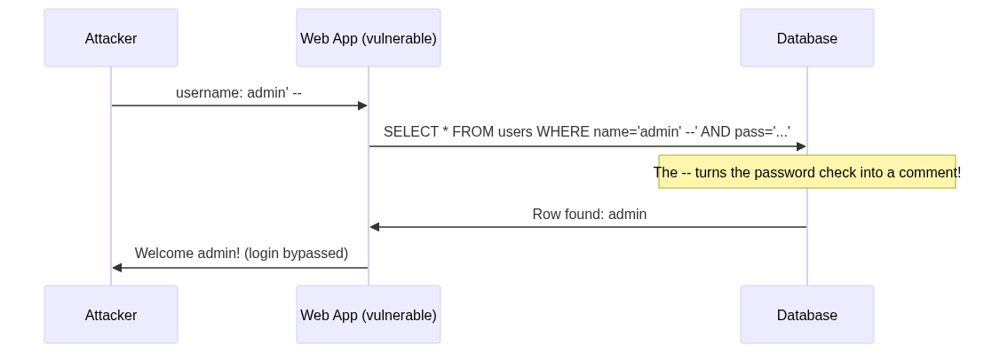
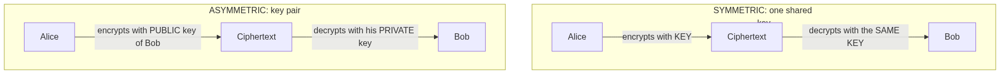
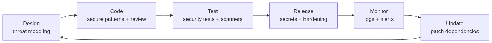

# Security First

Imagine building a beautiful house... and leaving the front door wide open with the keys in the lock. Well: writing software without thinking about security is exactly that. In this playbook we learn how to "lock the doors" of our code, with simple Python examples and plenty of real-world analogies. No prerequisites: if you know what a variable and an `if` are, you're ready.

---

## 1. The basics of security in software development

### What does "security" mean?

Computer security stands on three pillars, called the **CIA triad** (not the secret agency! It's an acronym):

| Pillar | Meaning | Real-life example |
|--------|---------|-------------------|
| **Confidentiality** | Only authorized people can read the data | Your secret diary is read by you alone |
| **Integrity** | Nobody can silently modify the data | Nobody can change the grades in the school register |
| **Availability** | The system works when it's needed | The school is open during class hours |

Every cyber attack hits at least one of these three pillars: it steals data (confidentiality), forges it (integrity), or takes the service down (availability).

### The 4 golden rules

**Rule 1 — Never trust input.** Everything coming from outside (forms, URLs, files, APIs) must be treated as suspicious. It's like your home intercom: before opening, you ask who's there.

```python
# ❌ I blindly trust whatever the user types
age = int(input("How old are you? "))  # what if they type "banana"? CRASH!

# ✅ I check (validate) the input before using it
answer = input("How old are you? ")
if answer.isdigit() and 0 < int(answer) < 130:
    age = int(answer)
else:
    print("Invalid age, try again")
```

**Rule 2 — Least privilege.** Every person (and every piece of code) should have only the permissions it needs, no more. The janitor has the school keys, but not the password to the grade register.

**Rule 3 — Defense in depth.** One protection is never enough: you need multiple layers, like a castle with moat + walls + guards. If an attacker gets past one layer, they hit the next.

**Rule 4 — Fail securely.** When something goes wrong, the system must close down, not swing open. If the electronic lock of a bank vault breaks, the door must stay shut, not open up.

```python
def can_enter(user):
    try:
        return check_permissions(user)
    except Exception:
        return False  # ✅ on error, I deny access (I don't grant it!)
```

---

## 2. OWASP explained for beginners

**OWASP** (Open Worldwide Application Security Project) is a worldwide community of experts that, every few years, publishes the **OWASP Top 10**: the ranking of the 10 most common vulnerabilities in web applications. Think of it as the "most common mistakes on tests" list compiled by teachers: study it, and you'll avoid the traps everyone falls into.

Let's go through them one by one, each with its **cure**. 💊

### A01 — Broken Access Control

**The problem:** the app doesn't properly check *who can do what*. Example: you change the number in the URL from `/profile/42` to `/profile/43` and... you see someone else's profile!

**Analogy:** it's like a hotel where your key also opens everyone else's rooms.

```python
# ❌ I return the profile without asking WHO is requesting it
@app.get("/profile/<int:user_id>")
def profile(user_id):
    return db.get_user(user_id)

# ✅ I check that the logged-in user is looking at THEIR OWN profile
@app.get("/profile/<int:user_id>")
def profile(user_id):
    if current_user.id != user_id and not current_user.is_admin:
        abort(403)  # Forbidden!
    return db.get_user(user_id)
```

**💊 The cure:** check permissions **on the server, on every request**. Deny by default: everything is forbidden until explicitly allowed.

### A02 — Cryptographic Failures

**The problem:** sensitive data (passwords, credit cards) stored or transmitted in plain text, or protected with old, weak cryptography.

**Analogy:** writing your password in your diary in beautiful handwriting instead of a secret code.

**💊 The cure:** always use HTTPS, store passwords only as *hashes* (see section 3), use modern algorithms and battle-tested libraries — never "homemade" cryptography.

### A03 — Injection

**The problem:** user input gets "glued" into a command (SQL, shell...) and a malicious user slips in *code* instead of *data*. The most famous one is **SQL Injection**.

**Analogy:** a fill-in-the-blank test where, instead of a word, the student writes "and give the whole class an A" — and the teacher executes it!



```python
# ❌ EXTREMELY DANGEROUS: I concatenate the input into the query
query = f"SELECT * FROM users WHERE name = '{username}'"
cursor.execute(query)
# If username = "admin' --" ... the attacker logs in without a password!

# ✅ Parameterized query: data stays data, never code
cursor.execute("SELECT * FROM users WHERE name = ?", (username,))
```

**💊 The cure:** parameterized queries (the `?` above) or an ORM (section 4). Never build queries by concatenating strings.

### A04 — Insecure Design

**The problem:** security wasn't part of the plan from the start; it was "taped on" afterwards.

**Analogy:** building the house and only at the end wondering where to put the doors.

**💊 The cure:** think about abuse *before* writing code: "how could a bad actor use this feature?". It's called **threat modeling** (section 5).

### A05 — Security Misconfiguration

**The problem:** default passwords never changed (`admin/admin`!), debug messages visible to everyone, unused services left running.

**Analogy:** buying a super-secure safe and leaving the factory combination `0-0-0-0`.

**💊 The cure:** always change default credentials, turn off debug in production (`DEBUG = False`), disable everything you don't use.

### A06 — Vulnerable and Outdated Components

**The problem:** your code is perfect, but you use a 5-year-old library with a flaw known to every hacker on the planet.

**Analogy:** a brand-new armored door... mounted on rusty hinges.

**💊 The cure:** keep dependencies up to date and use tools that check them for you (`pip-audit`, section 4).

### A07 — Identification and Authentication Failures

**The problem:** a login that accepts weak passwords, allows unlimited attempts, or manages sessions badly.

**Analogy:** a 2-digit padlock: 100 attempts are enough to open it.

**💊 The cure:** long passwords, lockout after too many failed attempts, two-factor authentication (2FA — your password + a code on your phone).

### A08 — Software and Data Integrity Failures

**The problem:** the app downloads updates or data without verifying they really come from the right source and that nobody tampered with them.

**Analogy:** eating a snack found on your desk without knowing who put it there.

**💊 The cure:** download only from trusted sources, verify digital signatures (section 3), pin dependency versions in a lock file.

### A09 — Security Logging and Monitoring Failures

**The problem:** someone attacks your app and you... don't even notice, because you record nothing.

**Analogy:** a school with no attendance register: if someone sneaks in, nobody will ever know.

```python
import logging

logging.warning("Failed login for %s from IP %s", username, ip)
# After 5 failures from the same IP → alert the administrator!
```

**💊 The cure:** log important events — failed logins, denied accesses — and set up alerts. But **never** write passwords or personal data into logs!

### A10 — SSRF (Server-Side Request Forgery)

**The problem:** the app accepts a URL from the user and visits it "on their behalf". An attacker makes it visit addresses *inside* the company network, which would be unreachable from outside.

**Analogy:** convincing the janitor (who can go anywhere) to run an errand for you in the teachers' lounge.

**💊 The cure:** if you really must accept URLs from users, use an **allow-list** of permitted domains and reject everything else, especially internal addresses.

---

## 3. Cryptography explained simply

Cryptography is the art of turning a readable message into gibberish for anyone who doesn't have the "key". There are three fundamental tools: the **hash**, **symmetric** encryption, and **asymmetric** encryption.

### Hash: the blender

A hash function takes any data and produces a fixed-length "fingerprint". It's a **blender**: from fruit you get a smoothie, but from the smoothie you **can't go back** to the whole fruit. And if you change even a single grape, the smoothie comes out completely different.

```python
import hashlib

print(hashlib.sha256(b"hello").hexdigest())
# 2cf24dba5fb0a30e26e83b2ac5b9e29e1b161e5c1fa7425e73043362938b9824

print(hashlib.sha256(b"Hello").hexdigest())  # just one capital H...
# 185f8db32271fe25f561a6fc938b2e264306ec304eda518007d1764826381969
# ...and the hash is TOTALLY different!
```

What is it for? **Storing passwords!** A website never stores your actual password, only its hash. At login, it hashes what you type and compares. If the database gets stolen, thieves only find "smoothies" that are impossible to reverse.

Careful though: for passwords you need a *slow, salted* hash (the "salt" is a random value added to each password, so two identical passwords produce different hashes):

```python
import hashlib, os

def hash_password(password: str) -> tuple[bytes, bytes]:
    salt = os.urandom(16)  # 16 random bytes, different for every user
    h = hashlib.pbkdf2_hmac("sha256", password.encode(), salt, 600_000)
    return salt, h  # store salt + hash in the database, NEVER the password

def verify_password(password: str, salt: bytes, stored_h: bytes) -> bool:
    h = hashlib.pbkdf2_hmac("sha256", password.encode(), salt, 600_000)
    return h == stored_h
```

> In a real project you'd use dedicated libraries like `bcrypt` or `argon2`: same principle, even more robust.

### Symmetric encryption: one single key

**The same key** is used both to close (encrypt) and to open (decrypt). Like a box with a padlock: whoever has a copy of the key can open it.

```python
from cryptography.fernet import Fernet  # pip install cryptography

key = Fernet.generate_key()   # the shared secret key
f = Fernet(key)

secret = f.encrypt(b"The treasure is under the apple tree")
print(secret)                  # unreadable stuff: gAAAAABm...

print(f.decrypt(secret))       # b"The treasure is under the apple tree"
```

✅ **Pros:** super fast, perfect for large amounts of data.
❌ **Cons:** how do I hand the key to my friend without anyone intercepting it? This is the *key exchange problem*.

### Asymmetric encryption: public key + private key

Here there are **two** keys, generated as a pair:

- the **public key** can be given to everyone: it can only *lock*;
- the **private key** stays with you alone: it's the only one that *unlocks*.

**Analogy:** you hand out **open padlocks** (public key) to everybody. Anyone can snap your padlock shut on a box, but only you have the (private) key that opens it. The key exchange problem... vanishes!



```python
# The concept with the cryptography library (simplified)
from cryptography.hazmat.primitives.asymmetric import rsa, padding
from cryptography.hazmat.primitives import hashes

private = rsa.generate_private_key(public_exponent=65537, key_size=2048)
public = private.public_key()    # this one you can publish anywhere

encrypted = public.encrypt(      # anyone can encrypt for you...
    b"Secret message",
    padding.OAEP(mgf=padding.MGF1(hashes.SHA256()),
                 algorithm=hashes.SHA256(), label=None),
)

msg = private.decrypt(           # ...but only you can decrypt
    encrypted,
    padding.OAEP(mgf=padding.MGF1(hashes.SHA256()),
                 algorithm=hashes.SHA256(), label=None),
)
```

### Digital signature: the other way around!

Using the keys in reverse gives you the **digital signature**: you encrypt a hash of the message with your *private* key, and anyone can verify it with your *public* key. It proves the message is yours and nobody modified it — like a wax seal that's impossible to forge.

### And HTTPS? It uses everything together!

When you see the padlock 🔒 in your browser, this is what's happening: the browser uses **asymmetric** encryption to safely exchange a **symmetric** key, then all the traffic travels encrypted with that one (because it's faster). The best of both worlds!

| Tool | Keys | Reversible? | Typical use |
|------|------|-------------|-------------|
| Hash | none | No, never | Storing passwords, verifying integrity |
| Symmetric | 1 shared | Yes, with the key | Encrypting lots of data fast |
| Asymmetric | 2 (public + private) | Yes, with the private one | Key exchange, digital signatures |

---

## 4. Frameworks & vulnerabilities: the right approach

### Don't reinvent the wheel (especially if it's armored)

Frameworks (Django, Flask, FastAPI...) contain protections built by experts and tested by millions of users. The first rule is: **use them, don't work around them**.

```python
# ❌ I build the query by hand (injection risk)
User.objects.raw(f"SELECT * FROM users WHERE name = '{name}'")

# ✅ I use the framework's ORM: it makes the query safe for me
User.objects.filter(name=name)
```

Other examples of "free" protections frameworks give you:

- **Automatic template escaping**: Django and Jinja2 turn `<script>` into harmless text, blocking XSS attacks (JavaScript injected into pages).
- **CSRF protection**: a secret token in forms prevents another site from sending requests in your name.
- **Sessions and passwords** already handled properly (Django stores salted hashes out of the box).

### But frameworks age: CVEs

Every publicly discovered vulnerability gets a **CVE** code (e.g. `CVE-2024-12345`) and ends up in databases consulted by everyone — hackers included! From that moment, running the vulnerable version is like leaving the map to the secret passage pinned to the front gate.

The right approach in 4 moves:

```bash
# 1. Declare dependencies with precise versions
#    requirements.txt:  flask==3.0.3

# 2. Check whether they have known vulnerabilities
pip install pip-audit
pip-audit                    # reports CVEs in your dependencies!

# 3. Update regularly (not just "when it breaks")
pip list --outdated

# 4. Analyze YOUR code too
pip install bandit
bandit -r .                  # finds dangerous patterns in Python code
```

> 💡 On GitHub you can enable **Dependabot**: it opens pull requests by itself when one of your dependencies has a flaw. Security on autopilot!

### The right mindset

1. **The framework protects you only if you follow it**: read the "Security" section of its documentation (every serious framework has one).
2. **Fewer dependencies = less risk**: before adding a library for two lines of code, ask yourself if you really need it.
3. **An abandoned dependency is a risk**: if it hasn't been updated in years, nobody will fix its flaws.

---

## 5. Keeping software secure throughout its life cycle

Security is not an exam you pass once: it's more like **brushing your teeth** — it must be done all the time, at every stage of the software's life.



### Phase 1 — Design: think like a thief

Before writing code, do a mini **threat modeling** session by asking yourself:

- What valuable data do I handle? (passwords, emails, photos...)
- Where does external data come in? (forms, APIs, uploaded files...)
- What could a bad actor do at each of those points?

You don't need to be an expert: even just writing these answers on a sheet of paper helps you avoid the "Insecure Design" vulnerability (A04).

### Phase 2 — Development: four eyes see better than two

- **Code review**: every change is read by another person before entering the project. Tons of flaws stop right here.
- **Security linters** (`bandit` for Python) integrated in your editor: they underline dangerous code as you write it, like a spell checker.

### Phase 3 — Testing: try being the bad guy

Besides normal tests, write tests that *try to attack* your app:

```python
def test_login_rejects_sql_injection():
    response = client.post("/login", data={
        "username": "admin' --",
        "password": "whatever",
    })
    assert response.status_code == 401  # it must NOT get in!

def test_other_users_profile_denied():
    login_as("mario")
    response = client.get("/profile/9999")  # someone else's profile
    assert response.status_code == 403
```

### Phase 4 — Release: secrets don't belong in the code

Database passwords, API keys and the like are **never written in the code** (they'd end up on Git forever!). They are passed in from the outside, via environment variables:

```python
import os

DB_PASSWORD = os.environ["DB_PASSWORD"]  # ✅ read from the environment
# DB_PASSWORD = "supersecret123"         # ❌ NEVER hardcoded!
```

And in production: `DEBUG = False`, HTTPS mandatory, minimal permissions for the database user.

### Phase 5 — Monitoring: keep your eyes open

Logs of suspicious events + automatic alerts (section A09). If something goes wrong, you want to find out from an alert at 3 AM, not from a newspaper article.

### Phase 6 — Updating: the cycle starts again

`pip-audit` on a regular schedule, security patches applied immediately, and a plan for when (not "if") something goes wrong: who to notify, how to stop the attack, how to restore data from backup.

> **The healthy software checklist:** ✅ threat modeling done · ✅ code review always · ✅ security tests · ✅ secrets out of the code · ✅ logs and alerts active · ✅ dependencies up to date

---

## 6. Bad Patterns vs Good Patterns

The final workout: same problems, two solutions side by side. Train your eye to spot the bad pattern at first glance!

### Passwords

```python
# ❌ BAD: password stored in plain text
db.save(username, password)

# ✅ GOOD: I store only hash + salt (or use bcrypt/argon2)
salt, h = hash_password(password)
db.save(username, salt, h)
```

### Database queries

```python
# ❌ BAD: input concatenated into the query → SQL injection
cursor.execute(f"SELECT * FROM users WHERE name = '{name}'")

# ✅ GOOD: parameterized query
cursor.execute("SELECT * FROM users WHERE name = ?", (name,))
```

### Secrets

```python
# ❌ BAD: API key written in the code (and pushed to Git!)
API_KEY = "sk-abc123-super-secret"

# ✅ GOOD: read from the environment, out of the repository
API_KEY = os.environ["API_KEY"]
```

### Executing user input

```python
# ❌ BAD: eval executes ANYTHING the user writes
result = eval(input("Type an expression: "))
# if they type: __import__('os').system('rm -rf /') ... disaster!

# ✅ GOOD: I only interpret what I expect
import ast
result = ast.literal_eval(input("Type a number or a list: "))
# accepts only "literal" values: numbers, strings, lists...
```

### Loading data

```python
# ❌ BAD: pickle can execute code while loading!
import pickle
data = pickle.loads(file_received_from_internet)

# ✅ GOOD: json contains only data, never code
import json
data = json.loads(file_received_from_internet)
```

### Error handling

```python
# ❌ BAD: I show the user the internal error details
except Exception as e:
    return f"Error: {e}"  # reveals tables, paths, versions...

# ✅ GOOD: details in the logs (for me), generic message (for the user)
except Exception:
    logging.exception("Error during payment")
    return "Oops, something went wrong. Please try again later."
```

### Comparing secrets

```python
# ❌ BAD: == takes longer when the first characters match,
# and an attacker can measure that (timing attack)!
if received_token == real_token: ...

# ✅ GOOD: constant-time comparison
import hmac
if hmac.compare_digest(received_token, real_token): ...
```

### Summary table

| ❌ Bad pattern | ✅ Good pattern | Vulnerability avoided |
|---------------|----------------|----------------------|
| Plain-text passwords | Hash + salt (bcrypt/argon2) | A02 Cryptographic Failures |
| Concatenated queries | Parameterized queries / ORM | A03 Injection |
| Secrets in the code | Environment variables | A05 Misconfiguration |
| `eval()` on input | `ast.literal_eval` / parsing | A03 Injection |
| `pickle` from external sources | `json` | A08 Integrity Failures |
| Detailed errors to the user | Internal logs + generic message | A05 Misconfiguration |
| Trusting input | Always validate | ...almost all of them! |

---

## In a nutshell

1. **Security stands on three pillars**: confidentiality, integrity, availability.
2. **Never trust input**: it's the root of almost every vulnerability.
3. **The OWASP Top 10** is your map of the most common traps — and every trap has a cure.
4. **Hashes for passwords, symmetric for data, asymmetric for key exchange and signatures.**
5. **Use your framework's protections** and keep dependencies up to date (`pip-audit`).
6. **Security is a habit**, not a finish line: it accompanies the software for its whole life, from design to monitoring.

Now go lock those doors. 🔒
