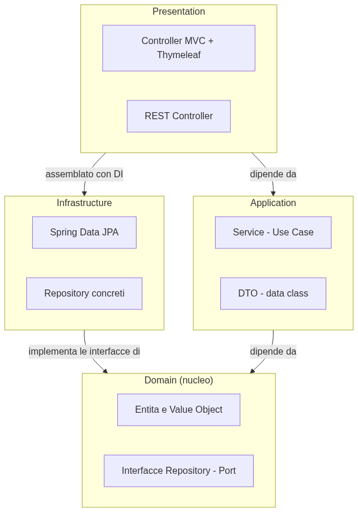

# Booting Spring Boot — Kotlin Edition

If you've already read the Java edition of this playbook, you already know everything about Spring Boot's foundations: Inversion of Control, Dependency Injection, auto-configuration. What changes here is the language you write those foundations with — and Kotlin isn't "Java with different syntax": it's a language designed from the ground up to eliminate entire categories of bugs (the infamous `NullPointerException` above all) and to let you write in ten lines what Java needs forty for, without losing an ounce of robustness.

Kotlin was born in 2011 at JetBrains (the same company behind IntelliJ IDEA), became the official language for Android in 2017, and today is one of the most solid choices for enterprise backends: **100% interoperability with Java** (you can call any Java library from Kotlin and vice versa, they run on the same JVM), **null safety built into the type system** (the compiler stops you from writing code that can blow up on a null value — you don't discover it at runtime anymore), and a syntax that removes ceremony without removing control.

Spring Boot has supported Kotlin as a first-class citizen for years: Spring Initializr generates Kotlin projects natively, there are Kotlin-specific extensions for Spring Security and Spring Data, and since Spring 5 support for **coroutines** is built in for reactive code. This playbook covers everything you need — from the OOP paradigm shift to a complete project, **PizzaHub**, written in idiomatic Kotlin from start to finish — with the same technical rigor and the same clarity as the Java edition, for anyone with 12 years of curiosity or 12 years of production to keep running.

---

## 1. A paradigm shift: OOP in Kotlin

**One-liner**: Kotlin is object-oriented exactly like Java, but starts from different premises: immutability is the default choice, `null` is part of the type system (not a runtime exception lying in wait), and classes are `final` until you explicitly say otherwise.

### `val` vs `var`: immutability first

```kotlin
val name = "Ada"        // not reassignable, ever — like "final String" in Java
var age = 36                // reassignable

name = "Grace"   // ❌ won't compile: Val cannot be reassigned
age = 37             // ✅ fine, var allows it
```

🧠 **Analogy**: think of `val` as a label written in permanent marker on a box — once written, it stays that way forever, even though the contents of the box (a mutable object) can still change inside it. `var`, on the other hand, is a label written in pencil, which you can erase and rewrite whenever you want.

> 💡 **Tip**: in an idiomatic Kotlin project, `val` is the default choice. You reach for `var` only when you have a concrete reason (a loop counter, an accumulator). If you notice you're writing more `var` than `val`, that's a signal the design has too much mutability.

### Null safety: the compiler protects you, not the debugger

In Java, any object reference can be `null`, and you only find out when a `NullPointerException` blows up — often far away from where that `null` was actually born. In Kotlin, nullability is **part of the type**: `String` and `String?` are two different types, and the compiler won't let you slip from one to the other without explicitly handling the `null` case.

```kotlin
var name: String = "Ada"       // can NEVER be null — guaranteed by the compiler
var nickname: String? = null     // can be null — the type openly declares it

println(name.length)        // ✅ always safe, name is never null
println(nickname.length)  // ❌ won't compile: nickname might be null

// you must explicitly handle the null case, with one of these tools:
println(nickname?.length)              // safe call: null if nickname is null, otherwise the length
println(nickname?.length ?: 0)         // elvis operator: a default value if it's null
println(nickname!!.length)             // "trust me": throws NPE if it's null — use only if you're ABSOLUTELY sure
```

> 🧠 **Golden rule**: `!!` (called the "not-null assertion") is an escape hatch from the type system, not a day-to-day tool. If you find yourself writing `!!` often, the problem is in the design — probably a value that should always be present is traveling as nullable, or you're ignoring a case that should be handled with `?:` or an `if (x != null)`.

### `data class`: no more boilerplate for data

```java
// "2006" Java: a hand-written class to represent a piece of data
public class Pizza {
    private final String nome;
    private final BigDecimal prezzo;
    // constructor, getters, equals, hashCode, toString written by hand...
}
```

```kotlin
// Kotlin: the same thing, in one line
data class Pizza(val nome: String, val prezzo: BigDecimal)
```

A `data class` automatically generates `equals()`, `hashCode()`, `toString()`, plus two tools Java doesn't even have with `record`:

```kotlin
val margherita = Pizza("Margherita", BigDecimal("6.50"))

// copy(): creates a new instance changing only the fields you want to change
val discountedMargherita = margherita.copy(prezzo = BigDecimal("5.50"))

// destructuring: breaks the object down into its components in one line
val (nome, prezzo) = margherita
println("$nome costs $prezzo")
```

> 💡 **Tip**: `copy()` is the key tool for working with immutable data without going crazy. Instead of mutating an existing object, you create a new one with updated values — the same pattern you'd use with `record` in Java or with the spread operator `{...obj, field: newValue}` in TypeScript.

### `final` classes by default, properties instead of getters/setters

```kotlin
// ❌ this class CANNOT be extended — it's the default, not a special case
class OrdineService(private val pizzaRepository: PizzaRepository)

// ✅ to allow inheritance, you have to declare it explicitly
open class Animale(val nome: String) {
    open fun verso() = "..."
}

class Cane(nome: String) : Animale(nome) {
    override fun verso() = "Woof!"
}
```

> 🧠 **Golden rule**: in Java every class is open to inheritance until you mark it `final`; in Kotlin it's the exact opposite — every class is `final` until you mark it `open`. This isn't a syntactic quirk: it encourages **composition over inheritance** (the same principle seen in the Java edition of this playbook), because extending a class requires an explicit, conscious decision, not the default behavior.

Properties replace hand-written getters and setters:

```kotlin
class Pizza(val nome: String) {
    var prezzo: BigDecimal = BigDecimal.ZERO
        set(value) {
            require(value > BigDecimal.ZERO) { "Price must be positive" }
            field = value
        }
}

val pizza = Pizza("Margherita")
pizza.prezzo = BigDecimal("6.50")   // calls the setter, validates internally
println(pizza.prezzo)                    // reads the property, no getPrezzo() needed
```

### `when`: pattern matching before it was cool

```kotlin
sealed interface RisultatoOrdine
data class OrdineCreato(val id: Long) : RisultatoOrdine
data class OrdineRifiutato(val motivo: String) : RisultatoOrdine

fun gestisci(risultato: RisultatoOrdine): String = when (risultato) {
    is OrdineCreato -> "Order #${risultato.id} created successfully"
    is OrdineRifiutato -> "Order rejected: ${risultato.motivo}"
    // the compiler KNOWS these are the only two possible cases (sealed),
    // so no "else" is needed — if you add a third one, the compiler forces you to handle it here
}
```

A `sealed interface` (or `sealed class`) declares a **closed** set of possible sub-types: the compiler knows every case up front, and a `when` that covers them all doesn't need an `else` — in fact, if you add a new sub-type later, every `when` that forgets it stops compiling. It's an elegant way to model alternative states (an order created or rejected, a valid response or an error) without exceptions and without nested `Optional`s.

### Extension functions: adding behavior without inheriting

```kotlin
// adds a method to BigDecimal, a class you didn't write and can't modify
fun BigDecimal.formattaEuro(): String = "€ ${this.setScale(2)}"

val prezzo = BigDecimal("6.5")
println(prezzo.formattaEuro())   // € 6.50 — looks like a native BigDecimal method, but it's yours
```

🧠 **Analogy**: an extension function is like sticking a post-it with extra instructions on an object you don't own, without modifying it. `BigDecimal` stays `BigDecimal`, you haven't touched it — you've just added a convenient way to call a function that takes that `BigDecimal` as its first parameter, but with syntax that looks like a method of the object itself.

### First-class functions and lambdas

```kotlin
val pizze = listOf(
    Pizza("Margherita", BigDecimal("6.50")),
    Pizza("Diavola", BigDecimal("8.00")),
    Pizza("Quattro Formaggi", BigDecimal("9.50"))
)

val cheap = pizze.filter { it.prezzo < BigDecimal("8.00") }
val names = pizze.map { it.nome }
val total = pizze.sumOf { it.prezzo }
```

There's no need for explicit Streams like in Java: `List`, `Set`, and `Map` in Kotlin already have `filter`, `map`, `sumOf`, `groupBy` as native functions, with `it` as the implicit parameter name when the lambda takes only one.

---

## 2. The core concepts of the framework

**One-liner**: Inversion of Control and Dependency Injection work exactly as in the Java edition — it's Spring, the philosophy doesn't change — but **constructor injection**, already the recommended practice in Java, becomes almost automatic in Kotlin thanks to the primary constructor.

### Constructor injection, even more natural

```kotlin
@Service
class OrdineService(
    private val pizzaRepository: PizzaRepository,
    private val ordineRepository: OrdineRepository
) {
    // pizzaRepository and ordineRepository are already properties of the class:
    // Kotlin's primary constructor declares AND initializes them in one shot
}
```

Compare this with the Java equivalent, which requires declaring fields, writing a constructor, and assigning every field by hand: in Kotlin the primary constructor **is** the field declaration. Spring sees the constructor, understands that `OrdineService` needs a `PizzaRepository` and an `OrdineRepository`, and injects them automatically — the exact same Inversion of Control mechanics seen in the Java edition, with less code to express it.

### The stereotype annotations, unchanged

```kotlin
@Component   // generic bean
@Service       // bean holding business logic
@Repository      // bean that talks to persistence
@Controller        // bean that handles web requests and returns HTML views
@RestController      // bean that returns data (JSON), not views
```

Same table, same meaning as the Java edition — these are Spring annotations, nothing language-specific about them. Only the syntax of the class carrying them changes.

### `@SpringBootApplication`, with one Kotlin-specific detail

```kotlin
@SpringBootApplication
class PizzaHubApplication

fun main(args: Array<String>) {
    runApplication<PizzaHubApplication>(*args)
}
```

Notice two Kotlin-specific details: `main` is a **top-level function**, it doesn't have to live inside a class like in Java; and `runApplication<PizzaHubApplication>(*args)` is an extension function provided by `spring-boot-starter` that replaces `SpringApplication.run(PizzaHubApplication.class, args)` — more concise, with the type passed as a generic instead of a `.class` literal.

---

## 3. Spring Initializr: the starting point

**One-liner**: [start.spring.io](https://start.spring.io) generates Kotlin projects natively — just select "Kotlin" as the language — but the generator automatically adds a couple of Kotlin-specific dependencies that Java doesn't need, and it's worth knowing why they're there.

### What to choose, and why

| Field | What to pick for a new project | Why |
|---|---|---|
| **Project** | Gradle - Kotlin | See section 4 for the pragmatic choice |
| **Language** | Kotlin | Obviously |
| **Spring Boot** | The latest **stable** version | Never a snapshot or release candidate for a real project |
| **Java** | 21 (LTS) | Kotlin runs on the JVM: you still need to pick which target JDK to use |
| **Packaging** | Jar | An executable jar with an embedded server, zero external installs |

### The dependencies for PizzaHub

Same as the Java edition — **Spring Web**, **Spring Data JPA**, **Thymeleaf**, **H2 Database**, **Spring Security** — plus two extras that Spring Initializr adds on its own when you select Kotlin:

- **`jackson-module-kotlin`** — teaches Jackson (Spring's JSON serialization engine) to understand Kotlin `data class`es, in particular constructor parameters with default values and nullability: without this module, deserializing JSON into a `data class` can behave in surprising ways
- **`kotlin-reflect`** — Kotlin's reflection library, required by several Spring features (like validation) that inspect classes at runtime

> 💡 **Tip**: you don't need to add them by hand — Spring Initializr includes them automatically when you select "Kotlin" as the language. But it's useful to know what they do, because removing them "to lighten the load" would break your `data class` JSON serialization in ways that are hard to diagnose.

### What the zip generates

```
pizzahub/
├── build.gradle.kts                              ← dependencies and build (section 4)
├── gradlew, gradlew.bat                            ← Gradle Wrapper: no need to install Gradle by hand
├── src/
│   ├── main/
│   │   ├── kotlin/com/pizzahub/
│   │   │   └── PizzaHubApplication.kt              ← entry point, @SpringBootApplication + main()
│   │   └── resources/
│   │       ├── application.yml                       ← configuration (section 8)
│   │       ├── static/                                  ← files served directly (CSS, images)
│   │       └── templates/                                ← Thymeleaf views (section 6)
│   └── test/
│       └── kotlin/com/pizzahub/
│           └── PizzaHubApplicationTests.kt          ← a "smoke" test: verifies the context starts up
└── .gitignore
```

Notice the `src/main/kotlin` path instead of `src/main/java` — both Gradle and Maven recognize both directories in a mixed Kotlin-Java project, but for a pure Kotlin project everything lives under `kotlin/`.

---

## 4. Maven vs Gradle: two different approaches

**One-liner**: the same choice seen in the Java edition, but with one extra natural pairing — Gradle with the Kotlin DSL (`build.gradle.kts`) means writing the build file **in the same language** as the rest of the project, without going through XML or Groovy.

### `build.gradle.kts`: Kotlin configuring Kotlin

```kotlin
// build.gradle.kts
plugins {
    kotlin("jvm") version "1.9.24"
    kotlin("plugin.spring") version "1.9.24"     // automatically opens @Component, @Service classes...
    kotlin("plugin.jpa") version "1.9.24"           // automatically opens @Entity classes (section 7)
    id("org.springframework.boot") version "3.3.0"
    id("io.spring.dependency-management") version "1.1.5"
}

group = "com.pizzahub"
version = "0.0.1-SNAPSHOT"

java {
    sourceCompatibility = JavaVersion.VERSION_21
}

dependencies {
    implementation("org.springframework.boot:spring-boot-starter-web")
    implementation("org.springframework.boot:spring-boot-starter-data-jpa")
    implementation("org.springframework.boot:spring-boot-starter-thymeleaf")
    implementation("com.fasterxml.jackson.module:jackson-module-kotlin")
    implementation("org.jetbrains.kotlin:kotlin-reflect")
    testImplementation("org.springframework.boot:spring-boot-starter-test")
    testImplementation("com.ninja-squad:springmockk:4.0.2")   // MockK for Spring, section 10
}

kotlin {
    compilerOptions {
        freeCompilerArgs.addAll("-Xjsr305=strict")   // interprets Java's @NonNull/@Nullable annotations strictly
    }
}
```

Notice the three Kotlin-specific plugins: `kotlin("jvm")` (the Kotlin compiler itself), `kotlin("plugin.spring")` and `kotlin("plugin.jpa")` — these last two deserve an explanation, because they solve a real friction point between Kotlin and Spring that we'll cover in detail in section 7.

### `pom.xml`: the same thing, in XML

```xml
<!-- pom.xml -->
<project>
    <parent>
        <groupId>org.springframework.boot</groupId>
        <artifactId>spring-boot-starter-parent</artifactId>
        <version>3.3.0</version>
    </parent>

    <properties>
        <kotlin.version>1.9.24</kotlin.version>
        <java.version>21</java.version>
    </properties>

    <dependencies>
        <dependency>
            <groupId>org.springframework.boot</groupId>
            <artifactId>spring-boot-starter-web</artifactId>
        </dependency>
        <dependency>
            <groupId>org.jetbrains.kotlin</groupId>
            <artifactId>kotlin-reflect</artifactId>
        </dependency>
        <dependency>
            <groupId>com.fasterxml.jackson.module</groupId>
            <artifactId>jackson-module-kotlin</artifactId>
        </dependency>
    </dependencies>

    <build>
        <plugins>
            <plugin>
                <groupId>org.jetbrains.kotlin</groupId>
                <artifactId>kotlin-maven-plugin</artifactId>
                <configuration>
                    <compilerPlugins>
                        <plugin>spring</plugin>
                        <plugin>jpa</plugin>
                    </compilerPlugins>
                </configuration>
            </plugin>
        </plugins>
    </build>
</project>
```

### The pragmatic comparison, Kotlin edition

| | Gradle Kotlin DSL | Maven |
|---|---|---|
| Build file language | Kotlin — same language as the project | XML |
| IDE autocomplete on the build file | Excellent (it's real Kotlin code) | Limited (schema-based XML) |
| Build speed | Incremental builds, caching — often faster | Slower on large projects |
| Learning curve | You need to understand the script, not just declare | More readable at a glance |
| Android ecosystem | The de facto standard | Rare |

> 🧠 **Pragmatic golden rule**: if the project is already Kotlin, **Gradle with the Kotlin DSL** is the more coherent choice — you write build logic in the same language as your classes, with full IDE autocomplete on the build file itself. Maven remains perfectly valid, especially in enterprise teams where standardization on Maven is already strong — but it loses that "same language everywhere" advantage that makes Gradle Kotlin DSL a particularly natural fit here.

---

## 5. Clean Code, Clean Architecture

**One-liner**: the same four layers seen in the Java edition — `domain`, `application`, `infrastructure`, `web` — with the same rule of dependencies pointing inward. What changes is how **naturally** Kotlin lets you honor that rule: immutable `data class`es for Value Objects, `sealed interface` for modeling alternative states without exceptions, extension functions for mapping between layers.

### Clean Code, in practice

```kotlin
// ❌ a lying name, a function that does too much
fun processaDati(d: List<Int>): List<Int> {
    val r = mutableListOf<Int>()
    for (x in d) {
        if (x > 0) r.add(x * 2)
    }
    return r
}

// ✅ honest name, single-expression function, single responsibility
fun raddoppiaValoriPositivi(numeri: List<Int>): List<Int> =
    numeri.filter { it > 0 }.map { it * 2 }
```

> 💡 **Tip**: the `fun name(...): Type = expression` syntax (without `{ return ... }`) is called an "expression body", and it's idiomatic Kotlin for functions that are, precisely, a single expression. It's not just aesthetics: it immediately communicates "this function computes a value", without needing to read a multi-line body to understand that.

### The four layers, applied to Spring Boot Kotlin

```
com.pizzahub/
├── domain/            ← core: entities, value objects, repository interfaces. ZERO dependency on Spring
├── application/         ← services, use cases, DTOs. Depends only on domain
├── infrastructure/        ← Spring Data JPA implementations, external clients. Implements domain's interfaces
└── web/                     ← MVC and REST controllers. The entry point, wired together via Dependency Injection
```



```kotlin
// domain/PizzaRepository.kt — the interface (the "port") lives in the domain
interface PizzaRepository {
    fun trovaPerId(id: Long): Pizza?
    fun tutte(): List<Pizza>
}

// infrastructure/PizzaJpaRepository.kt — the implementation lives outside, and DEPENDS on domain
@Repository
interface PizzaJpaRepository : JpaRepository<Pizza, Long>, PizzaRepository {
    override fun trovaPerId(id: Long): Pizza? = findByIdOrNull(id)
    override fun tutte(): List<Pizza> = findAll()
}
```

Notice `Pizza?` as the return type instead of `Optional<Pizza>`: in Kotlin, a nullable type **is already** the exact equivalent of `Optional` — no extra wrapper needed, the compiler still forces you to handle the "absent" case everywhere it's used. `findByIdOrNull` is an extension function from Spring Data JPA designed specifically for Kotlin, an alternative to `findById(id).orElse(null)`.

### `sealed interface` for domain errors

```kotlin
sealed interface CreaOrdineErrore {
    data class PizzaNonTrovata(val id: Long) : CreaOrdineErrore
    data class QuantitaNonValida(val quantita: Int) : CreaOrdineErrore
}

fun creaOrdine(dto: CreaOrdineDto): Either<CreaOrdineErrore, Ordine> {
    val pizza = pizzaRepository.trovaPerId(dto.pizzaId)
        ?: return Either.Left(CreaOrdineErrore.PizzaNonTrovata(dto.pizzaId))

    if (dto.quantita <= 0) {
        return Either.Left(CreaOrdineErrore.QuantitaNonValida(dto.quantita))
    }

    return Either.Right(Ordine(pizza, dto.quantita))
}
```

> 🧠 **Golden rule**: this pattern (often called "Either" or "Result", with or without a dedicated library like Arrow) makes it **impossible to ignore an error**: the caller must explicitly handle both `Left` and `Right` to extract the value. It's an alternative to exceptions for errors that are part of the normal business flow (an order can reasonably fail because a pizza doesn't exist), reserving true exceptions for genuinely exceptional conditions. In the PizzaHub project (section 10) we'll still use exceptions for simplicity — but it's worth knowing this alternative exists and is idiomatic Kotlin.

### A rich model, made concise by Kotlin

```kotlin
class Ordine(
    val pizza: Pizza,
    val quantita: Int
) {
    init {
        require(quantita > 0) { "Quantity must be positive" }
    }

    fun totale(): BigDecimal = pizza.prezzo.multiply(BigDecimal.valueOf(quantita.toLong()))
}
```

The `init` block runs every time the object is constructed — it's the natural place to validate invariants, replacing the manual check you'd write inside an explicit constructor in Java. `require()` is a standard Kotlin function that throws `IllegalArgumentException` if the condition is false: the same "fail fast" pattern seen in the Java edition, with less syntax.

---

## 6. Modern MVC (with Thymeleaf)

**One-liner**: Thymeleaf stays valid HTML regardless of the backend language — templates don't change at all between Java and Kotlin. What changes is the controller: shorter, with `data class` for forms and properties instead of getters/setters.

### `@Controller` and `@RestController`, in Kotlin

```kotlin
@Controller
class PizzaMvcController(private val pizzaService: PizzaService) {

    @GetMapping("/pizze")
    fun elenco(model: Model): String {
        model.addAttribute("pizze", pizzaService.tutte())
        return "pizze"   // Spring looks for templates/pizze.html
    }
}

@RestController
@RequestMapping("/api/pizze")
class PizzaRestController(private val pizzaService: PizzaService) {

    @GetMapping
    fun elenco(): List<PizzaDto> = pizzaService.tutte()
}
```

Notice how constructor injection (section 2) eliminates the boilerplate entirely: no separately declared field, no hand-written constructor — `private val pizzaService: PizzaService` in the primary constructor is all it takes.

### The Thymeleaf template: identical to Java, because it's just HTML

```html
<!-- templates/pizze.html -->
<!DOCTYPE html>
<html xmlns:th="http://www.thymeleaf.org">
<head><title>Our pizzas</title></head>
<body>
    <h1>Menu</h1>
    <ul>
        <li th:each="pizza : ${pizze}">
            <span th:text="${pizza.nome}">Pizza name</span> —
            <span th:text="${pizza.prezzo} + ' €'">Price</span>
        </li>
    </ul>
    <p th:if="${pizze.isEmpty()}">No pizzas available, check back later!</p>
</body>
</html>
```

Thymeleaf reads Kotlin properties (`pizza.nome`, `pizza.prezzo`) exactly like it would read Java getters — Kotlin properties compile down to `getNome()`/`getPrezzo()` bytecode, so anything outside the JVM (including Thymeleaf) sees no difference at all.

### Form binding with `data class`

```kotlin
data class NuovaPizzaForm(
    @field:NotBlank val nome: String = "",
    @field:Positive val prezzo: BigDecimal = BigDecimal.ZERO
)
```

```kotlin
@GetMapping("/pizze/nuova")
fun form(model: Model): String {
    model.addAttribute("nuovaPizza", NuovaPizzaForm())
    return "pizze/nuova"
}

@PostMapping("/pizze")
fun crea(@ModelAttribute @Valid form: NuovaPizzaForm, errors: BindingResult): String {
    if (errors.hasErrors()) {
        return "pizze/nuova"
    }
    pizzaService.crea(form)
    return "redirect:/pizze"   // Post-Redirect-Get, same rule as the Java edition
}
```

> 💡 **Tip**: notice `@field:NotBlank` instead of `@NotBlank`. In Kotlin, a primary-constructor parameter can become a field, a getter, a setter, or a constructor parameter — and without the `@field:` prefix, the annotation might land on the wrong target (for example on the constructor instead of the field), silently breaking Jakarta Bean Validation. It's a small detail, but worth knowing, because the resulting bug is hard to diagnose.

---

## 7. Data access: let's clear things up

**One-liner**: JDBC, `JdbcTemplate`, JPA/Hibernate, Spring Data JPA — the same abstraction ladder as the Java edition. But Kotlin and JPA have a real friction point worth understanding well before building a project on top of it: JPA entities need to be **mutable and open to inheritance**, while Kotlin makes everything immutable and `final` by default.

### The problem: Hibernate needs what Kotlin hides by default

Hibernate, to create its **lazy-loading proxies** (the "lazily" loaded relationships seen in section 7 of the Java edition), needs to be able to **extend** your entity classes at runtime. But in Kotlin, classes are `final` by default (section 1) — so without intervention, Hibernate couldn't create those proxies.

```kotlin
// ❌ without the kotlin("plugin.jpa") plugin, this entity is FINAL: Hibernate can't proxy it
@Entity
class Pizza(
    @Id @GeneratedValue(strategy = GenerationType.IDENTITY)
    val id: Long? = null,
    val nome: String,
    val prezzo: BigDecimal
)
```

You also need a **no-argument constructor**, which JPA uses internally to instantiate the object before populating its fields via reflection — but a `data class` with mandatory parameters in its primary constructor doesn't have one.

### The fix: the `kotlin-spring` and `kotlin-jpa` compiler plugins

These are the same plugins already seen in the `build.gradle.kts` in section 4:

```kotlin
plugins {
    kotlin("plugin.spring") version "1.9.24"   // automatically opens classes annotated @Component, @Service, @Configuration...
    kotlin("plugin.jpa") version "1.9.24"        // automatically opens @Entity classes, and generates a no-arg constructor
}
```

With these plugins active, the code above **works without any visible changes**: behind the scenes, the compiler treats every class annotated `@Entity` as if it were `open` and adds it a no-argument constructor — you don't have to write `open class` by hand on every entity, nor give up `data class` where you still want to use it.

> 🧠 **Golden rule**: these two plugins aren't an optional detail — they're **nearly mandatory** in a Spring Boot Kotlin project that uses JPA or dependency injection on standard Kotlin classes. Forgetting them produces obscure runtime errors (`Unable to instantiate` or proxies behaving unexpectedly), not compile errors — so it's worth verifying them from the project's very first commit, not discovering them in production.

### The JPA entity in Kotlin

```kotlin
@Entity
@Table(name = "pizze")
class Pizza(

    @Column(nullable = false)
    val nome: String,

    @Column(nullable = false)
    val prezzo: BigDecimal
) {
    @Id
    @GeneratedValue(strategy = GenerationType.IDENTITY)
    var id: Long? = null
        protected set
}
```

Notice `id` as a nullable `var` with `protected set`: the id is `null` until the entity gets saved (the database hasn't generated it yet), then becomes non-null — but you don't want application code freely reassigning it from outside, so the setter stays `protected`.

### Spring Data JPA: one interface, zero implementation

```kotlin
interface PizzaJpaRepository : JpaRepository<Pizza, Long> {

    // the method name IS the query — Spring Data interprets it and generates the SQL, just like in Java
    fun findByNomeContainingIgnoreCase(frammento: String): List<Pizza>

    @Query("SELECT p FROM Pizza p WHERE p.prezzo BETWEEN :min AND :max ORDER BY p.prezzo")
    fun findInPriceRange(@Param("min") min: BigDecimal, @Param("max") max: BigDecimal): List<Pizza>
}
```

### The N+1 problem, unchanged

```kotlin
@Entity
class Ordine(
    @ManyToOne(fetch = FetchType.LAZY)
    @JoinColumn(name = "pizza_id")
    val pizza: Pizza,

    val quantita: Int
) {
    @Id @GeneratedValue(strategy = GenerationType.IDENTITY)
    var id: Long? = null
        protected set
}
```

Same golden rule as the Java edition: `FetchType.LAZY` loads the relationship only when it's read, and reading it in a loop over many orders generates N separate queries. The fix is still `JOIN FETCH` in an explicit JPQL query:

```kotlin
@Query("SELECT o FROM Ordine o JOIN FETCH o.pizza WHERE o.id = :id")
fun findWithPizza(@Param("id") id: Long): Ordine?
```

### `@Transactional`, unchanged

```kotlin
@Service
class OrdineService(
    private val pizzaRepository: PizzaRepository,
    private val ordineRepository: OrdineRepository
) {
    @Transactional
    fun creaOrdine(dto: CreaOrdineDto): Ordine {
        val pizza = pizzaRepository.trovaPerId(dto.pizzaId)
            ?: throw NoSuchElementException("Pizza not found: ${dto.pizzaId}")

        val ordine = Ordine(pizza, dto.quantita)
        return ordineRepository.salva(ordine)
    }
}
```

---

## 8. Per-environment configuration: how do you do it?

**One-liner**: the same Spring profiles (`application-{profile}.yml`, `@Profile`, `SPRING_PROFILES_ACTIVE`) as the Java edition — but Kotlin adds a particularly elegant way to read typed configuration: `@ConfigurationProperties` bound directly to a `data class`.

### `application.yml` and profiles, unchanged

```yaml
# application.yml — shared by all environments
spring:
  application:
    name: pizzahub

logging:
  level:
    root: INFO
```

```yaml
# application-dev.yml — active only when the "dev" profile is on
spring:
  datasource:
    url: jdbc:h2:mem:pizzahub
  h2:
    console:
      enabled: true
  jpa:
    hibernate:
      ddl-auto: update

logging:
  level:
    com.pizzahub: DEBUG
```

```yaml
# application-prod.yml — active only when the "prod" profile is on
spring:
  datasource:
    url: ${DATABASE_URL}
    username: ${DATABASE_USER}
    password: ${DATABASE_PASSWORD}
  jpa:
    hibernate:
      ddl-auto: validate
```

> 🧠 **Golden rule**: just like the Java edition, `ddl-auto: update` is convenient in development and dangerous in production — in `prod` always use `validate`, and leave real schema migrations to a versioned tool like Flyway or Liquibase.

### `@ConfigurationProperties` with `data class`: typed configuration

```yaml
# application.yml
pizzahub:
  nome-locale: "PizzaHub Downtown"
  consegna-gratuita-sopra: 20.00
  numero-forni: 2
```

```kotlin
@ConfigurationProperties(prefix = "pizzahub")
data class PizzaHubProperties(
    val nomeLocale: String,
    val consegnaGratuitaSopra: BigDecimal,
    val numeroForni: Int
)
```

```kotlin
@Configuration
@EnableConfigurationProperties(PizzaHubProperties::class)
class ConfigurazioneApp
```

```kotlin
@Service
class OrdineService(
    private val properties: PizzaHubProperties
    // ...
) {
    fun calcolaSpedizione(totale: BigDecimal): BigDecimal =
        if (totale >= properties.consegnaGratuitaSopra) BigDecimal.ZERO else BigDecimal("3.50")
}
```

> 💡 **Tip**: this pattern is particularly idiomatic in Kotlin because an immutable `data class` is **exactly** what you want to represent configuration: a set of values read once at startup, which don't change again during execution. No `@Value("${...}")` scattered around the code — a single typed, testable spot that represents the whole application's configuration.

### The principle remains: external configuration, never hardcoded

```yaml
# ❌ credentials written in code
spring:
  datasource:
    password: SuperSecret123

# ✅ placeholder, value read from the environment at runtime
spring:
  datasource:
    password: ${DATABASE_PASSWORD}
```

Same [Twelve-Factor App](https://12factor.net/config) rule seen in the Java edition: configuration that changes between environments never ends up in version control.

---

## 9. API first, Security first

**One-liner**: the same REST design as the Java edition — resources as nouns, honest HTTP verbs, DTOs separated from entities — but Spring Security offers Kotlin a **dedicated DSL**, more readable than the lambda-based configuration used in Java.

### DTOs as `data class`, not entities on the public contract

```kotlin
// ❌ exposes the domain entity directly
@GetMapping("/api/pizze/{id}")
fun dettaglio(@PathVariable id: Long): Pizza = pizzaService.trovaPerId(id)

// ✅ a dedicated DTO: the API contract is independent from the database schema
data class PizzaDto(val id: Long, val nome: String, val prezzo: BigDecimal) {
    companion object {
        fun da(pizza: Pizza): PizzaDto = PizzaDto(pizza.id!!, pizza.nome, pizza.prezzo)
    }
}

@GetMapping("/api/pizze/{id}")
fun dettaglio(@PathVariable id: Long): PizzaDto = PizzaDto.da(pizzaService.trovaPerId(id))
```

`companion object` is Kotlin's equivalent of a Java `static` method: a block of functions "tied to the class" instead of an instance — used here for an idiomatic factory method, `PizzaDto.da(pizza)`.

### Honest status codes

```kotlin
@RestController
@RequestMapping("/api/pizze")
class PizzaRestController(private val pizzaService: PizzaService) {

    @GetMapping("/{id}")
    fun dettaglio(@PathVariable id: Long): ResponseEntity<PizzaDto> {
        val pizza = pizzaService.trovaPerId(id) ?: return ResponseEntity.notFound().build()
        return ResponseEntity.ok(PizzaDto.da(pizza))
    }

    @PostMapping
    fun crea(@RequestBody @Valid dto: NuovaPizzaDto): ResponseEntity<PizzaDto> {
        val pizza = pizzaService.crea(dto)
        val uri = URI.create("/api/pizze/${pizza.id}")
        return ResponseEntity.created(uri).body(PizzaDto.da(pizza))
    }

    @DeleteMapping("/{id}")
    fun elimina(@PathVariable id: Long): ResponseEntity<Void> {
        pizzaService.elimina(id)
        return ResponseEntity.noContent().build()
    }
}
```

### Validation with `data class`

```kotlin
data class NuovaPizzaDto(
    @field:NotBlank(message = "Name is required") val nome: String,
    @field:Positive(message = "Price must be positive") val prezzo: BigDecimal
)
```

Same `@field:` seen in section 6 — always needed when annotating a primary-constructor parameter for Jakarta Bean Validation.

### Spring Security: the Kotlin DSL

```kotlin
@Configuration
@EnableWebSecurity
class SecurityConfig {

    @Bean
    fun filterChain(http: HttpSecurity): SecurityFilterChain {
        http {
            authorizeHttpRequests {
                authorize(HttpMethod.GET, "/api/pizze/**", permitAll)
                authorize("/pizze/**", authenticated)
                authorize(anyRequest, permitAll)
            }
            formLogin { }
            csrf { ignoringRequestMatchers("/api/**") }
        }
        return http.build()
    }

    @Bean
    fun passwordEncoder(): PasswordEncoder = BCryptPasswordEncoder()
}
```

Compare this syntax to the Java equivalent (a chain of lambdas on `HttpSecurity`): Spring Security's Kotlin DSL (`http { authorizeHttpRequests { ... } }`) uses **lambdas with receiver**, a language feature that lets you write nested configuration that reads almost like a YAML file, while still remaining 100% type-safe Kotlin code.

> 🧠 **Golden rule**: `BCryptPasswordEncoder` remains the correct choice, unchanged from Java — it's a deliberately slow hashing algorithm, designed to make brute-force attacks expensive. It doesn't change with the language: it's a cryptographic property, not a syntactic one.

### Method-level authorization

```kotlin
@Service
class OrdineService(/* ... */) {

    @PreAuthorize("hasRole('ADMIN')")
    fun elimina(ordineId: Long) {
        ordineRepository.deleteById(ordineId)
    }
}
```

---

## 10. A complete project, step by step

Let's put it all together: **PizzaHub**, the same order-management app for a pizzeria seen in the Java edition, this time written in idiomatic Kotlin from start to finish — `data class`, null safety, `sealed interface`, the Spring Security DSL, and tests with **MockK** instead of Mockito.

### What PizzaHub does

```bash
GET  /pizze                  # admin panel: list of pizzas (Thymeleaf, requires login)
GET  /api/pizze               # public API: list of pizzas as JSON
POST /api/ordini              { "pizzaId": 1, "quantita": 2 }   # creates an order
GET  /api/ordini/{id}         # order detail, with the computed total
```


### Project structure

```
pizzahub/
├── build.gradle.kts
├── src/main/kotlin/com/pizzahub/
│   ├── PizzaHubApplication.kt
│   ├── domain/
│   │   ├── Pizza.kt
│   │   ├── Ordine.kt
│   │   ├── PizzaRepository.kt
│   │   └── OrdineRepository.kt
│   ├── application/
│   │   ├── OrdineService.kt
│   │   ├── PizzaService.kt
│   │   └── dto/
│   │       ├── CreaOrdineDto.kt
│   │       ├── OrdineDto.kt
│   │       └── PizzaDto.kt
│   ├── infrastructure/
│   │   ├── PizzaJpaRepository.kt
│   │   └── OrdineJpaRepository.kt
│   ├── web/
│   │   ├── PizzaMvcController.kt
│   │   └── OrdineRestController.kt
│   └── config/
│       └── SecurityConfig.kt
└── src/main/resources/
    ├── application.yml
    ├── application-dev.yml
    └── templates/
        └── pizze.html
```

### Step 1 — Generate the project

On [start.spring.io](https://start.spring.io): Gradle - Kotlin, Java 21, dependencies `Spring Web`, `Spring Data JPA`, `Thymeleaf`, `H2 Database`, `Spring Security`, `Validation`. Download and extract the zip as `pizzahub/` (section 3). Manually add the `kotlin("plugin.spring")` and `kotlin("plugin.jpa")` plugins if Initializr doesn't already include them (section 7) — they're essential.

### Step 2 — Domain: entities and "ports"

```kotlin
// domain/Pizza.kt
@Entity
class Pizza(

    @Column(nullable = false)
    val nome: String,

    @Column(nullable = false)
    val prezzo: BigDecimal
) {
    @Id @GeneratedValue(strategy = GenerationType.IDENTITY)
    var id: Long? = null
        protected set
}
```

```kotlin
// domain/Ordine.kt
@Entity
class Ordine(

    @ManyToOne(fetch = FetchType.LAZY)
    val pizza: Pizza,

    val quantita: Int
) {
    @Id @GeneratedValue(strategy = GenerationType.IDENTITY)
    var id: Long? = null
        protected set

    init {
        require(quantita > 0) { "Quantity must be positive" }
    }

    fun totale(): BigDecimal = pizza.prezzo.multiply(BigDecimal.valueOf(quantita.toLong()))
}
```

```kotlin
// domain/PizzaRepository.kt
interface PizzaRepository {
    fun trovaPerId(id: Long): Pizza?
    fun tutte(): List<Pizza>
}

// domain/OrdineRepository.kt
interface OrdineRepository {
    fun salva(ordine: Ordine): Ordine
    fun trovaPerId(id: Long): Ordine?
}
```

### Step 3 — Infrastructure: Spring Data JPA

```kotlin
// infrastructure/PizzaJpaRepository.kt
@Repository
interface PizzaJpaRepository : JpaRepository<Pizza, Long>, PizzaRepository {
    override fun trovaPerId(id: Long): Pizza? = findByIdOrNull(id)
    override fun tutte(): List<Pizza> = findAll()
}

// infrastructure/OrdineJpaRepository.kt
@Repository
interface OrdineJpaRepository : JpaRepository<Ordine, Long>, OrdineRepository {
    override fun salva(ordine: Ordine): Ordine = save(ordine)
    override fun trovaPerId(id: Long): Ordine? = findByIdOrNull(id)
}
```

### Step 4 — Application: DTOs and services

```kotlin
// application/dto/PizzaDto.kt
data class PizzaDto(val id: Long, val nome: String, val prezzo: BigDecimal) {
    companion object {
        fun da(pizza: Pizza) = PizzaDto(pizza.id!!, pizza.nome, pizza.prezzo)
    }
}

// application/dto/CreaOrdineDto.kt
data class CreaOrdineDto(
    @field:NotNull val pizzaId: Long,
    @field:Positive val quantita: Int
)

// application/dto/OrdineDto.kt
data class OrdineDto(val id: Long, val pizzaNome: String, val quantita: Int, val totale: BigDecimal) {
    companion object {
        fun da(ordine: Ordine) = OrdineDto(ordine.id!!, ordine.pizza.nome, ordine.quantita, ordine.totale())
    }
}
```

```kotlin
// application/PizzaService.kt
@Service
class PizzaService(private val pizzaRepository: PizzaRepository) {
    fun tutte(): List<PizzaDto> = pizzaRepository.tutte().map { PizzaDto.da(it) }
    fun trovaPerId(id: Long): Pizza? = pizzaRepository.trovaPerId(id)
}

// application/OrdineService.kt
@Service
class OrdineService(
    private val pizzaRepository: PizzaRepository,
    private val ordineRepository: OrdineRepository
) {
    @Transactional
    fun creaOrdine(dto: CreaOrdineDto): OrdineDto {
        val pizza = pizzaRepository.trovaPerId(dto.pizzaId)
            ?: throw NoSuchElementException("Pizza not found: ${dto.pizzaId}")

        val ordine = Ordine(pizza, dto.quantita)
        return OrdineDto.da(ordineRepository.salva(ordine))
    }
}
```

Notice that `OrdineService` knows nothing about JPA, Hibernate, or HTTP — it depends only on interfaces defined in `domain`, exactly like in the Java edition. This is what makes the service testable in isolation (step 7) and the database swappable without touching a single line of business logic.

### Step 5 — Web: MVC and REST together

```kotlin
// web/PizzaMvcController.kt
@Controller
class PizzaMvcController(private val pizzaService: PizzaService) {

    @GetMapping("/pizze")
    fun elenco(model: Model): String {
        model.addAttribute("pizze", pizzaService.tutte())
        return "pizze"
    }
}

// web/OrdineRestController.kt
@RestController
@RequestMapping("/api")
class OrdineRestController(
    private val pizzaService: PizzaService,
    private val ordineService: OrdineService
) {

    @GetMapping("/pizze")
    fun pizze(): List<PizzaDto> = pizzaService.tutte()

    @PostMapping("/ordini")
    fun creaOrdine(@RequestBody @Valid dto: CreaOrdineDto): ResponseEntity<OrdineDto> {
        val ordine = ordineService.creaOrdine(dto)
        return ResponseEntity.created(URI.create("/api/ordini/${ordine.id}")).body(ordine)
    }
}
```

```html
<!-- templates/pizze.html -->
<!DOCTYPE html>
<html xmlns:th="http://www.thymeleaf.org">
<head><title>PizzaHub — Menu</title></head>
<body>
    <h1>Our pizzas</h1>
    <ul>
        <li th:each="pizza : ${pizze}">
            <span th:text="${pizza.nome}"></span> — <span th:text="${pizza.prezzo} + ' €'"></span>
        </li>
    </ul>
</body>
</html>
```

### Step 6 — Per-environment configuration

```yaml
# application.yml
spring:
  application:
    name: pizzahub

# application-dev.yml
spring:
  datasource:
    url: jdbc:h2:mem:pizzahub
  h2:
    console:
      enabled: true
  jpa:
    hibernate:
      ddl-auto: update
    show-sql: true
```

```kotlin
// config/DevDataSeeder.kt — sample data, development ONLY (section 8)
@Configuration
class DevDataSeeder {

    @Bean
    @Profile("dev")
    fun seed(repo: PizzaJpaRepository) = CommandLineRunner {
        repo.save(Pizza("Margherita", BigDecimal("6.50")))
        repo.save(Pizza("Diavola", BigDecimal("8.00")))
    }
}
```

### Step 7 — Minimal security

```kotlin
// config/SecurityConfig.kt
@Configuration
@EnableWebSecurity
class SecurityConfig {

    @Bean
    fun filterChain(http: HttpSecurity): SecurityFilterChain {
        http {
            authorizeHttpRequests {
                authorize("/api/**", permitAll)
                authorize("/pizze/**", authenticated)
                authorize(anyRequest, permitAll)
            }
            formLogin { }
            csrf { ignoringRequestMatchers("/api/**") }
        }
        return http.build()
    }
}
```

### Step 8 — Tests, with JUnit 5 and MockK

```kotlin
// src/test/kotlin/com/pizzahub/application/OrdineServiceTest.kt
class OrdineServiceTest {

    @Test
    fun `creaOrdine with an existing pizza computes the correct total`() {
        // Arrange — fake repositories, no real database
        val pizzaRepository = mockk<PizzaRepository>()
        val ordineRepository = mockk<OrdineRepository>()

        val margherita = Pizza("Margherita", BigDecimal("6.50"))
        every { pizzaRepository.trovaPerId(1L) } returns margherita
        every { ordineRepository.salva(any()) } answers { firstArg() }

        val service = OrdineService(pizzaRepository, ordineRepository)

        // Act
        val result = service.creaOrdine(CreaOrdineDto(pizzaId = 1L, quantita = 3))

        // Assert
        assertEquals(BigDecimal("19.50"), result.totale)
        assertEquals("Margherita", result.pizzaNome)
    }

    @Test
    fun `creaOrdine with a non-existent pizza throws an exception`() {
        val pizzaRepository = mockk<PizzaRepository>()
        val ordineRepository = mockk<OrdineRepository>()
        every { pizzaRepository.trovaPerId(99L) } returns null

        val service = OrdineService(pizzaRepository, ordineRepository)

        assertThrows<NoSuchElementException> {
            service.creaOrdine(CreaOrdineDto(pizzaId = 99L, quantita = 1))
        }
    }
}
```

> 🧠 **Golden rule**: **MockK** is to idiomatic Kotlin mocking what Mockito is to Java — with one concrete advantage: Mockito has historically struggled to mock `final` classes (and, as seen in section 7, classes are `final` by default in Kotlin), requiring extra configuration. MockK was designed from the ground up with Kotlin's characteristics in mind: it mocks `final class`es with no extra configuration, and has a syntax (`every { } returns`, `verify { }`) that leverages the same lambdas-with-receiver feature of the language you're testing.

```kotlin
// REST endpoint test, with the actual Spring context started
@SpringBootTest
@AutoConfigureMockMvc
@ActiveProfiles("dev")
class OrdineRestControllerTest {

    @Autowired lateinit var mockMvc: MockMvc

    @Test
    fun `post ordini with a valid payload returns 201`() {
        mockMvc.post("/api/ordini") {
            contentType = MediaType.APPLICATION_JSON
            content = """{ "pizzaId": 1, "quantita": 2 }"""
        }.andExpect {
            status { isCreated() }
        }
    }
}
```

`lateinit var` is Kotlin's way of declaring "this property has no value right now, but it will have one before it's read" — used here because `@Autowired` injects `mockMvc` **after** the object is constructed, so it can't be a `val` initialized in the constructor. The compiler takes your word for it: if you read `mockMvc` before Spring injects it, you get a runtime exception, not a compile error — which is why `lateinit` should be used sparingly, only where the framework (not you) controls the timing of initialization.

> 💡 **Tip**: `mockMvc.post("/api/ordini") { ... }` is Spring MVC Test's Kotlin DSL, an alternative to `mockMvc.perform(post(...))` — the same logic as the Spring Security DSL seen in section 9: lambdas with receiver that make nested configuration read like a declarative block.

```bash
./gradlew test                                    # all tests
./gradlew test --tests OrdineServiceTest             # a single class
```

### Step 9 — Run and try it out

```bash
./gradlew bootRun --args='--spring.profiles.active=dev'
```

```bash
curl http://localhost:8080/api/pizze
# [{"id":1,"nome":"Margherita","prezzo":6.50}, {"id":2,"nome":"Diavola","prezzo":8.00}]

curl -X POST http://localhost:8080/api/ordini \
  -H "Content-Type: application/json" \
  -d '{"pizzaId": 1, "quantita": 3}'
# 201 {"id":1,"pizzaNome":"Margherita","quantita":3,"totale":19.50}
```

One last professional touch: handle `NoSuchElementException` with an honest `404` instead of letting a generic `500` leak through:

```kotlin
// web/GestoreErrori.kt
@RestControllerAdvice
class GestoreErrori {

    @ExceptionHandler(NoSuchElementException::class)
    fun gestisciNonTrovato(e: NoSuchElementException): ResponseEntity<Map<String, String>> =
        ResponseEntity.status(HttpStatus.NOT_FOUND).body(mapOf("errore" to (e.message ?: "Not found")))
}
```

### Concepts applied

- **Section 1**: `data class` for DTOs and entities, null safety with `?`/`?:`, `sealed interface` for domain errors, `val` as the default
- **Section 2**: constructor injection built into the primary constructor, unchanged stereotype annotations
- **Section 5**: separation into `domain` / `application` / `infrastructure` / `web`, with dependencies pointing inward
- **Section 6**: `@Controller` + Thymeleaf for the admin panel, `@RestController` for the API, `data class` for forms
- **Section 7**: the `kotlin-spring`/`kotlin-jpa` plugins to resolve the friction between `final` classes and Hibernate, `Pizza?` instead of `Optional<Pizza>`
- **Section 8**: `@ConfigurationProperties` bound to a `data class` for typed configuration
- **Section 9**: DTOs as `data class`, honest status codes, Spring Security's Kotlin DSL
- **Section 10 itself**: unit tests with MockK, integration tests with the MockMvc DSL

---

## 🎉 You made it!

You've completed **Booting Spring Boot — Kotlin Edition**. Now you know:

- How Kotlin shifts the OOP paradigm compared to Java: `val`/`var`, null safety in the type system, `data class`, `final` classes by default, `sealed interface` for exhaustive pattern matching
- How Inversion of Control and Dependency Injection become even more natural thanks to the primary constructor
- How to generate a Kotlin project from Spring Initializr, and why you need `jackson-module-kotlin` and `kotlin-reflect`
- The pragmatic differences between Gradle Kotlin DSL and Maven, and why the former is the more natural pairing for a Kotlin project
- Clean Code and Clean Architecture applied with immutable `data class`es, `sealed interface` for domain errors, and extension functions for mapping between layers
- How to build modern views with Thymeleaf, with form binding via `data class` (and the `@field:` detail not to forget)
- Why JPA and Kotlin need the `kotlin-spring`/`kotlin-jpa` plugins, and how `Pizza?` replaces `Optional<Pizza>`
- How to type per-environment configuration with `@ConfigurationProperties` and a `data class`
- How to design a clean REST API with DTOs as `data class`, and how to use Spring Security's Kotlin DSL
- How to put it all together in **PizzaHub**, with MockK instead of Mockito for idiomatic tests

**Where to go from here?**

- 📖 [Spring Framework Kotlin Support](https://docs.spring.io/spring-framework/reference/languages/kotlin.html) — the official documentation on Kotlin support in Spring
- 🧪 [Kotlin Documentation](https://kotlinlang.org/docs/home.html) — the official language reference, always up to date
- 🎯 [MockK Documentation](https://mockk.io) — the complete guide to the mocking library used in section 10
- 📘 *Kotlin in Action* by Dmitry Jemerov and Svetlana Isakova — the reference book for understanding Kotlin in depth, written by its designers
- ☕ [Booting Spring Boot — Java Edition](/en/playbook/spring) — compare the exact same project, PizzaHub, written in Java: useful for understanding what really changes between the two languages and what's just plain Spring

> 🧠 **One last piece of advice**: Kotlin isn't "better Java" in the abstract — it's a language with different design choices that, in certain contexts (null safety, conciseness, type-safe DSLs), remove real friction. But the friction with JPA seen in section 7 is concrete, not imagined: if your team has no Kotlin experience and the project is already a mature Java codebase, migration should be evaluated pragmatically, not chased as a trend. If you're starting from scratch, or the team is already comfortable with Kotlin, it's a solid choice for a robust, maintainable enterprise backend. Happy coding! 🎯
