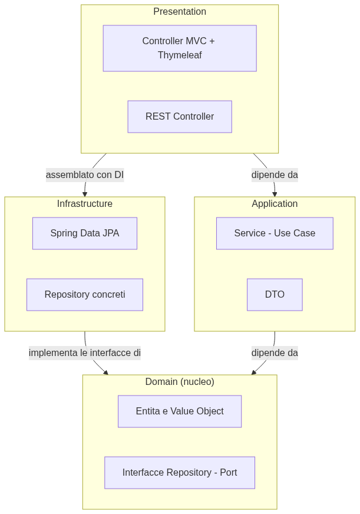
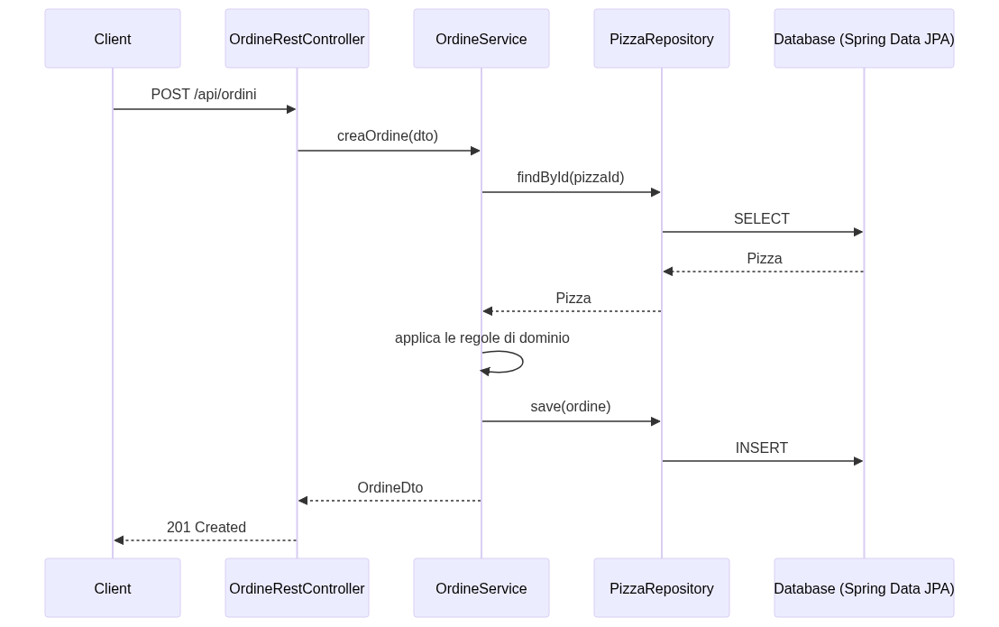

# Booting Spring Boot — Java Edition

If the last time you wrote Java was in school, or if your mental image of Java is "lots of `{ }`, lots of `getter`/`setter` boilerplate, and an endless XML file called `web.xml`", this playbook is for you. The Java of 2006 — verbose, ceremonious, with frameworks that needed more configuration than code — has been gone for years. Today's Java has `record`, `var`, pattern matching, streams, and a framework, **Spring Boot**, that gets you a working HTTP server faster than it takes to read this sentence.

Spring Boot isn't "Spring with less work": it's the pragmatic answer to a real problem. Spring (the framework, born in 2003) was extremely powerful but drowned everyone in XML and manual configuration. In 2014, Pivotal launched **Spring Boot**: same engine underneath, but with **smart auto-configuration**, an embedded server, and the "convention over configuration" philosophy — get things running with sensible defaults, and let us customize only what actually matters.

This playbook starts from the basics — modern Java, the framework's core concepts — and ends with a complete, working project: **PizzaHub**, a small order-management app for a pizzeria, with a web view (Thymeleaf), a REST API, a real database, per-environment configuration, and security. No shortcuts, no dangerous corners cut: just what's needed, explained well, with the same care whether you're 12 years old and just getting curious about programming, or you need to ship real code to production tomorrow morning.

---

## 1. Modern Java, Modern OOP — we're not in 2006 anymore

**One-liner**: Java has changed more in the last 10 years than in the 20 before that. Starting with Java 8 (2014), the language embraced functional programming and type inference, stopped forcing you to write boilerplate for every little thing, and since 2017 it ships a new version **every six months**, with an LTS (Long Term Support) release roughly every two years.

### A brief history, because it explains the "why"

Java was born in 1995 with a precise promise: *"write once, run anywhere"* — write it once, and the bytecode runs on any machine that has a JVM (Java Virtual Machine). It was a revolution, and it's still why Java is everywhere: banks, enterprise systems, Android (with an alternative JVM), embedded systems. But for years Java stayed **rigidly object-oriented and verbose**: everything had to be a class, every value needed hand-written `getter`/`setter` methods, and collections were looped over with explicit `for` loops.

🧠 **Analogy**: imagine having to write a formal letter in a 1995 office: a mandatory header, fixed courtesy phrases, every sentence built from a rigid template. "Old-style" Java was like that: to say "take this list of numbers, keep the even ones, and double them" took 8 lines of loops and scratch variables. Modern Java is like sending a clear, direct message: you say what you want, not how to get there step by step.

```java
// "2006" Java: verbose, imperative, full of boilerplate
List<Integer> numbers = Arrays.asList(1, 2, 3, 4, 5, 6);
List<Integer> result = new ArrayList<Integer>();
for (int i = 0; i < numbers.size(); i++) {
    Integer n = numbers.get(i);
    if (n % 2 == 0) {
        result.add(n * 2);
    }
}

// Modern Java (17+): declarative, with Stream
List<Integer> result = numbers.stream()
    .filter(n -> n % 2 == 0)
    .map(n -> n * 2)
    .toList();
```

### `var`: type inference, not dynamic typing

```java
var name = "Ada";          // the compiler INFERS String, and it stays static forever
var age = 36;                 // int
var list = new ArrayList<String>();   // ArrayList<String>, no need to repeat it twice

// age = "thirty-six";  ❌ won't compile: age is int, forever
```

> 🧠 **Golden rule**: `var` doesn't make Java "behave like Python". The type is decided once and for all by the compiler based on what you assign, and it never changes — it only removes pointless repetition (`ArrayList<String> list = new ArrayList<String>()` becomes `var list = new ArrayList<String>()`).

### `record`: no more boilerplate for data

Before Java 16, representing "a plain piece of data" (two coordinates, a price with a currency) required a whole class: private fields, a constructor, getters, `equals()`, `hashCode()`, `toString()` — often 40 lines just to say "these two values, together".

```java
// "2006" Java: a hand-written data class
public class Point {
    private final int x;
    private final int y;

    public Point(int x, int y) {
        this.x = x;
        this.y = y;
    }

    public int getX() { return x; }
    public int getY() { return y; }

    @Override
    public boolean equals(Object o) {
        if (this == o) return true;
        if (!(o instanceof Point)) return false;
        Point p = (Point) o;
        return x == p.x && y == p.y;
    }

    @Override
    public int hashCode() { return Objects.hash(x, y); }

    @Override
    public String toString() { return "Point[x=" + x + ", y=" + y + "]"; }
}

// Modern Java (16+): the same thing, in one line
public record Point(int x, int y) {}
```

```java
var p1 = new Point(1, 2);
var p2 = new Point(1, 2);
System.out.println(p1.equals(p2));   // true — VALUE comparison, generated for free
System.out.println(p1.x());          // 1 — generated getter, no "get" prefix
```

A `record` is **immutable by construction** (its fields are `final`, no `setX()`), and it's the default choice for DTOs, Value Objects, and any data that represents "a value" rather than "an entity that changes over time" — the same concept we'll use for DTOs in section 9.

### Pattern matching: a `switch` that reasons about types

```java
Object value = 42;

String description = switch (value) {
    case Integer n when n < 0 -> "negative";
    case Integer n when n == 0 -> "zero";
    case Integer n -> "positive: " + n;
    case String s -> "it's a string: " + s;
    default -> "unknown";
};

// pattern matching on a record: "destructures" the data in one go
record Pizza(String name, double price) {}

Object o = new Pizza("Margherita", 6.50);
if (o instanceof Pizza(String name, double price) && price < 10) {
    System.out.println(name + " is cheap: " + price);
}
```

### Interfaces, abstract classes, and "favor composition over inheritance"

This principle from the Gang of Four applies to Java just as much as to any other OOP language: prefer **composing behaviors** over building deep, fragile inheritance hierarchies.

```java
// ❌ inheritance that "lies": a penguin IS a bird, but it doesn't fly
class Bird { void fly() { System.out.println("Flying!"); } }
class Penguin extends Bird {
    @Override
    void fly() { throw new UnsupportedOperationException(); }
}

// ✅ composition: compose the behavior, not the genealogy
interface Movement { void move(); }

class Flying implements Movement {
    public void move() { System.out.println("Flying!"); }
}
class Swimming implements Movement {
    public void move() { System.out.println("Swimming!"); }
}

class Animal {
    private final String name;
    private final Movement movement;

    Animal(String name, Movement movement) {
        this.name = name;
        this.movement = movement;
    }

    void move() { movement.move(); }
}

var penguin = new Animal("Pingu", new Swimming());
var eagle = new Animal("Eagle", new Flying());
```

> 🧠 **Golden rule**: always start from a small, focused interface. Reach for inheritance (`extends`) only when two classes truly share the same conceptual identity, not just a convenient piece of code to reuse.

### `Optional`: no more surprise `NullPointerException`

```java
// ❌ can explode in production, miles away from where the null was born
Pizza pizza = findPizza(id);
System.out.println(pizza.name());   // NullPointerException if pizza is null

// ✅ Optional forces you to EXPLICITLY decide what to do when it's missing
Optional<Pizza> pizza = findPizza(id);
String name = pizza.map(Pizza::name).orElse("Pizza not found");

pizza.ifPresentOrElse(
    p -> System.out.println("Found: " + p.name()),
    () -> System.out.println("No pizza with this id")
);
```

> 💡 **Tip**: `Optional` is meant for **return values**, not for class fields or method parameters — using it everywhere is just as wrong as never using it. You'll use it a lot with Spring Data JPA (section 7), where `findById()` returns exactly an `Optional<T>`.

### Virtual Threads (Java 21): concurrency without thread-pool pain

Since Java 21, **Project Loom** introduced *virtual threads*: thousands of "lightweight" threads managed by the JVM, letting you write blocking, readable code (no callbacks, no cascading `CompletableFuture`) while still keeping high scalability — extremely useful for I/O-bound web applications like the ones you'll write with Spring Boot.

```java
// before Java 21: a limited thread pool, each thread is "heavy" (costs ~1MB of stack)
ExecutorService pool = Executors.newFixedThreadPool(200);

// Java 21+: virtual threads, very lightweight — you can create millions without running out of memory
ExecutorService pool = Executors.newVirtualThreadPerTaskExecutor();
```

Spring Boot 3.2+ supports virtual threads with a single line of configuration (`spring.threads.virtual.enabled=true`) — we'll see it in section 8.

---

## 2. Spring Boot: the core concepts

**One-liner**: Spring Boot rests on two ideas that come from the original Spring framework — **Inversion of Control** (IoC) and **Dependency Injection** (DI) — plus a third idea, entirely its own, that makes them practical to use for real: **auto-configuration**.

### Inversion of Control: who's in charge, who obeys

In "normal" code, you're the one creating your objects and their dependencies:

```java
// you control everything by hand: you create the object and its dependencies
PizzaRepository repository = new PizzaRepositoryJpa(entityManager);
OrdineService service = new OrdineService(repository);
```

With **Inversion of Control**, this control "flips": you're no longer the one building objects and wiring them together — a **container** (Spring's *ApplicationContext*) does it for you, following rules that you declare.

🧠 **Analogy**: think of a restaurant kitchen. Without IoC, **you're** the chef who walks to the pantry, picks up every single ingredient, and assembles them by hand every time a dish is needed. With IoC, there's an **automatic stockroom** (the Spring container): you tell it "this dish needs flour, tomato, and mozzarella" (the declared dependencies), and it hands them to you already prepared at the counter, without you ever having to go looking in the pantry.

### Dependency Injection: how dependencies actually arrive

```java
@Service
public class OrdineService {

    private final PizzaRepository pizzaRepository;

    // constructor injection: Spring sees that OrdineService needs
    // a PizzaRepository, and hands it over automatically when creating the instance
    public OrdineService(PizzaRepository pizzaRepository) {
        this.pizzaRepository = pizzaRepository;
    }
}
```

You never write `new OrdineService(...)` scattered around the codebase: Spring creates the instance, figures out what it needs by looking at the constructor, and injects it automatically. This is called **constructor injection**, and it's the recommended approach — preferable to `@Autowired` on a field, because it makes dependencies explicit, mandatory, and testable without needing to start Spring in your tests (we'll see this in section 10).

```java
// ❌ field injection: works, but hides dependencies and complicates testing
@Service
public class OrdineService {
    @Autowired
    private PizzaRepository pizzaRepository;
}

// ✅ constructor injection: explicit dependencies, the object is always in a valid state
@Service
public class OrdineService {
    private final PizzaRepository pizzaRepository;

    public OrdineService(PizzaRepository pizzaRepository) {
        this.pizzaRepository = pizzaRepository;
    }
}
```

### "Beans" and the stereotype annotations

A **bean** is simply "an object managed by the Spring container". To tell Spring "this class should become a bean", you mark it with a **stereotype** annotation:

| Annotation | Meaning | Where you'll use it |
|---|---|---|
| `@Component` | A generic bean, no specific role | Utilities, cross-cutting services |
| `@Service` | A bean that holds business logic | `OrdineService` (section 10) |
| `@Repository` | A bean that talks to persistence | Spring Data JPA interfaces (section 7) |
| `@Controller` | A bean that handles web requests and returns **HTML views** | Thymeleaf controllers (section 6) |
| `@RestController` | Like `@Controller`, but returns **data** (JSON), not views | REST API (section 9) |

They're all specializations of `@Component` — using the right one doesn't change the technical behavior, but it clearly communicates **the role** of the class to anyone reading the code: it's documentation the compiler checks for you.

### Auto-configuration: the real difference from "classic" Spring

Spring (without "Boot") required configuring every piece by hand: the server, the datasource, the template engine. Spring Boot looks at **what's on your classpath** (which libraries you've added as a dependency) and automatically configures sensible default beans.

```java
// Add this dependency to the project (section 3/4):
// spring-boot-starter-data-jpa

// Spring Boot sees: "there's Hibernate on the classpath, there's a DataSource configured"
// → it automatically configures EntityManager, TransactionManager, and more,
//   WITHOUT you writing a single line of XML or Java configuration
```

🧠 **Analogy**: it's like buying flat-pack furniture with instructions that are already "smart" — if the box contains screws for a glass shelf, the furniture assembles itself already thinking in terms of glass; if it contains ones for wood, it adapts on its own. You don't have to spell out every single detail: the system **observes what you have** and behaves accordingly.

### `@SpringBootApplication`: three annotations in one

```java
@SpringBootApplication
public class PizzaHubApplication {
    public static void main(String[] args) {
        SpringApplication.run(PizzaHubApplication.class, args);
    }
}
```

`@SpringBootApplication` is actually shorthand for three annotations combined:

| Annotation | What it does |
|---|---|
| `@Configuration` | This class can declare beans |
| `@EnableAutoConfiguration` | Turns on the auto-configuration described above |
| `@ComponentScan` | Automatically looks for `@Component`, `@Service`, `@Repository`, `@Controller` in this package and its sub-packages |

> 🧠 **Golden rule**: the class annotated with `@SpringBootApplication` must live in the **root** package of the project (e.g. `com.pizzahub`), not in a sub-package — otherwise `@ComponentScan` won't find the beans you wrote elsewhere.

---

## 3. Spring Initializr: the starting point

**One-liner**: [start.spring.io](https://start.spring.io) is the official Spring Boot project generator. Pick your language, version, build tool, and dependencies, download a ready-made zip — no Spring project should ever start from a hand-written empty file.

### What to choose, and why

| Field | What to pick for a new project | Why |
|---|---|---|
| **Project** | Maven or Gradle | See section 4 for the pragmatic choice |
| **Language** | Java | Kotlin is a valid alternative, but this playbook sticks to Java |
| **Spring Boot** | The latest **stable** version, not the first one on the list if it's marked *SNAPSHOT* or *M1/RC* | Snapshots are development builds, not for real projects |
| **Java** | 21 (LTS) | Latest Long Term Support: longest support window, virtual threads included (section 1) |
| **Packaging** | Jar | An executable jar with an embedded server — no separate Tomcat to install (see below) |

### The dependencies for PizzaHub

In the "Add Dependencies" section of the site, we search for and add:

- **Spring Web** — for building REST APIs and receiving HTTP requests (`spring-boot-starter-web`, includes an **embedded** Tomcat server: no separate install needed)
- **Spring Data JPA** — for talking to the database without hand-writing SQL (section 7)
- **Thymeleaf** — the template engine for HTML views (section 6)
- **H2 Database** — an in-memory database, perfect for development and tests, zero installation
- **Spring Security** — authentication and authorization (section 9)
- **Spring Boot DevTools** — automatic app restart on every saved change, like `nodemon` for Node.js

> 💡 **Tip**: don't add "everything that might be useful". Every starter brings transitive dependencies, startup time, and surface area to maintain. Only add what the project uses **today** — the same YAGNI principle we'll revisit in section 5.

### What the zip generates

```
pizzahub/
├── pom.xml                                    ← dependencies and build configuration (section 4)
├── mvnw, mvnw.cmd                              ← Maven Wrapper: no need to have Maven installed on the machine
├── src/
│   ├── main/
│   │   ├── java/com/pizzahub/
│   │   │   └── PizzaHubApplication.java        ← the entry point, annotated with @SpringBootApplication
│   │   └── resources/
│   │       ├── application.properties           ← application configuration (section 8)
│   │       ├── static/                            ← files served directly (CSS, images)
│   │       └── templates/                          ← Thymeleaf views (section 6)
│   └── test/
│       └── java/com/pizzahub/
│           └── PizzaHubApplicationTests.java     ← a "smoke" test: verifies the context starts up
└── .gitignore                                       ← already configured for a Java/Maven project
```

The **Maven Wrapper** (`mvnw`/`mvnw.cmd`) deserves a note: it's a script that downloads and runs the exact Maven version declared by the project, so you don't have to install it globally on the machine — the same role `./gradlew` plays for Gradle. Always use `./mvnw` instead of `mvn` to make sure everyone on the team (and CI) uses the exact same version.

```bash
./mvnw spring-boot:run     # starts the app, using the project's own Maven version
```

### CLI vs web UI

If you'd rather stay in the terminal, IntelliJ IDEA and VS Code (with the "Spring Boot Extension Pack") integrate Spring Initializr directly into new-project creation — the exact same generation, without opening a browser.

---

## 4. Maven vs Gradle: two different approaches

**One-liner**: both do the same job — managing dependencies and orchestrating the build — but with opposite philosophies. Maven is **declarative and rigid** (an XML file describing *what* you want); Gradle is **programmable and flexible** (a Groovy or Kotlin script describing *how*, too).

### `pom.xml`: declarative, predictable

```xml
<!-- pom.xml -->
<project>
    <parent>
        <groupId>org.springframework.boot</groupId>
        <artifactId>spring-boot-starter-parent</artifactId>
        <version>3.3.0</version>
    </parent>

    <groupId>com.pizzahub</groupId>
    <artifactId>pizzahub</artifactId>
    <version>0.0.1-SNAPSHOT</version>

    <properties>
        <java.version>21</java.version>
    </properties>

    <dependencies>
        <dependency>
            <groupId>org.springframework.boot</groupId>
            <artifactId>spring-boot-starter-web</artifactId>
        </dependency>
        <dependency>
            <groupId>org.springframework.boot</groupId>
            <artifactId>spring-boot-starter-data-jpa</artifactId>
        </dependency>
        <dependency>
            <groupId>org.springframework.boot</groupId>
            <artifactId>spring-boot-starter-test</artifactId>
            <scope>test</scope>
        </dependency>
    </dependencies>
</project>
```

Notice the `<parent>spring-boot-starter-parent</parent>`: it's what **automatically** pins the compatible versions of every Spring dependency, so you never have to ask "which Jackson version works with this Spring Web version?" — Maven already knows.

### `build.gradle.kts`: programmable, concise

```kotlin
// build.gradle.kts
plugins {
    java
    id("org.springframework.boot") version "3.3.0"
    id("io.spring.dependency-management") version "1.1.5"
}

group = "com.pizzahub"
version = "0.0.1-SNAPSHOT"

java {
    sourceCompatibility = JavaVersion.VERSION_21
}

dependencies {
    implementation("org.springframework.boot:spring-boot-starter-web")
    implementation("org.springframework.boot:spring-boot-starter-data-jpa")
    testImplementation("org.springframework.boot:spring-boot-starter-test")
}
```

### The pragmatic comparison

| | Maven | Gradle |
|---|---|---|
| Format | XML, declarative | Groovy or Kotlin DSL, programmable |
| Build speed | Slower on large projects | Incremental builds and caching — often faster |
| Learning curve | Easier to read for beginners | More powerful, but you need to understand the script |
| Convention | Very strong, little flexibility | Flexible, you can write arbitrary build logic |
| Enterprise adoption | Still slightly ahead | Growing, the standard for Android |
| Command | `./mvnw clean install` | `./gradlew build` |

> 🧠 **Pragmatic golden rule**: if you're new to Spring, or working in a "traditional" enterprise team, go with **Maven**: verbose XML, but readable by anyone at a glance, zero surprises. If the project needs custom builds, complex multi-module setups, or the team already comes from Android/Kotlin, go with **Gradle**: more upfront investment, but faster and more expressive builds. There's no wrong answer here: they're two different roads to the same destination — this playbook uses Maven in its examples because it's Spring Initializr's default choice.

### The commands you'll use every day

```bash
./mvnw spring-boot:run       # start the application
./mvnw test                     # run the tests
./mvnw clean package              # compile and build the executable jar in target/
./mvnw dependency:tree               # show the dependency tree (useful for debugging conflicts)

# Gradle equivalents
./gradlew bootRun
./gradlew test
./gradlew build
./gradlew dependencies
```

---

## 5. Clean Code, Clean Architecture

**One-liner**: clean code in Java means honest names, small methods, and classes with a single reason to change. Clean Architecture organizes the project into layers with one rule only: **dependencies always point inward**, toward the domain.

### Clean Code, in practice

```java
// ❌ a lying name, a method that does too much
public List<Integer> processData(List<Integer> d) {
    List<Integer> r = new ArrayList<>();
    for (Integer x : d) {
        if (x > 0) r.add(x * 2);
    }
    return r;
    // ...another 40 lines...
}

// ✅ honest name, a single responsibility
public List<Integer> doublePositiveValues(List<Integer> numbers) {
    return numbers.stream()
        .filter(n -> n > 0)
        .map(n -> n * 2)
        .toList();
}
```

```java
// ❌ the comment just repeats what the code already says
// check if the order is valid
if (order.getTotal() > 0 && !order.getLines().isEmpty()) { }

// ✅ a well-named method removes the need for the comment
if (order.isValid()) { }
```

> 💡 **Tip**: if you need a comment to explain WHAT a line does, the problem is naming, not missing documentation. Save comments for the WHY ("// we use UTC here because the external provider requires it"), never for the WHAT.

### The four layers, applied to Spring Boot

Unlike stacks where Clean Architecture translates into separate projects/modules, in a typical Spring Boot project the layers are **packages**, inside the same Maven/Gradle module — simpler to manage for small-to-medium projects, with the same dependency discipline.

```
com.pizzahub/
├── domain/            ← core: entities, value objects, repository interfaces. ZERO dependency on Spring
├── application/        ← services, use cases, DTOs. Depends only on domain
├── infrastructure/       ← Spring Data JPA implementations, external clients. Implements domain's interfaces
└── web/                    ← MVC and REST controllers. The entry point, wired together via Dependency Injection
```



The **dependency rule** has no exceptions: `domain` doesn't know about Spring, doesn't know about Hibernate, doesn't know about HTTP — it's pure Java. `infrastructure` knows about `domain` (to implement its interfaces), but `domain` never knows about `infrastructure`.

```java
// domain/PizzaRepository.java — the interface (the "port") lives in the domain
public interface PizzaRepository {
    Optional<Pizza> findById(Long id);
    List<Pizza> all();
    Pizza save(Pizza pizza);
}

// infrastructure/PizzaJpaRepository.java — the implementation lives outside, and DEPENDS on domain
@Repository
public interface PizzaJpaRepository extends JpaRepository<Pizza, Long>, PizzaRepository {
    // Spring Data JPA generates the implementation at runtime — see section 7
}
```

The concrete benefit: you can test all the logic in `application` **without a real database**, by swapping `PizzaRepository` for a fake in-memory one in your tests (section 10). And you can change databases — from H2 to PostgreSQL — by touching only `infrastructure`.

### SOLID, with pragmatism

| Principle | The textbook version | The pragmatic version |
|---|---|---|
| **S**ingle Responsibility | A class has a single reason to change | If the class name contains an "and" ("HandlerAndValidator"), split it |
| **O**pen/Closed | Open for extension, closed for modification | Only use interfaces where you know multiple implementations will be needed, not everywhere "just in case" |
| **L**iskov Substitution | A subclass should replace its base without breaking anything | If `Penguin extends Bird` needs to throw an exception on `fly()`, the inheritance is wrong (see section 1) |
| **I**nterface Segregation | Many small interfaces, not one giant one | A `PizzaRepository` with 20 methods is an anti-pattern: split by responsibility |
| **D**ependency Inversion | Depend on abstractions, not concrete implementations | `OrdineService` depends on `PizzaRepository` (the interface), never directly on `PizzaJpaRepository` |

> 🧠 **Golden rule**: SOLID principles aren't physical laws, they're heuristics. Apply them when they solve a real problem (code that's hard to test, extend, or understand). Don't apply them "up front" on a three-line health-check endpoint — that's overengineering, the exact opposite of pragmatism.

### Anemic model vs rich model

```java
// ❌ anemic model: just getters/setters, all the logic scattered across controllers/services
public class Ordine {
    private Long id;
    private List<RigaOrdine> lines;
    // just getters and setters, zero behavior
}

// ✅ rich model: the entity protects its own rules
public class Ordine {
    private final List<RigaOrdine> lines = new ArrayList<>();

    public void addLine(Pizza pizza, int quantity) {
        if (quantity <= 0) {
            throw new IllegalArgumentException("Quantity must be positive");
        }
        lines.add(new RigaOrdine(pizza, quantity));
    }

    public BigDecimal total() {
        return lines.stream()
            .map(RigaOrdine::subtotal)
            .reduce(BigDecimal.ZERO, BigDecimal::add);
    }
}
```

> 🧠 **Golden rule**: the "anemic model" is the most common anti-pattern in enterprise Java code. A rich model, like `Ordine` above, can answer questions about its own state on its own (`total()`) and protects its own invariants (`addLine` rejects negative quantities). Business logic lives where the data it involves lives, not scattered across controllers.

---

## 6. Modern MVC (with Thymeleaf)

**One-liner**: **MVC** (Model-View-Controller) separates "the data" (Model), "what the user sees" (View), and "who decides what to show" (Controller). **Thymeleaf** is Spring Boot's modern template engine: **valid** HTML even before it's processed, with special attributes (`th:*`) that the server replaces with real data.

### `@Controller` vs `@RestController`

```java
// @Controller: returns the NAME of an HTML view to render
@Controller
public class PizzaMvcController {

    private final PizzaService pizzaService;

    public PizzaMvcController(PizzaService pizzaService) {
        this.pizzaService = pizzaService;
    }

    @GetMapping("/pizze")
    public String list(Model model) {
        model.addAttribute("pizze", pizzaService.all());
        return "pizze";   // Spring looks for templates/pizze.html
    }
}

// @RestController: returns DATA (serialized to JSON), not a view
@RestController
@RequestMapping("/api/pizze")
public class PizzaRestController {

    private final PizzaService pizzaService;

    public PizzaRestController(PizzaService pizzaService) {
        this.pizzaService = pizzaService;
    }

    @GetMapping
    public List<PizzaDto> list() {
        return pizzaService.all();   // Spring automatically serializes to JSON
    }
}
```

> 🧠 **Golden rule**: `@RestController` is simply `@Controller` + `@ResponseBody` on every method — it tells Spring "don't look for a view, the return value **is already** the response". In section 10 you'll use both in the same project: `@Controller` for the admin panel with Thymeleaf, `@RestController` for the public API.

### Thymeleaf: HTML that stays HTML

```html
<!-- templates/pizze.html -->
<!DOCTYPE html>
<html xmlns:th="http://www.thymeleaf.org">
<head>
    <title>Our pizzas</title>
</head>
<body>
    <h1>Menu</h1>

    <ul>
        <li th:each="pizza : ${pizze}">
            <span th:text="${pizza.nome}">Pizza name</span> —
            <span th:text="${pizza.prezzo} + ' €'">Price</span>
        </li>
    </ul>

    <p th:if="${pizze.isEmpty()}">No pizzas available, check back later!</p>

    <a th:href="@{/pizze/nuova}">Add a pizza</a>
</body>
</html>
```

The key point, and the reason Thymeleaf is considered "modern" compared to older engines (like JSP): this file **is valid HTML**, openable in a browser even with no server behind it — `th:text="${pizza.nome}"` is simply ignored by the browser, while "Pizza name" stays visible as a static placeholder. A designer can work on the file without ever having to run the whole application.

### The most-used Thymeleaf selectors

| Attribute | What it does |
|---|---|
| `th:text="${value}"` | Replaces the tag's content with `value` |
| `th:each="x : ${list}"` | Repeats the tag for each element of `list` |
| `th:if` / `th:unless` | Shows the tag only if the condition is true/false |
| `th:href="@{/path}"` | Generates a URL, automatically handling the context path |
| `th:object` + `th:field` | Binds a form to a Java object (see below) |
| `th:fragment` | Defines a reusable piece of template (header, footer) |

### Form binding: from the browser to a Java object

```html
<!-- templates/pizze/nuova.html -->
<form th:action="@{/pizze}" th:object="${nuovaPizza}" method="post">
    <input type="text" th:field="*{nome}" placeholder="Pizza name" />
    <input type="number" th:field="*{prezzo}" step="0.01" />
    <button type="submit">Save</button>
</form>
```

```java
@GetMapping("/pizze/nuova")
public String form(Model model) {
    model.addAttribute("nuovaPizza", new NuovaPizzaForm());
    return "pizze/nuova";
}

@PostMapping("/pizze")
public String create(@ModelAttribute @Valid NuovaPizzaForm form, BindingResult errors) {
    if (errors.hasErrors()) {
        return "pizze/nuova";   // go back to the form, showing validation errors
    }
    pizzaService.create(form);
    return "redirect:/pizze";   // redirect after a successful POST: avoids double submit on refresh
}
```

> 💡 **Tip**: the `redirect:` after a `POST` isn't a stylistic detail — it's the **Post-Redirect-Get** pattern: if the user presses F5 after saving, the browser repeats the last GET request (harmless), not the last POST (which would otherwise create two identical pizzas).

### Fragments: don't repeat header and footer everywhere

```html
<!-- templates/fragments/layout.html -->
<header th:fragment="header">
    <nav>PizzaHub</nav>
</header>
```

```html
<!-- templates/pizze.html -->
<div th:replace="~{fragments/layout :: header}"></div>
```

---

## 7. Data access: let's clear things up

**One-liner**: Java has at least three levels for talking to a database, and confusion about which one to use is extremely common. From lowest to highest level of abstraction: **JDBC** (the raw driver), **JPA/Hibernate** (the ORM — a standard plus its most widely used implementation), **Spring Data JPA** (a layer on top of JPA that generates repositories for you).

### The three levels, in a table

| Tool | What it is | How much code you write | When it makes sense |
|---|---|---|---|
| **JDBC** | The standard Java API for talking to a relational DB, very low level | A lot: you open connections, write SQL, map `ResultSet` by hand | Very specific queries, maximum performance, total control |
| **`JdbcTemplate`** | A Spring wrapper over JDBC: manages connections and resources for you | Less: you still write SQL, but no boilerplate for opening/closing | Native, high-performance queries, without all the ceremony of raw JDBC |
| **JPA + Hibernate** | The Java **standard** for ORM (JPA is the spec, Hibernate the most-used implementation) | Little: you write annotated entities, Hibernate generates the SQL | The majority of CRUD-centric applications |
| **Spring Data JPA** | A layer on top of JPA: **generates the repository implementation from an interface** | Very little: you declare an interface, the implementation is born on its own | The de facto standard in a modern Spring Boot project |

🧠 **Analogy**: JDBC is like cooking from raw ingredients, weighed by hand, following a recipe written in a foreign language (SQL). JPA/Hibernate is a programmable kitchen robot: you tell it "this is the shape of the cake" (the entity) and it takes care of the ingredients and cooking times (the SQL queries). Spring Data JPA is the same robot, but with pre-set recipes for the most common dishes: it only needs the dish's name (`findByNome`) to already know what to do, without you even having to program it.

### The JPA entity

```java
// domain/Pizza.java
@Entity
@Table(name = "pizze")
public class Pizza {

    @Id
    @GeneratedValue(strategy = GenerationType.IDENTITY)
    private Long id;

    @Column(nullable = false)
    private String nome;

    @Column(nullable = false)
    private BigDecimal prezzo;

    protected Pizza() {}   // required by JPA, don't use it directly in your own code

    public Pizza(String nome, BigDecimal prezzo) {
        this.nome = nome;
        this.prezzo = prezzo;
    }

    public Long getId() { return id; }
    public String getNome() { return nome; }
    public BigDecimal getPrezzo() { return prezzo; }
}
```

### Spring Data JPA: one interface, zero implementation

```java
// infrastructure/PizzaJpaRepository.java
public interface PizzaJpaRepository extends JpaRepository<Pizza, Long> {

    // the method NAME is the query: Spring Data interprets it and generates the SQL
    List<Pizza> findByNomeContainingIgnoreCase(String fragment);

    List<Pizza> findByPrezzoLessThan(BigDecimal maxPrice);

    // for more complex queries, explicit JPQL (similar to SQL, but works on entities, not tables)
    @Query("SELECT p FROM Pizza p WHERE p.prezzo BETWEEN :min AND :max ORDER BY p.prezzo")
    List<Pizza> findInPriceRange(@Param("min") BigDecimal min, @Param("max") BigDecimal max);
}
```

By extending `JpaRepository<Pizza, Long>` you get, **for free**, without writing a line: `save()`, `findById()`, `findAll()`, `deleteById()`, pagination, sorting. The rest — methods with names like `findByNomeContainingIgnoreCase` — is generated by Spring Data **by interpreting the method name** at runtime: there's no hidden magic, just a very precise naming convention the framework knows how to read.

### Relationships

```java
@Entity
public class Ordine {

    @Id
    @GeneratedValue(strategy = GenerationType.IDENTITY)
    private Long id;

    @ManyToOne(fetch = FetchType.LAZY)
    @JoinColumn(name = "pizza_id")
    private Pizza pizza;

    private int quantita;
}
```

> 🧠 **Golden rule — the N+1 problem**: `FetchType.LAZY` means "load this relationship only when it's actually read". Convenient, but dangerous: if you loop over 1,000 orders and read `ordine.getPizza()` for each one **outside** an optimized query, Hibernate runs 1,000 separate queries — one per order. This is the famous **N+1 problem**, the most common performance trap with any ORM (the same concept applies to Entity Framework in .NET, Prisma in Node, ActiveRecord in Rails). The fix: use `JOIN FETCH` in an explicit JPQL query when you already know you'll need the relationship.

```java
@Query("SELECT o FROM Ordine o JOIN FETCH o.pizza WHERE o.id = :id")
Optional<Ordine> findWithPizza(@Param("id") Long id);
```

### Transactions

```java
@Service
public class OrdineService {

    @Transactional   // either every operation succeeds, or all of them are rolled back
    public Ordine creaOrdine(CreaOrdineDto dto) {
        Pizza pizza = pizzaRepository.findById(dto.pizzaId())
            .orElseThrow(() -> new PizzaNonTrovataException(dto.pizzaId()));

        Ordine ordine = new Ordine(pizza, dto.quantita());
        return ordineRepository.save(ordine);
    }
}
```

`@Transactional` is what makes `creaOrdine()` **atomic**: if any operation inside the method fails (an unhandled exception), Spring rolls back every change made up to that point — never a "half-saved" order in the database.

---

## 8. Per-environment configuration: how do you do it?

**One-liner**: a serious application runs in at least three different environments — development (`dev`), test, production (`prod`) — each with its own configuration (a different database, different log levels, different credentials). Spring Boot handles this with **profiles**.

### `application.yml` and profiles

```yaml
# src/main/resources/application.yml — configuration shared by ALL environments
spring:
  application:
    name: pizzahub
  threads:
    virtual:
      enabled: true   # virtual threads (Java 21+, section 1) enabled by default

logging:
  level:
    root: INFO
```

```yaml
# src/main/resources/application-dev.yml — active only when the "dev" profile is on
spring:
  datasource:
    url: jdbc:h2:mem:pizzahub
  h2:
    console:
      enabled: true   # web dashboard for the database, at /h2-console — development only!
  jpa:
    hibernate:
      ddl-auto: update   # Hibernate updates the schema automatically, handy in dev

logging:
  level:
    com.pizzahub: DEBUG
```

```yaml
# src/main/resources/application-prod.yml — active only when the "prod" profile is on
spring:
  datasource:
    url: ${DATABASE_URL}          # read from an environment variable, NEVER hardcoded
    username: ${DATABASE_USER}
    password: ${DATABASE_PASSWORD}
  jpa:
    hibernate:
      ddl-auto: validate   # in production the schema is NEVER auto-modified, only validated

logging:
  level:
    com.pizzahub: WARN
```

> 🧠 **Golden rule**: `ddl-auto: update` is very convenient in development and **very dangerous** in production — it can silently alter the schema of a real database. In production always use `validate` (Hibernate checks that the schema matches the entities, without touching it) and leave real schema changes to a versioned migration tool like **Flyway** or **Liquibase**.

### Activating a profile

```bash
# from the command line
./mvnw spring-boot:run -Dspring-boot.run.profiles=dev

# as an environment variable (the standard way in production, e.g. inside a container)
export SPRING_PROFILES_ACTIVE=prod
java -jar pizzahub.jar
```

```java
// or, condition an entire bean on the active profile
@Configuration
public class DevOnlyConfig {

    @Bean
    @Profile("dev")
    public CommandLineRunner sampleData(PizzaRepository repo) {
        return args -> {
            repo.save(new Pizza("Margherita", new BigDecimal("6.50")));
            repo.save(new Pizza("Diavola", new BigDecimal("8.00")));
        };
    }
}
```

### The principle: external configuration, never hardcoded

```yaml
# ❌ credentials written in code, end up in Git forever
spring:
  datasource:
    password: SuperSecret123

# ✅ placeholder, value read from the environment at runtime
spring:
  datasource:
    password: ${DATABASE_PASSWORD}
```

This is the **twelfth rule** of the famous [Twelve-Factor App](https://12factor.net/config) methodology: configuration that changes between environments (credentials, URLs, feature flags) must be **externalized** — never committed to source control. Locally, a tool like [direnv](https://direnv.net/) or a `.env` file (never committed, always in `.gitignore`) covers the development case; in production, environment variables provided by the hosting platform or a dedicated vault (AWS Secrets Manager, HashiCorp Vault).

> 💡 **Tip**: `application.yml` is preferable to `application.properties` when the configuration has a nested structure (like above) — less repetition, more readability. For very simple configuration, `.properties` remains a perfectly valid, equally supported choice.

---

## 9. API first, Security first

**One-liner**: "API first" means designing your API's contract (resources, HTTP verbs, formats) **before** writing the implementation, as a shared source of truth for the whole team. "Security first" means security isn't a layer bolted on at the end, but part of the design from the very first endpoint.

### Design resources, not actions

```
❌ GET  /getPizze
❌ POST /creaNuovaPizza
❌ POST /eliminaPizza?id=3

✅ GET    /api/pizze              list all pizzas
✅ GET    /api/pizze/{id}         a specific pizza
✅ POST   /api/pizze              create a new pizza
✅ PUT    /api/pizze/{id}         replace an existing pizza
✅ DELETE /api/pizze/{id}         delete a pizza
```

The HTTP verb (`GET`, `POST`, `PUT`, `DELETE`) already tells you **the action** — the resource name (`/pizze`) should always stay a **noun**, never a verb. That's the heart of a clean REST style.

### DTOs, not entities, on the public contract

```java
// ❌ exposes the domain entity directly: changing a column breaks the public API
@GetMapping("/api/pizze/{id}")
public Pizza detail(@PathVariable Long id) { ... }

// ✅ a dedicated DTO: the API contract is independent from the database schema
public record PizzaDto(Long id, String nome, BigDecimal prezzo) {
    public static PizzaDto from(Pizza pizza) {
        return new PizzaDto(pizza.getId(), pizza.getNome(), pizza.getPrezzo());
    }
}

@GetMapping("/api/pizze/{id}")
public PizzaDto detail(@PathVariable Long id) {
    return PizzaDto.from(pizzaService.findById(id));
}
```

> 🧠 **Golden rule**: the entity (`Pizza`) knows the domain rules. The DTO knows only the shape of the data over the network. Mixing them up creates dangerous coupling: adding an internal field to the entity would end up exposing it externally, without you ever deciding to.

### Honest status codes

```java
@RestController
@RequestMapping("/api/pizze")
public class PizzaRestController {

    @GetMapping("/{id}")
    public ResponseEntity<PizzaDto> detail(@PathVariable Long id) {
        return pizzaService.findById(id)
            .map(PizzaDto::from)
            .map(ResponseEntity::ok)              // 200
            .orElse(ResponseEntity.notFound().build());   // 404
    }

    @PostMapping
    public ResponseEntity<PizzaDto> create(@RequestBody @Valid NuovaPizzaDto dto) {
        var pizza = pizzaService.create(dto);
        var uri = URI.create("/api/pizze/" + pizza.getId());
        return ResponseEntity.created(uri).body(PizzaDto.from(pizza));   // 201
    }

    @DeleteMapping("/{id}")
    public ResponseEntity<Void> delete(@PathVariable Long id) {
        pizzaService.delete(id);
        return ResponseEntity.noContent().build();   // 204
    }
}
```

### Validating incoming DTOs

```java
public record NuovaPizzaDto(
    @NotBlank(message = "Name is required") String nome,
    @Positive(message = "Price must be positive") BigDecimal prezzo
) {}
```

`@Valid` on the controller parameter, combined with `jakarta.validation` annotations on the DTO, makes Spring automatically reject malformed payloads with a `400 Bad Request` — **before** your own code even runs, exactly like the schema-first validation seen in other stacks.

### OpenAPI: documenting the API without writing it twice by hand

```xml
<dependency>
    <groupId>org.springdoc</groupId>
    <artifactId>springdoc-openapi-starter-webmvc-ui</artifactId>
    <version>2.5.0</version>
</dependency>
```

With this single dependency, Spring Boot automatically exposes `/v3/api-docs` (the OpenAPI schema in JSON) and `/swagger-ui.html` (an interactive UI to explore and try out the API) — generated **from the code itself** (controllers, DTOs, validation annotations), with no separate file to keep manually in sync.

### Spring Security: the basics

```java
@Configuration
@EnableWebSecurity
public class SecurityConfig {

    @Bean
    public SecurityFilterChain filterChain(HttpSecurity http) throws Exception {
        http
            .authorizeHttpRequests(auth -> auth
                .requestMatchers(HttpMethod.GET, "/api/pizze/**").permitAll()   // public reads
                .requestMatchers("/pizze/**").authenticated()                    // admin panel: authenticated only
                .anyRequest().permitAll()
            )
            .formLogin(Customizer.withDefaults())
            .csrf(csrf -> csrf.ignoringRequestMatchers("/api/**"));   // CSRF protects forms, not stateless APIs

        return http.build();
    }

    @Bean
    public PasswordEncoder passwordEncoder() {
        return new BCryptPasswordEncoder();   // NEVER store passwords in plain text, never with MD5/SHA1
    }
}
```

> 🧠 **Golden rule**: `BCryptPasswordEncoder` isn't an arbitrary choice — it's a hashing algorithm that's **deliberately slow** (with a configurable "cost factor"), designed to make brute-force attacks extremely expensive even if the database is compromised. Never roll your own hashing: always use a community-tested standard.

### Method-level authorization

```java
@Service
public class OrdineService {

    @PreAuthorize("hasRole('ADMIN')")
    public void delete(Long ordineId) {
        ordineRepository.deleteById(ordineId);
    }
}
```

`@PreAuthorize` moves the authorization check **inside** the service, not just in the controller — so the rule applies wherever the method is called, even from another internal service, not only when it comes from an HTTP endpoint.

---

## 10. A complete project, step by step

Let's put it all together: **PizzaHub**, a small order-management app for a pizzeria. An admin panel with Thymeleaf to manage the menu, a public REST API to browse pizzas and create orders, Spring Data JPA with H2, per-environment profiles, and Spring Security.

### What PizzaHub does

```bash
GET  /pizze                  # admin panel: list of pizzas (Thymeleaf, requires login)
GET  /api/pizze              # public API: list of pizzas as JSON
POST /api/ordini             { "pizzaId": 1, "quantita": 2 }   # creates an order
GET  /api/ordini/{id}        # order detail, with the computed total
```



### Project structure

```
pizzahub/
├── pom.xml
├── src/main/java/com/pizzahub/
│   ├── PizzaHubApplication.java
│   ├── domain/
│   │   ├── Pizza.java
│   │   ├── Ordine.java
│   │   ├── PizzaRepository.java
│   │   └── OrdineRepository.java
│   ├── application/
│   │   ├── OrdineService.java
│   │   ├── PizzaService.java
│   │   └── dto/
│   │       ├── CreaOrdineDto.java
│   │       ├── OrdineDto.java
│   │       └── PizzaDto.java
│   ├── infrastructure/
│   │   ├── PizzaJpaRepository.java
│   │   └── OrdineJpaRepository.java
│   ├── web/
│   │   ├── PizzaMvcController.java
│   │   └── OrdineRestController.java
│   └── config/
│       └── SecurityConfig.java
└── src/main/resources/
    ├── application.yml
    ├── application-dev.yml
    └── templates/
        └── pizze.html
```

### Step 1 — Generate the project

On [start.spring.io](https://start.spring.io): Maven, Java 21, dependencies `Spring Web`, `Spring Data JPA`, `Thymeleaf`, `H2 Database`, `Spring Security`, `Validation`. Download and extract the zip as `pizzahub/` (section 3).

### Step 2 — Domain: entities and "ports"

```java
// domain/Pizza.java
@Entity
public class Pizza {

    @Id
    @GeneratedValue(strategy = GenerationType.IDENTITY)
    private Long id;

    @Column(nullable = false)
    private String nome;

    @Column(nullable = false)
    private BigDecimal prezzo;

    protected Pizza() {}

    public Pizza(String nome, BigDecimal prezzo) {
        this.nome = nome;
        this.prezzo = prezzo;
    }

    public Long getId() { return id; }
    public String getNome() { return nome; }
    public BigDecimal getPrezzo() { return prezzo; }
}
```

```java
// domain/Ordine.java
@Entity
public class Ordine {

    @Id
    @GeneratedValue(strategy = GenerationType.IDENTITY)
    private Long id;

    @ManyToOne(fetch = FetchType.LAZY)
    private Pizza pizza;

    private int quantita;

    protected Ordine() {}

    public Ordine(Pizza pizza, int quantita) {
        if (quantita <= 0) {
            throw new IllegalArgumentException("Quantity must be positive");
        }
        this.pizza = pizza;
        this.quantita = quantita;
    }

    public Long getId() { return id; }
    public Pizza getPizza() { return pizza; }
    public int getQuantita() { return quantita; }

    public BigDecimal totale() {
        return pizza.getPrezzo().multiply(BigDecimal.valueOf(quantita));
    }
}
```

```java
// domain/PizzaRepository.java
public interface PizzaRepository {
    Optional<Pizza> trovaPerId(Long id);
    List<Pizza> tutte();
}

// domain/OrdineRepository.java
public interface OrdineRepository {
    Ordine salva(Ordine ordine);
    Optional<Ordine> trovaPerId(Long id);
}
```

### Step 3 — Infrastructure: Spring Data JPA

```java
// infrastructure/PizzaJpaRepository.java
public interface PizzaJpaRepository extends JpaRepository<Pizza, Long>, PizzaRepository {

    default Optional<Pizza> trovaPerId(Long id) { return findById(id); }
    default List<Pizza> tutte() { return findAll(); }
}

// infrastructure/OrdineJpaRepository.java
public interface OrdineJpaRepository extends JpaRepository<Ordine, Long>, OrdineRepository {

    default Ordine salva(Ordine ordine) { return save(ordine); }
    default Optional<Ordine> trovaPerId(Long id) { return findById(id); }
}
```

### Step 4 — Application: DTOs and services

```java
// application/dto/PizzaDto.java
public record PizzaDto(Long id, String nome, BigDecimal prezzo) {
    public static PizzaDto da(Pizza pizza) {
        return new PizzaDto(pizza.getId(), pizza.getNome(), pizza.getPrezzo());
    }
}

// application/dto/CreaOrdineDto.java
public record CreaOrdineDto(
    @NotNull Long pizzaId,
    @Positive int quantita
) {}

// application/dto/OrdineDto.java
public record OrdineDto(Long id, String pizzaNome, int quantita, BigDecimal totale) {
    public static OrdineDto da(Ordine ordine) {
        return new OrdineDto(ordine.getId(), ordine.getPizza().getNome(), ordine.getQuantita(), ordine.totale());
    }
}
```

```java
// application/PizzaService.java
@Service
public class PizzaService {

    private final PizzaRepository pizzaRepository;

    public PizzaService(PizzaRepository pizzaRepository) {
        this.pizzaRepository = pizzaRepository;
    }

    public List<PizzaDto> tutte() {
        return pizzaRepository.tutte().stream().map(PizzaDto::da).toList();
    }
}

// application/OrdineService.java
@Service
public class OrdineService {

    private final PizzaRepository pizzaRepository;
    private final OrdineRepository ordineRepository;

    public OrdineService(PizzaRepository pizzaRepository, OrdineRepository ordineRepository) {
        this.pizzaRepository = pizzaRepository;
        this.ordineRepository = ordineRepository;
    }

    @Transactional
    public OrdineDto creaOrdine(CreaOrdineDto dto) {
        Pizza pizza = pizzaRepository.trovaPerId(dto.pizzaId())
            .orElseThrow(() -> new NoSuchElementException("Pizza not found: " + dto.pizzaId()));

        Ordine ordine = new Ordine(pizza, dto.quantita());
        return OrdineDto.da(ordineRepository.salva(ordine));
    }
}
```

Notice how `OrdineService` knows nothing about JPA, Hibernate, or HTTP — it depends only on interfaces defined in `domain`. This is exactly what makes the service testable in isolation (step 7) and the database swappable without touching a single line of business logic.

### Step 5 — Web: MVC and REST together

```java
// web/PizzaMvcController.java
@Controller
public class PizzaMvcController {

    private final PizzaService pizzaService;

    public PizzaMvcController(PizzaService pizzaService) {
        this.pizzaService = pizzaService;
    }

    @GetMapping("/pizze")
    public String elenco(Model model) {
        model.addAttribute("pizze", pizzaService.tutte());
        return "pizze";
    }
}

// web/OrdineRestController.java
@RestController
@RequestMapping("/api")
public class OrdineRestController {

    private final PizzaService pizzaService;
    private final OrdineService ordineService;

    public OrdineRestController(PizzaService pizzaService, OrdineService ordineService) {
        this.pizzaService = pizzaService;
        this.ordineService = ordineService;
    }

    @GetMapping("/pizze")
    public List<PizzaDto> pizze() {
        return pizzaService.tutte();
    }

    @PostMapping("/ordini")
    public ResponseEntity<OrdineDto> creaOrdine(@RequestBody @Valid CreaOrdineDto dto) {
        OrdineDto ordine = ordineService.creaOrdine(dto);
        return ResponseEntity.created(URI.create("/api/ordini/" + ordine.id())).body(ordine);
    }
}
```

```html
<!-- templates/pizze.html -->
<!DOCTYPE html>
<html xmlns:th="http://www.thymeleaf.org">
<head><title>PizzaHub — Menu</title></head>
<body>
    <h1>Our pizzas</h1>
    <ul>
        <li th:each="pizza : ${pizze}">
            <span th:text="${pizza.nome}"></span> — <span th:text="${pizza.prezzo} + ' €'"></span>
        </li>
    </ul>
</body>
</html>
```

### Step 6 — Per-environment configuration

```yaml
# application.yml
spring:
  application:
    name: pizzahub

# application-dev.yml
spring:
  datasource:
    url: jdbc:h2:mem:pizzahub
  h2:
    console:
      enabled: true
  jpa:
    hibernate:
      ddl-auto: update
    show-sql: true
```

```java
// config/DevDataSeeder.java — sample data, development ONLY (section 8)
@Configuration
public class DevDataSeeder {

    @Bean
    @Profile("dev")
    public CommandLineRunner seed(PizzaJpaRepository repo) {
        return args -> {
            repo.save(new Pizza("Margherita", new BigDecimal("6.50")));
            repo.save(new Pizza("Diavola", new BigDecimal("8.00")));
        };
    }
}
```

### Step 7 — Minimal security

```java
// config/SecurityConfig.java
@Configuration
@EnableWebSecurity
public class SecurityConfig {

    @Bean
    public SecurityFilterChain filterChain(HttpSecurity http) throws Exception {
        http.authorizeHttpRequests(auth -> auth
                .requestMatchers("/api/**").permitAll()
                .requestMatchers("/pizze/**").authenticated()
                .anyRequest().permitAll()
            )
            .formLogin(Customizer.withDefaults())
            .csrf(csrf -> csrf.ignoringRequestMatchers("/api/**"));
        return http.build();
    }
}
```

### Step 8 — Tests, with JUnit 5 and Mockito

```java
// src/test/java/com/pizzahub/application/OrdineServiceTest.java
class OrdineServiceTest {

    @Test
    void creaOrdine_withExistingPizza_computesTheCorrectTotal() {
        // Arrange — fake repositories, no real database
        PizzaRepository pizzaRepository = mock(PizzaRepository.class);
        OrdineRepository ordineRepository = mock(OrdineRepository.class);

        Pizza margherita = new Pizza("Margherita", new BigDecimal("6.50"));
        when(pizzaRepository.trovaPerId(1L)).thenReturn(Optional.of(margherita));
        when(ordineRepository.salva(any())).thenAnswer(inv -> inv.getArgument(0));

        var service = new OrdineService(pizzaRepository, ordineRepository);

        // Act
        var result = service.creaOrdine(new CreaOrdineDto(1L, 3));

        // Assert
        assertEquals(new BigDecimal("19.50"), result.totale());
        assertEquals("Margherita", result.pizzaNome());
    }

    @Test
    void creaOrdine_withNonExistentPizza_throwsException() {
        PizzaRepository pizzaRepository = mock(PizzaRepository.class);
        OrdineRepository ordineRepository = mock(OrdineRepository.class);
        when(pizzaRepository.trovaPerId(99L)).thenReturn(Optional.empty());

        var service = new OrdineService(pizzaRepository, ordineRepository);

        assertThrows(NoSuchElementException.class,
            () -> service.creaOrdine(new CreaOrdineDto(99L, 1)));
    }
}
```

```java
// REST endpoint test, with the actual Spring context started
@SpringBootTest
@AutoConfigureMockMvc
@ActiveProfiles("dev")
class OrdineRestControllerTest {

    @Autowired MockMvc mockMvc;

    @Test
    void postOrdini_withValidPayload_returns201() throws Exception {
        mockMvc.perform(post("/api/ordini")
                .contentType(MediaType.APPLICATION_JSON)
                .content("""
                    { "pizzaId": 1, "quantita": 2 }
                    """))
            .andExpect(status().isCreated());
    }
}
```

> 🧠 **Golden rule**: notice the difference between the two tests. The first (`OrdineServiceTest`) is a **pure unit test**: no Spring annotations, no context to start, runs in milliseconds thanks to Clean Architecture (section 5). The second (`OrdineRestControllerTest`) is an **integration test**: it starts the whole Spring context to verify that HTTP, JSON, validation, and the service actually work together. You need both, in different proportions: many fast unit tests, a handful of targeted integration tests.

```bash
./mvnw test                        # all tests
./mvnw test -Dtest=OrdineServiceTest   # a single class
```

### Step 9 — Run and try it out

```bash
./mvnw spring-boot:run -Dspring-boot.run.profiles=dev
```

```bash
curl http://localhost:8080/api/pizze
# [{"id":1,"nome":"Margherita","prezzo":6.50}, {"id":2,"nome":"Diavola","prezzo":8.00}]

curl -X POST http://localhost:8080/api/ordini \
  -H "Content-Type: application/json" \
  -d '{"pizzaId": 1, "quantita": 3}'
# 201 {"id":1,"pizzaNome":"Margherita","quantita":3,"totale":19.50}

curl -X POST http://localhost:8080/api/ordini \
  -H "Content-Type: application/json" \
  -d '{"pizzaId": 999, "quantita": 1}'
# 500 (worth improving with a dedicated @ExceptionHandler — see below)
```

One last professional touch: handle the `NoSuchElementException` with an honest `404` instead of letting a generic `500` leak through:

```java
// web/GestoreErrori.java
@RestControllerAdvice
public class GestoreErrori {

    @ExceptionHandler(NoSuchElementException.class)
    public ResponseEntity<Map<String, String>> gestisciNonTrovato(NoSuchElementException e) {
        return ResponseEntity.status(HttpStatus.NOT_FOUND).body(Map.of("errore", e.getMessage()));
    }
}
```

`@RestControllerAdvice` intercepts exceptions thrown by **any** `@RestController` in the application, in a single place — no `try/catch` repeated in every endpoint.

### Concepts applied

- **Section 1**: `record` for DTOs, `Optional` for values that might be missing, `var` wherever the type is obvious
- **Section 2**: constructor injection for every service, stereotype annotations (`@Service`, `@Repository`, `@Controller`, `@RestController`)
- **Section 5**: separation into `domain` / `application` / `infrastructure` / `web`, with dependencies pointing inward
- **Section 6**: `@Controller` + Thymeleaf for the admin panel, `@RestController` for the API
- **Section 7**: Spring Data JPA, annotated entities, `@Transactional`, relationships with `FetchType.LAZY`
- **Section 8**: a `dev` profile with H2 and sample data, configuration ready for an external `prod` profile
- **Section 9**: DTOs instead of entities on the public contract, honest status codes, validation with `@Valid`, basic Spring Security
- **Section 10 itself**: pure unit tests (Mockito) and integration tests (`MockMvc`) in the right proportions

---

## 🎉 You made it!

You've completed **Booting Spring Boot — Java Edition**. Now you know:

- How modern Java (17/21, LTS) left behind the boilerplate of 2006: `record`, `var`, pattern matching, `Optional`, virtual threads
- Spring's core concepts: Inversion of Control, constructor-based Dependency Injection, auto-configuration, the stereotype annotations
- How to start from a clean project with Spring Initializr, without writing configuration by hand
- The pragmatic differences between Maven and Gradle, and when to prefer one over the other
- Clean Code and Clean Architecture applied to a real Spring Boot project: domain, application, infrastructure, web
- How to build modern views with Thymeleaf, staying valid HTML even before rendering
- The three levels of data access in Java (JDBC, JPA/Hibernate, Spring Data JPA), and how to avoid the N+1 trap
- How to separate per-environment configuration with Spring profiles, without ever committing a secret
- How to design a clean REST API, with DTOs, honest status codes, and basic Spring Security
- How to put it all together in **PizzaHub**, a real project, from `start.spring.io` to the first `curl`

**Where to go from here?**

- 📖 [Spring Boot Reference Documentation](https://docs.spring.io/spring-boot/docs/current/reference/html/) — the official documentation, always up to date
- 🧪 [Baeldung](https://www.baeldung.com) — probably the most complete online resource for practical Spring deep dives
- 📘 *Clean Architecture* by Robert C. Martin — the reference book for layered separation, language-agnostic
- 🗃️ [Spring Data JPA Reference](https://docs.spring.io/spring-data/jpa/reference/) — advanced query derivation, specifications, projections
- 💎 [.NET Pragmatic Approach](/en/playbook/dotnet) — compare the same problem (a robust enterprise app) solved on another modern runtime

> 🧠 **One last piece of advice**: Spring Boot gives you a huge toolbox — you don't use all of it together, always, on every project. Use Thymeleaf when you genuinely need a server-rendered panel, not "because it's there". Use Spring Security with the minimal configuration that solves your real problem, not with every available option. Pragmatic discipline — a few clear layers, tests that matter, code that reads itself — always beats the "enterprise" architecture nobody can touch anymore. Happy coding! ☕
